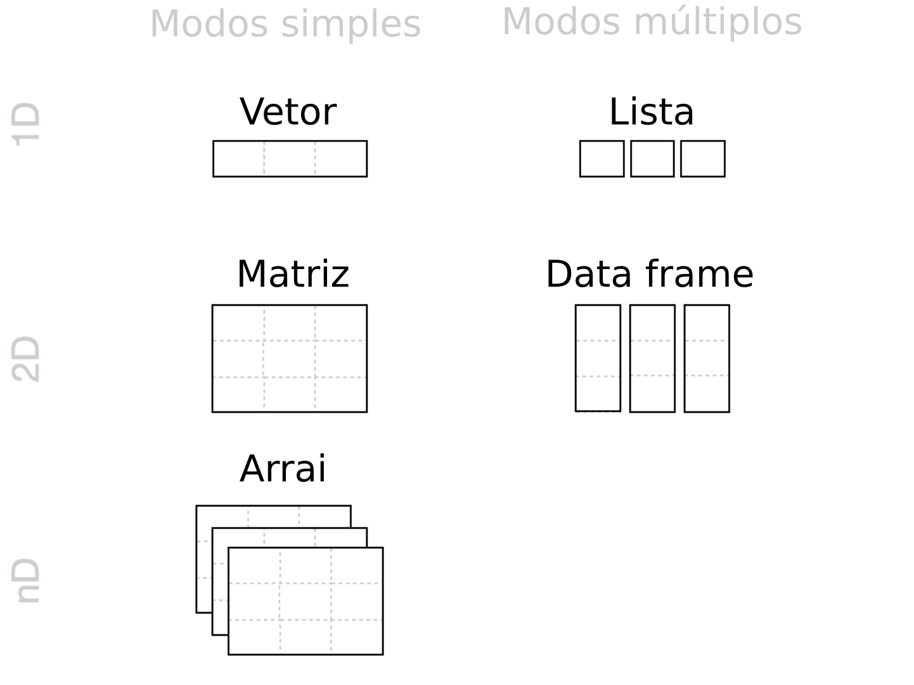

# Introdução à linguagem R {#intro-r}

## Introdução

O objetivo desta seção é **apresentar aspectos básicos da linguagem R** para que qualquer pessoa possa realizar todos os passos para a análise de dados nessa linguagem. Nela, abordaremos as questões mais básicas sobre a linguagem como: 1) R e RStudio, 2) funcionamento da linguagem, 3) estrutura e manipulação de objetos, 4) *tidyverse* e 5) principal material de R. 

Todo processo de aprendizagem torna-se mais efetivo quando a **teoria é combinada com a prática**, então recomendamos fortemente que você leitor, acompanhe os códigos e exercícios deste livro, ao mesmo tempo que os executa em seu computador, e não só os leia passivamente. Por motivos de espaço, não abordaremos todas as questões relacionadas ao uso da linguagem R nesta seção. Logo, aconselhamos que o leitor consulte o material sugerido no final dessa seção para se aprofundar.

## R e RStudio

Com o R é possível **manipular e analisar dados, visualizar gráficos** e escrever desde **pequenas linhas de códigos até programas inteiros**. O R é a versão em código aberto de uma linguagem de programação criada por **John M. Chambers** (Stanford University, CA, EUA), nos anos 1980 no Bell Labs, chamada de S, que contou com três versões: Old S (1976-1987), New S (1988-1997) e S4 (1998), utilizada na IDE S-PLUS (1988-2008). Essa linguagem tornou-se bastante popular e vários produtos comerciais que a usam estão disponíveis, como o S-PLUS, SPSS, STATA e SAS. 

No final dos anos 1990, **Robert Gentleman** e **Ross Ihaka** (Auckland University, NZ), iniciaram o desenvolvimento da **versão free da linguagem S**, com o seguinto histórico: Desenvolvimento (1997-2000), Versão 1 (2000-2004), Versão 2 (2004-2013), Versão 3 (2013-2020) e Versão 4 (2020). Para mais detalhes do histório de desenvolvimento do S e R, consultar Wickham (2013), sendo que atualmente a linguagem R é mantida por uma rede de colaboradores denominada **R Core Team**. A **origem do nome R** é desconhecida, mas reza que ao lançarem o nome da linguagem os autores se valeram da letra que vinha antes do S, uma vez que a linguagem R foi baseada nela, e utilizaram a letra "R".

Um aspecto digno de nota é que a linguagem R, ao contrário de outras linguagem como Fortran e C que são compiladas, é uma **linguagem interpretada**, o que a faz ser mais fácil de programar, pois processa linhas de comando e as transforma em linguagem de máquina (código binário que o computador efetivamente lê), apesar desse fato diminuir a velocidade de processamento.

Para começarmos a trabalhar com o R é necessário baixá-lo na página do R Project. Então, acesse esse [site](http://www.r-project.org), e em seguida, clique no link **download R**, que o levará à pagina do CRAN Mirros (*Comprehensive R Archive Network*). Escolha a **página espelho do Brasil** mais próxima de você para baixar o programa. Escolha agora o **sistema operacional** do seu computador (passos adicionais existem para diferentes distribuições Linux), para Windows, clique em **base** para finalmente chegar à **página de download** com a versão mais recente do R. 

Reserve algum tempo posteriormente para **explorar esta página do R-Project**. Existem
vários [livros](http://www.r-project.org/doc/bib/R-books.html) dedicados a diversos assuntos baseados no R. Além disso, estão disponíveis [manuais](http://cran.r-project.org/manuals.html) em [diversas línguas](http://cran.r-project.org/other-docs.html) para serem baixados gratuitamente.

Como o R é um software livre, não existe a possibilidade de o usuário entrar em **contato com um serviço de suporte de usuários**, muito comuns em softwares pagos. Ao invés disso, existem várias listas de emails que fornecem suporte à [comunidade de usuários](http://www.r-project.org/mail.html). Nós, particularmente, recomendamos o ingresso nas seguintes listas: R-help, R-sig-ecology, e [R-br](http://www.leg.ufpr.br/doku.php/software:rbr). Este último representa um grupo de usuários brasileiro do programa R.

Apesar de podemos utilizar o R com a IDE (Ambiente de Desenvolvimento Integrado - *Integrated Development Environment*) RGui que vem com a instalação da linguagem, para usuários Windows (Figura \@ref(fig:fig-rgui)) ou no próprio terminal para usuários Linux e MacOS, existem alguns IDEs específicos para facilitar nosso uso dessa linguagem. 

```{r fig-rgui, fig.align='center', fig.cap="Interface do RGui. Os números indicam: (1) R Script, (2) R Console, e (3) R Graphics.", out.width="100%", echo=FALSE}
library(knitr)
include_graphics("img/cap04_rgui.png")
```

Entretanto, desde 2011, um IDE se tornou mais popular na comunidade: o [RStudio](https://rstudio.com/) (Figura \@ref(fig:fig-rstudio)). O RStudio possui algumas características que o tornam tão popular: várias janelas de visualização, marcação e preenchimento automático do script, integração com controle de versão, dentre outras opções. Para fazer o download do RStudio, acessamos o [site](https://rstudio.com/products/rstudio/download/#download), e escolhemos o instalador com base em nosso sistema operacional. 

Um último ponto técnico importante: para evitar possíveis erros, é interessante instalar primeiro a linguagem R, seguida do IDE RStudio.

## Funcionamento da linguagem R

Nesta seção veremos o **principais conceitos** para entender como a **linguagem funciona** ou como geralmente utilizamos o IDE RStudio no dia-a-dia, para executar nossas rotinas utilizando a linguagem R. Veremos então: 1) console, 2) script (editor/roteiro), 3) objetos (variáveis), 4) operadores, 5 ) funções, 6) pacotes, 7) ambiente (environment/workspace), 8) ajuda (help) e 9) citações.

Antes de iniciarmos propriamente dito, é fundamental entendermos alguns pontos sobre as janelas e o funcionamento delas no RStudio (Figura \@ref(fig:fig-rstudio)).

```{r fig-rstudio, fig.align='center', fig.cap="Interface do RStudio. Os números indicam: (1) janelas com abas de Script e R Markdown; (2) janela com abas de Console, Terminal e Jobs; (3) janela com abas de Environment, History, Conections e Tutorial; e (4) janela com abas de Files, Plots, Packages, Help e Viewer.", out.width="100%", echo=FALSE}
knitr::include_graphics("img/cap04_rstudio.png")
```

Detalhando algumas dessas janelas, temos:

- **Console**: é onde os códigos são rodados e vemos as saídas
- **Editor/Script**: é onde escrevemos nossos códigos em R ou R Markdown
- **Environment**: painel com todos os objetos criados na sessão
- **History**: painel com o histórico dos comandos rodados
- **Files**: painel que mostra os arquivos no diretório de trabalho
- **Plots**: painel onde os gráficos são apresentados
- **Packages**: painel que lista os pacotes
- **Help**: painel onde a documentação das funções é exibida

No RStudio, alguns atalhos são fundamentais para aumentar nossa produtividade:

- **f1**: abre o painel de *Help*
- **ctrl + Enter**: roda a linha selecionada no script
- **ctrl + Shift + N**: abre um novo script
- **ctrl + S**: salva um script
- **ctrl + Z**: desfaz uma operação
- **ctrl + shift + Z**: refaz uma operação
- **alt + -**: insere um sinal de atribuição (<-)
- **ctrl + Shift + M**: insere um operador pipe (%>%) 
- **ctrl + Shift + C**: comenta uma linha no script - insere um (#) 
- **ctrl + Shift + R**: insere uma sessão (# ----------------------)
- **ctrl + Shift + H**: abre uma janela para selecionar o diretório de trabalho
- **ctrl + Shift + f10**: reinicia o console
- **ctrl + L**: limpa os comandos do console 
- **alt + Shift + K**: abre uma janela com todos os atalhos disponíveis

### Console

O console é onde a versão da linguagem R instalada é carregada para executar os códigos da linguagem (Figura \@ref(fig:fig-rstudio) (2)). Na janela do console irá aparecer o símbolo `>` seguida de uma barra vertical `|` que fica piscando, onde iremos digitar ou enviar nossos códigos do script. Podemos fazer um pequeno exercício: vamos digitar `2 + 2`, seguido da tecla `Enter` para que essa operação seja executada.

```{r}
10 + 2
```

O resultado retorna o valor `12`, precedido de um valor entre colchetes. Esses colchetes demonstram a posição do elemento numa sequência de valores. Se fizermos essa outra operação `1:42`, o R vai criar uma sequência unitária de valores de 1 a 42. A depender da largura da janela do console, vai aparecer um número diferente entre colchete indicando sua posição na sequência: antes do 1 vai aparecer o `[1]`, depois quando a sequência for quebrada, vai aparecer o número correspondente da posição do elemento, no nosso caso `[26]`.

```{r}
1:42
```

Podemos ver o hitórico dos código executados no Console na aba **History** (Figura \@ref(fig:fig-rstudio) (3)).

### Scripts

Scripts são **rascunhos dos códigos**, e onde de fato os códigos são escritos e depois enviados ao console (Figura \@ref(fig:fig-rstudio) (1)). Scripts são arquivos de texto simples, criados com a extensão (terminação) `.R`. Para criar um script basta ir em File > New File > R Script, ou clicando no ícone logo abaixo de File, ou ainda usando o atalho `ctrl + shift + N`.

Uma vez escrito os códigos no script, podemos rodar esses códigos de duas formas: 1)
todo o script de uma vez, clicando em **Source** ou usando o atalho `ctrl + shift + enter`; 2) a linha onde o cursos estiver posicionado, independente de sua posição naquela linha, clicando em **Run** ou usando o atalho `ctrl + enter`.

Devemos sempre **salvar nossos scripts**, tomando por via de regra: primeiro criar o arquivo e depois ir salvando versão desse mesmo arquivo. Há diversos motivos para criar um script: continuar o desenvolvimento do mesmo em outro momento ou em outro computador, preservar trabalhos passados, ou ainda compartilhar seus códigos com outra pessoa. Para criar ou salvar um script basta ir em File > Save, escolher um diretório e nome para o script, e salvar. Podemos ainda utilizar o atalho `ctrl + S`.

Em relação aos scripts, ainda há os **comentários**, representados pelos símbolos `#` (hash) ou `#'` (hash-linha). Comentários não são lidos pelo console do R e são utilizados geralmente para descrever informações sobre dados ou funções, ou ainda para suprimir linhas de código. É interessante ter no início de cada script um cabeçalho identificando o objetivo ou análise, autor e data.

```{r}
#' ---
#' title: capitulo 04 - introducao ao r
#' author: mauricio vancine
#' date: 2021-02-17
#' ---
```

Além disso, podemos usar comentários para adicionar informações sobre os códigos.

```{r}
# comentarios
# o r nao le o codigo depois do # (hash)
42 # essas palavras nao sao executadas, apenas o 42
```

Um ponto muito importante é escrever os comentários sempre em inglês para tornar seu código mais reprodutível possível. Por fim, outro ponto fundamental é ter **boas práticas de estilo de código**. Quanto mais organizado e padronizado estiver os scripts, mais fácil de entendê-los e de procurar possíveis erros. Existem dois guias de boas práticas para adequadar seus scripts: [Hadley Wickham](http://adv-r.had.co.nz/Style.html) e [Google](https://google.github.io/styleguide/Rguide.xml).

### Operadores

No R, temos cinco tipos de operadores: aritméticos, relacionais, lógicos, atribuição
e diversos. Todos são descritos na Tabela \@ref(tab:tab-operadores).

```{r tab-operadores, echo=FALSE}
kable(data.frame(Operador = c(
  "+", "-", "*", "/", "%%", "%/%", "^ ou **",
  ">", "<", ">=", "<=", "==", "!=",
  "!", "&", "|", "&&", "||",
  "<- ou =", "<<-", "->", "->>",
  ":", "%in%", "%*%", "%>%", "%--%"),
  Tipo = c(
    rep("Aritmético", 7),
    rep("Relacional", 6),
    rep("Lógico", 5),
    rep("Atribuição", 4),
    rep("Diversos", 5)), 
  Descrição = c(
    "Adição", "Subtração", "Multiplicação", "Divisão", "Resto da divisão", "Divisão inteira", "Expoente",
    "Maior", "Menor", "Maior ou igual", "Menor ou igual", "Igualdade", "Diferença",
    "Lógico NÃO", "Lógico elementar E", "Lógico elementar OU", "Lógico E", "Lógico OU", 
    "Atribuição à esquerda", "Super atribuição à esquerda", "Atribuição à direita", "Super atribuição à direita",
    "Sequência unitária", "Elementos que pertencem a um vetor", "Multiplar matriz com sua transposta", "pipe", "Intervalo de datas")),
  align = "c",
  caption = "Operadores no R.")
```

Como exemplo, podemos fazer operações simples usando os operadores aritméticos.

```{r}
# operacoes aritmeticas
10 + 2 # adicao
10 * 2 # multiplicacao
```

Precisamos ficar atentos à dominância dos operadores aritméticos: `^ >> * ou / >> + ou -`. Veja no exemplo abaixo como o uso dos parênteses mudam os resultados.

```{r}
# sem especificar - segue a ordem dos operadores
1 * 2 + 2 / 2 ^ 2

# especificando - segue a ordem dos parenteses
((1 * 2) + (2 / 2)) ^ 2
```

### Objetos

**Objetos** são **palavras** às quais são **atribuídos dados**. Essa atribuição possibilita a manipulação de dados ou resultados de análises. Iremos utilizar os símbolos `<` (menor), seguido de `-` (menos), sem espaço, dessa forma `<-`. Também podemos utilizar o símbolo de igual (`=`), mas não recomendamos, por não fazer parte das boas práticas de escrita de códigos em R. Podemos inserir essa combinação de símbolos com o atalho `alt + -`. Para demonstrar, vamos atribuir o valor `10` à palavra `obj_10`, e chamar esse objeto novamente para verificar seu conteúdo.

```{r}
# atribuicao - simbolo (<-)
obj_10 <- 10
obj_10
```

Todos os objetos criados numa sessão do R ficam listados na aba **Environment** (Figura \@ref(fig:fig-rstudio) (3)). Além disso, o RStudio possui a função *auto complete*, ou seja, podemos digitar as primeiras letras de um objeto (ou função) e em seguida apertar `Tab` para que o RStudio liste tudo que começar com essas letras.

Dois pontos importantes sobre atribuições: primeiro, o R sobrescreve os valores dos objetos com o mesmo nome, deixando o objeto com o valor da segunda atribuição.

```{r}
# sobrescreve o valor dos objetos
obj <- 100
obj

# obj agora vale 2
obj <- 2
obj
```

Segundo, o R tem limitações ao nomear objetos: 

 - nome de objetos só podem começar por letras (a-z ou A-Z) ou pontos (.)
 - nome de objetos só podem conter letras (a-z ou A-Z), números (0-9), underscores (_) ou pontos (.)
 - R é case-sensitive, i.e., ele difere letras maiúsculas de minúsculas. Assim, um objeto chamado "resposta" é diferente do objeto "RESPOSTA"
 - devemos evitar acentos ou cedilha (ç) para facilitar a memorização dos objetos
 - nome de objetos não podem ser iguais a nomes especies (`break`, `else`, `FALSE`, `for`, `function`, `if`, `Inf`, `NA`, `NaN`, `next`, `repeat`, `return`, `TRUE`, `while`)

Podemos ainda utilizar objetos para fazer operações e criar novos objetos. Isso pode parecer um pouco confuso para os iniciantes na linguagem, mas é fundamental aprender essa lógica para passar para os próximos passos.

```{r}
# definir dois objetos
va1 <- 10
va2 <- 2

# operacoes com objetos e atribuicao
adi <- va1 + va2
adi
```

Por fim, é fundamental entender que um objeto é uma **alocação de um pequeno espaço na memória RAM** do seu computador, onde o R armazenará um valor ou o resultado de uma função, utilizando o nome que definimos. Sendo assim, se fizermos uma atribuição de um **objeto maior que o tamanho da memória RAM**, esse objeto **não será alocado**, e a atribuição não funcionará. Existem opções para contornar esse tipo de limitação, mas não abordaremos aqui. Entretanto, podemos utilizar a função `object.size()` para saber quanto espaço nosso objeto criado está alocando de memória RAM. O conceito de função é tratado na seção seguinte.

```{r}
# tamanho de um objeto
object.size(adi)
```

### Funções

Funções são **códigos preparados para realizar uma tarefa** de modo simples. Outra forma de entender uma função é: comandos que realizam operações em argumentos. A estrutura de uma função é muito similar à sintaxe usada em planilhas eletrônicas, sendo composta por:

> nome_da_funcao(argumento1, argumento2)

1. **Nome da função**: remete ao que ela faz
1. **Parênteses**: limitam a função
1. **Argumentos**: onde a função irá atuar 
1. **Vírgulas**: separam os argumentos

Os argumentos de uma função podem ser de dois tipos:

1. **Valores ou objetos**: a função irá alterar os valores em si ou os valores atribuídos aos objetos
1. **Parâmetros**: valores fixos que informam um método ou a realização de uma operação. Informa-se o nome desse argumento, seguido de "=" e um número, texto ou TRUE ou FALSE

Alguns exemplos de argumentos como valores ou objetos.

```{r}
# funcoes - argumentos como valores
# soma
sum(10, 2)

# funcoes - argumentos como objetos
# soma
sum(va1, va2)
```

Alguns exemplos de argumentos como parâmetros. Note que apesar do valor do argumento ser o mesmo (10), seu efeito no resultado muda drasticamente. Aqui também é importante destacar um ponto: 1 podemos informar os argumentos sequencialmente, sem explicitar seus nomes, ou 2) independente da ordem, mas explicitando seus nomes. Entretanto, como no exemplo abaixo, devemos informar o nome do argumento (i.e., parâmetro), para que seu efeito seja o que desejamos.

```{r}
# funcoes - argumentos como parametros
# repeticao - repita todos os elementos
rep(x = 1:5, times = 10)

# repeticao - repita cada um dos elementos
rep(x = 1:5, each = 10)
```

Um ponto fundamental, e que deve ser entendido nesse ponto, é o **fluxo de atribuições do resultado da operação de funções a novos objetos**. No desenvolvimento de qualquer script, grande parte da estrutura do mesmo será dessa forma: atribuição de dados > operações com funções > atribuição dos resultados a novos objetos >  operações com funções desses novos objetos > atribuição dos resultados a novaos objetos....Ao entender esse funcionamento, começamos a entender como devemos pensar na organização do nosso script para montar as análises de que precisamos.

```{r}
# atribuicao dos resultados
# repeticao
rep_times <- rep(x = 1:5, times = 10)
rep_times

# somar e atribuir
rep_times_soma <- sum(rep_times)
rep_times_soma

# raiz e atribuir
rep_times_soma_raiz <- sqrt(rep_times_soma)
rep_times_soma_raiz
```

Por fim, é fundamental também entender a **origem das funções** que usamos no R. Todas as funções são advindas de **pacotes**. Esses pacotes possuem duas origens.

1. pacotes já instalados por padrão e que são carregados quando abrimos o R (*R Base*)
1. pacotes que instalamos e carregamos com funções

### Pacotes

Pacotes são **conjunto extras de funções para executar tarefas específicas**, além do *R Base*. Existe literalmente milhares de pacotes para as mais diversas tarefas: estatística, ecologia, geografia, sensoriamento remoto, econometria, ciências sociais, gráficos, *machine learning* etc. Podemos verificar este vasto conjunto de pacotes pelo [link](https://cran.r-project.org/web/packages/available_packages_by_name.html) que lista por nome os **pacotes oficiais**, ou seja, que passaram pelo crivo do **CRAN**. Existem ainda muito mais **pacotes em desenvolvimento**, geralmente disponibilizados em repositórios do **GitHub ou GitLab**.

Primeiramente, com uma sessão do R sem carregar nenhum pacote extra, podemos verificar pacotes carregados pelo *R Base* utilizando a função `search()`.

```{r eval=FALSE}
# verificar pacotes carregados
search()
```

Podemos ainda verificar todos pacotes instalados em seu computador com a função `library()`.

```{r eval=FALSE}
# verificar pacotes instalados
library()
```

No R, quando tratamos de pacotes, devemos destacar dois conceitos: instalar um pacote e carregar um pacote. A **instalação** de pacotes possui alguns características:

1. Instala-se apenas uma vez
1. Precisa estar conectado à internet
1. O nome do pacote precisa estar entre aspas
1. Função (CRAN): `install.packages()`

Vamos instalar o pacote *vegan* diretamente do CRAN, que possui funções para realizar uma série de análise em ecologia. Para isso, podemos ir em Tools > Install Packages..., ou ir na aba **Packages** (Figura \@ref(fig:fig-rstudio) (4)), procurar um pacote ou simplesmente clicar em "Install". Podemos ainda utilizar a função `install.packages()`.

```{r eval=FALSE}
# instalar pacotes
install.packages("vegan")
```

Uma vez instalado um pacote, não há necessidade de instalá-lo novamente. Entretanto, todas as vezes que iniciarmos uma sessão no R, precisamos **carregar** os pacotes com as funções que precisamos utilizar. O **carregamento** de pacotes possui alguns características:

1. Carrega-se toda vez que se abre uma nova sessão do R
2. Não precisa estar conectado à internet
3. O nome do pacote não precisa estar entre aspas
4. Funções: `library()` ou `require()`

Vamos carregar o pacote *vegan* que instalamos anteriormente. Podemos ir na aba **Packages** (Figura \@ref(fig:fig-rstudio) (4)) e ticar o pacote que queremos carregar ou utilizar a função `library()`.

```{r}
# carregar pacotes
library(vegan)
```

Como dissemos anteriormente, alguns pacotes em desenvlvimento encontram-se disponíveis em repositórios do GitHub ou GitLab. Para instalar pacotes do GitHub, por exemplo, precisamos instalar e carregar o pacote *devtools*.

```{r eval=FALSE}
# instalar pacote devtools
install.packages("devtools")

# carregar pacote devtools
library(devtools)
```

Uma vez instalado e carregado este pacote, podemos instalar o pacote do GitHub, utilizando a função `devtools::install_github()`. Precisamos atentar para usar essa forma "nome_usuario/nome_repositorio", retirados do link do repositório de interesse. Como exemplo, podemos instalar mesmo pacote *vegan* do repositório do GitHub [vegandevs/vegan](https://github.com/vegandevs/vegan), e depois utilizar a função `library()` para carregá-lo normalmente.

```{r eval=FALSE}
# instalar pacote do github
devtools::install_github("vegandevs/vegan")

# carregar pacote do github
library("vegan")
```

A maioria dos pacotes vem com bancos de dados que podem ser acessados pela função `data()`. Esses bancos de dados podem ser usados para testar as funções do pacote. Se estiver com dúvida na maneira como você deve preparar a planilha para realizar uma análise específica, entre no help da função e veja os conjuntos de dados que estão no exemplo desta função. Como exemplo, vamos carregar os dados `dune` do pacote *vegan*.

```{r}
# carregar dados de um pacote
library(vegan)
data(dune)
dune[1:6, 1:6]
```

Se por algum motivo precisarmos **desinstalar** um pacote, podemos utilizar a função `remove.packages()`. 

E um último ponto fundamental de pacotes, diz respeito à **atualização** dos mesmos. Os pacotes são atualizados com frequência, e infelizmente ou felizmente (pois as atualizações podem oferecer algumas quebras entre pacotes), não se atualizam sozinhos. Muitas vezes, a instalação de um pacote pode depender da versão dos pacotes dependentes, e geralmente uma janela se abre que todos os pacotes dependentes sejam atualizados. Podemos ir na aba **Packages** (Figura \@ref(fig:fig-rstudio) (4)) e clicar em "Update" ou usar a função `update.packages(ask = FALSE)` para atualizá-los, entretanto, essa é uma função que costuma demorar para terminar de rodar.

```{r eval=FALSE}
# atualizacao dos pacotes instalados 
update.packages(ask = FALSE)
```

### Ajuda (help)

Um importante passo para melhorar a usuabilidade e ter mais familiaridade com a linguagem R é aprender a usar a **ajuda de cada função**. Para tanto, podemos utilizar a função `help()` ou o operador `?`, depois de ter carregado o pacote, para abri uma nova aba (Figura \@ref(fig:fig-rstudio) (4)) que possui diversas informações sobre a função de interesse. O arquivo de ajuda do R possui geralmente nove ou dez tópicos, que nos auxiliam muito no entendimento dos dados de entrada, argumento e que operações estão sendo realizadas:

- **Description**: resumo da função
- **Usage**: como utilizar a função e quais os seus argumentos
- **Arguments**: detalha os argumentos e como os mesmos devem ser especifidados
- **Details**: detalhes importantes para se usar a função
- **Value**: mostra como interpretar a saída (*output*) da função (os resultados)
- **Note**: notas gerais sobre a função
- **Authors**: autores da função
- **References**: referências bibliográficas para os métodos usados pra construir a função
- **See also**: funções relacionadas
- **Examples**: exemplos do uso da função. Às vezes pode ser útil copiar esse trecho e colar no R para ver como funciona e como usar a função.

Vamos realizar um exemplo, buscando o *help* da função `aov()`.

```{r eval=FALSE}
# help
help(aov)
?aov
```

Além das funções, podemos buscas detalhes de um pacote em específico, para uma página simples do *help* utilizando a função `help()` ou o operador `?`. Entretanto, para uma opção que ofereça uma descrição detalhada e um índice de todas as funções do pacote, podemos utilizar a função `library()`, mas agora utilizando o argumento "help", indicamos o pacote de interesse entre aspas.

```{r eval=FALSE}
# help do pacote
help(vegan)
?vegan

# help detalhado
library(help = "vegan")
```

Outra ferramenta de busca é a página [rseek](http://www.rseek.org), na qual é possível buscar por um termo não só nos pacotes do R, mas também em listas de emails, manuais, páginas na internet e livros sobre o programa.

### Citações

Ao utilizar o R para realizar alguma análise em seus estudos ecológicos, é fundamental a citação do mesmo. Para saber como citar exatamente o R em artigos, existe uma função denominada `citation()`, que provê um formato genérico de citação e um BibTeX para arquivos LaTeX e R Markdown.

```{r}
# citacao do R
citation()
```

No resultado dessa função, há uma mensagem muito interessante: "See also 'citation("pkgname")' for citing R packages.". Dessa forma, aconselhamos os usuários de R a citar também os pacotes que utilizaram em suas análises para dar os devidos créditos aos desenvolvedores das funções implementadas nos pacotes. Como exemplo, vamos ver como fica a citação do pacote *vegan*.

```{r}
# citacao do pacote vegan
citation("vegan")
```

### Principais erros de iniciantes

**Errar** quando se está iniciando com R é **muito comum e faz parte do aprendizado**. Entretanto, os erros nunca devem ser encarados como uma forma de desestímulo para continuar tentando. Todos nós, autores desse livro, e provavelmente usuários muito experientes já passaram por um momento em que se quer desistir de tudo. Jovem aprendiz de R, a **única diferença entre você** que está iniciando agora e nós que usamos há mais tempo, **são as horas de uso (e raiva)**. O que temos a mais é experiência para olhar o erro, lê-lo e conseguir interpretar.

Dessa forma, o ponto mais importante de quem está iniciando é ter **paciência, calma, bom humor, ler e entender a mensagem de erro**. Iremos listar aqui o que consideramos os **princiais erros dos iniciantes no R**.

**1. Esquecer de completar uma função ou bloco de comandos**

Esquecer de completar uma função ou bloco de comandos é algo bem comum. Geralmente esquecemos de fechar aspas `""` ou parênteses `()`, mas felizmente geralmente o R nos informa isso, indicando um símbolo de `+`. `

```{r error=TRUE}
sum(1, 2
    +
```

**2. Esquecer da vírgula**

Outro erro bastante comum é esquecer de acrescentar a vírgula `,` para separar argumentos dentro de uma função, principalmente se estamos compondo várias função acopladas, i.e., uma função dentro da outra.

```{r error=TRUE}
sum(1 2)
```

**3. Chamar um objeto errado**

Pode parecer simples, mas esse é de longo o erro que as pessoas mais me interrompiam no laboratório. Quando estamos mais avançados e temos um longo script, fomos atribundo diversos objetos e em algum momento atribuímos um nome do qual não lembramos. E aí, quando chamamos o objeto ele não existe e devolve um erro, que pode ser facilmente identificado, como o exemplo abaixo.

```{r error=TRUE}
obj <- 10
OBJ
```

**4. Esquecer de carregar um pacote**

Esse também um erro recorrentes, mesmo para usuários mais experientes. Em scripts de análises complexas, que requerem vários pacotes, geralmente esquecemos de um ou outro... A melhor forma de evitar esse tipo de erro é listar o pacotes que vamos precisar usar logo no início do script.

```{r error=TRUE}
ggplot(iris) + aes(Sepal.Length, Sepal.Width) + geom_point() + theme_bw()
```

```{r fig.align='center'}
library(ggplot2)
ggplot(iris) + aes(Sepal.Length, Sepal.Width) + geom_point() + theme_bw()
```

**5. Usar o nome da função de forma errônea**

Esse erro não é tão comum, mas pode ser incômodo às vezes. Algumas funções possuem nomes no padrão "Camel Case", i.e., com letras maiúsculas para no meio do nome da função. Isso às vezes pode confundir, ou ainda, as funções podem ou não ser separadas com `.`, como `row.names()` e `colnames()`. Na seção de *tidyverse*, veremos que houve uma padronização nos nomes das funções para "Snake Case", i.e, todas as funções possuem letras minúsculas, com palavras separadas por *underscore* `_`.

```{r error=TRUE}
colsums(iris[, -5])
```

```{r}
colSums(iris[, -5])
```

## Estrutura e manipulação de objetos 

O conhecimento sobre a **estrutura e manipulação de objetos** é fundamental para ter domínio e entendimento do funcionamento da linguagem R. Nesta seção, trataremos da estrutura e manipulação de dados no R, no que ficou conhecido como modo *R Base*, em contrapartida ao *tidyverse*, tópico da próxima seção. Abordaremos temas chaves: 1) atributos de objetos, 2) manipulação de objetos unidimensionais e 
multidimensionais, 3) valores faltantes e especiais, 4) diretório de trabalho, 5) importar, conferir e exportar dados.

### Atributo dos objetos

Quando fazemos **atribuições de dados** no R (`<-`), os objetos gerados possuem três características.

1. **Nome**: palavra que o R reconhece os dados atribuídos
1. **Conteúdo**: dados em si
1. **Atributos**: modos (*natureza*) e estruturas (*organização*)

Vamos explorar mais a fundo os **modos** e **estruturas**. Vale ressaltar que isso é uma simplificação, pois há muitas classes de objetos como funções e saídas de funções que possuem outros atributos.

#### Modo dos objetos 

A depender da **natureza dos elementos** que compõem os dados que foram atribuídos aos objetos, esses objetos podem ser, de forma simples um dos cinco: numérico do tipo inteiro (*interger*), numérico do tipo flutuante (*double*), texto (*character*), lógico (*logical*), e complexos (*complex*).

A atribuição de números no R podem gerar dois tipos de modos: **interger** para números inteiros e **double** para números flutuantes ou com decimais. 

```{r}
# numerico double
obj_numerico_double <- 1

# modo
mode(obj_numerico_double)

# tipo
typeof(obj_numerico_double)
```

A título de praticidade, ambos são incorporados como o modo **numeric**, com o tipo **double**, a menos que especifiquemos que seja inteiro com o a letra `L` depois do número.

```{r}
# numerico interger
obj_numerico_inteiro <- 1L

# modo
mode(obj_numerico_inteiro)

# tipo
typeof(obj_numerico_inteiro)
```

Além de números, podemos atribuir textos, utilizando para isso aspas `""`.

```{r}
# caracter
obj_caracter <- "a" # atencao para as aspas

# modo
mode(obj_caracter)
```

Em algumas situações, precisamos indicar a ocorrência ou não de um evento. Para isso, utilizamos as palavras reservadas (`TRUE` e `FALSE`), chamadas de variáveis booleanas. Devemos nos ater para que essas palavras são com letras maiúsculas e sem aspas.

```{r}
# logico
obj_logico <- TRUE # maiusculas e sem aspas

# modo
mode(obj_logico)
```

Por fim, existe um modo pouco utilizado que cria números complexos (raiz de números negativos).

```{r}
# complexo
obj_complexo <- 1+1i

# modo
mode(obj_complexo)
```

Podemos fazer conversão entre esses modos com diversas funções.

```{r eval=FALSE}
# conversoes entre modos
as.numeric()
as.integer()
as.character()
as.logical()
as.complex()
```

### Estrutura dos objetos 

Uma vez entendido a **natureza dos modos dos elementos** do objetos no R, podemos passar para o passo seguinte, e entender como esses **elementos são estruturados** dentro dos objetos.

Essa estruturação irá nos contar sobre a **organização dos elementos**, com relação aos **modos e dimensionalidade** da disposição dos elementos (Figura \@ref(fig:fig-r-estruturas)). De modo bem simples, os elementos podem ser estruturados em cinco tipos:

1. **Vetores e fatores**: homogênio (*um modo*) e unidimensional (*uma dimensão*) Um tipo especial de vetor são os fatores, usados para designar variáveis categóricas
1. **Matrizes**: homogênio (*um modo*) e bidimensional (*duas dimensões*)
1. **Arrais**: homogênio (*um modo*) e multidimensional (*mais de duas dimensões*)
1. **Data frames**: heterogêneo (*mais de um modo*) e bidimensional (*duas dimensões*)
1. **Listas**: heterogêneo (*mais de um modo*) e unidimensional (*uma dimensão*)

```{r fig-r-estruturas, fig.align='center', fig.cap="Estruturas de dados mais comuns de R: vetores, matrizes, arrays, listas e data frames. Adaptado de: Grolemund (2014).", out.width="70%", echo=FALSE}

```

#### Vetor

**Vetores** representam o **encadeamento de elementos** numa sequência unidimensionais. No Capítulo YY, vimos o conceito de variáveis aleatórias. No R, essas variáveis podem ser entendidas como vetores. Dessa forma essa estrutura de dados pode ser traduzida como medidas de uma **variável quantitativa** (discretas ou contínuas), **variável binária** (booleana - TRUE e FALSE) ou **descrição** (informações em texto).

Há diversas formas de se **criar um vetor** no R: 

1. Concatenando elementos com a função `c`
1. Criando sequências unitárias `:` ou com a função `seq()`
1. Criando repetições com a função `rep()`
1. "Colar" palavras com uma sequência numérica com a função `paste()` ou `paste0()`
1. Amostrando aleatoriamente elementos com a função `sample()`

```{r}
# concatenar elementos numericos
concatenar <- c(15, 18, 20, 22, 18)

# sequencia unitaria (x1:x2)
sequencia <- 1:10

# sequencia com diferentes espacamentos 
sequencia_esp <- seq(from = 0, to = 100, by = 10) 

# repeticao
repeticao <- rep(x = c(TRUE, FALSE), times = 5)

# cola palavra e sequencia numerica - sem separacao definida (" ")
colar <- paste("amostra", 1:5)

# amostragem aleatória - sem reposição
amostragem <- sample(1:100, 10)
```

Como os vetores são homogênios, i.e., só comportam um modo, quando combinamos mais de modo no mesmo objeto existe uma dominância de modos. Existe dessa forma uma **coerção** dos elementos combinados para todos fiquem iguais. Essa dominância segue essa ordem: 

> **`DOMINANTE`** character >>> double >>> interger >>> logical **`RECESSIVO`**

Além disso, podemos utilizar as conversões listadas anteiormente para alterar os modos. Vamos exemplificar combinando os vetores criados anteriormente, e convertendo-os. 

```{r}
# coercao
c(colar, amostragem)

# conversao
as.numeric(repeticao)
```

#### Fator

O **fator** representa medidas de uma **variável qualitativa**, podendo ser **nominal ou ordinal**. É fundamental destacar que fatores no R devem ser entendidos como um vetor de **interger**, i.e., ele é composto por números inteiros representando os níveis da variável categórica. 

Para criar um fator no R, usamos uma função específica `factor()`, na qual podemos especificar os **níveis** com o argumento **leval**, ou fazemos uma conversão usando a função `as.factor()`. Trabalhar com fatores no *R Base* não é das tarefas mais agradáveis, mas mais adiante na seção XX usaremos a versão *tidyverse* usando o pacote *forcats*.

```{r}
# fatores nominal
fator_nominal <- factor(x = sample(c("floresta", "pastagem", "cerrado"), 20, replace = TRUE),
                levels = c("floresta", "pastagem", "cerrado"))

# fatores ordinal
fator_ordinal <- factor(x = sample(c("baixa", "media", "alta"), 20, replace = TRUE),
                        levels = c("baixa", "media", "alta"), ordered = TRUE)

# conversao
fator <- as.factor(x = sample(c("floresta", "pastagem", "cerrado"), 20, replace = TRUE))
```

#### Matriz 

A **matrix** representa os dados no **formato de tabela**, com linhas e colunas. As linhas representam **unidades amostrais** (locais, transectos, parcelas) e as coluncas representam **variáveis quantitativas** (discretas ou contínuas) ou **descrições** (informações em texto).

Podemos **criar matrizes** no R de **duas formas** principais. A primeira delas **dispondo elementos de um vetor** em um certo número de linhas e colunas com a função `matrix()`, podendo preencher essa matriz com os elementos do vetor por linhas ou por colunas alterando o argumento **byrow**.

```{r}
# vetor
ve <- 1:12

# matrix - preenchimento por linhas - horizontal
ma_row <- matrix(data = ve, nrow = 4, ncol = 3, byrow = TRUE)

# matrix - preenchimento por colunas - vertical
ma_col <- matrix(data = ve, nrow = 4, ncol = 3, byrow = FALSE)
```

A segundo forma **combinando vetores**, utilizando a função `rbind` para combinar veores por linha, i.e., vetor embaixo do outro, e `cbind` para combinar vetores por coluna, i.e., vetor ao lado do outro.

```{r}
# criar dois vetores
vec_1 <- c(1, 2, 3)
vec_2 <- c(4, 5, 6)

# combinar por linhas - vertical - um embaixo do outro
ma_rbind <- rbind(vec_1, vec_2)

# combinar por colunas - horizontal - um ao lado do outro
ma_cbind <- cbind(vec_1, vec_2)
```

#### Arrai

O **arrai** representa **combinação de tabelas**, com linhas, colunas e dimensões. Essa combinação pode ser feita em múltiplas dimensões, mas apesar disso, geralmente é mais comum o uso em Ecologia para três dimensões, por exemplo: **linhas **(unidades amostrais), **colunas** (espécies) e **dimensão** (tempo). Isso gera um "cubo mágico", onde podemos comparar, nesse caso, comunidades ao longo do tempo.

Podemos criar arrais no R **dispondo elementos de um vetor** em um certo **número de linhas, colunas e dimensões** com a função `array()`. Em nosso exemplo, vamos compor 10 comunidades de 20 espécies ao longo de cinco períodos. 

```{r}
# arrai
ar <- array(data = sample(c(0, 1), 1e3, rep = TRUE), 
            dim = c(10, 20, 5))
```

#### Data frame

O **data frame** representa dados no **formato de tabela**, com linhas e colunas, muito semelhante à matriz. Mas diferentemente das matrizes, os data frames comportam **mais de um modo** em suas colunas. Dessa forma, as linhas do data frame ainda representam **unidades amostrais** (locais, transectos, parcelas), mas as colunas agora podem representar **descrições** (informações em texto), **variáveis quantitativas** (discretas ou contínuas) e/ou **variáveis qualitativas** (nominais ou ordinais).

A forma mais simples de criar data frames no R é através da **combinação de vetores**. Essa combinação é feita com a função `data.frame()`, e ocorre de **forma horizontal**, semelhante à função `cbind()`. Sendo assim, todos os vetores precisam ter o mesmo **número de elementos**, ou seja, **mesmo comprimento**. Podemos ainda nomear as colunas para cada vetor.

```{r}
# criar tres vetores
vec_ch <- c("sp1", "sp2", "sp3")
vec_nu <- c(4, 5, 6)
vec_fa <- factor(c("campo", "floresta", "floresta"))

# data.frame - combinar por colunas - horizontal - um ao lado do outro
df <- data.frame(vec_ch, vec_nu, vec_fa)

# data.frame - nomear as colunas
df <- data.frame(especies = vec_ch, 
                 abundancia = vec_nu, 
                 vegetacao = vec_fa)
```

#### Lista

A **lista é tipo especial de vetor**, que aceita objetos como elementos. Ela é a estrutura de dados utilizada para **agrupar objetos**, e é geralmente a **saída de muitas funções** que fazem análises estatísticas.

Podemos criar listas através da função `list()`. Essa função funciona de forma semelhante à função `c()` para a criação de vetores, mas agora estamos concatenando elementos. Podemos ainda nomear os elementos que estamos combinando. 

Um ponto interessante para entender **data frames**, é que eles são listas, em que todos os elementos (colunas) possuem o mesmo **número de elementos**, ou seja, **mesmo comprimento**.

```{r}
# lista
lista <- list(rep(1, 20), # vector
              factor(1, 1), # factor
              cbind(c(1, 2), c(1, 2))) # matrix

# lista - nomear os elementos
lista <- list(vector = rep(1, 20), # vector
              factor = factor(1, 1), # factor
              matrix = cbind(c(1, 2), c(1, 2))) # matrix
```

#### Funções

Uma última estrutura de objetos criados no R são as **funções**. Elas são objetos **criados pelo usuário** e **reutilizados** para fazer operações específicas. A criação de funções geralmente é um tópico tratado num segundo momento, quando o usuário de R adquire certo conhecimento da linguagem. Aqui abordarem apenas seu funcionamento básico, diferenciando sua estrutura para entendimento e sua diferenciação das demais estruturas. Vamos criar uma função simples que retorna a multiplicação de dois termos.

```{r}
# criar uma funcao
multi <- function(x, y){
  
  mu <- (x * y)
  return(mu)
  
}

# uso
multi(42, 42)
```

### Manipulação de objetos unidimensionais

Vamos agora explorar formas de **manipular elementos de objetos unidimensionais**, ou seja vetores, fatores e listas.

A primeira forma de manipulação é através da **indexação**, utilizando os operadores `[]`. Com a indexação podemos **acessar elementos** de vetores e fatores por **sua posição**. Iremos utilizar números, sequência de números ou operação booleanas para retornar partes dos vetores ou factores. Podemos ainda retirar elementos dos vetores com o operação aritmético `-`.

```{r}
# fixar a amostragem
set.seed(42)

# amostrar 10 elementos de uma sequencia
ve <- sample(seq(0, 2, .05), 10)
ve

# seleciona o quinto elemento
ve[5]

# seleciona os elementos de 1 a 5
ve[1:5]

# retira o decimo elemento
ve[-10]

# retira os elementos 2 a 9
ve[-(2:9)]
```

Podemos ainda fazer uma **seleção condicional** do vetor. Ao utilizarmos operadores relacionais, teremos como resposta um vetor lógico. Esse vetor lógico pode ser utilizado dentro da indexação para seleção de elementos.

```{r}
# quais valores sao maiores que 1?
ve > 1

# valores acima de 1
ve[ve > 1]
```

Além da indexação, temos algumas **função que nos auxiliam em algumas operações com objetos unidimensionais** listadas na Tabela \@ref(tab:tab-tab-funcoes-conf-uni).

```{r tab-tab-funcoes-conf-uni, echo=FALSE}
kable(data.frame(
  Função = c(
    "`max()`",
    "`min()`", 
    "`range()`", 
    "`length()`", 
    "`sum()`",
    "`cumsum()`",
    "`prod()`",
    "`sqrt()`",
    "`abs()`",
    "`exp()`",
    "`log()`",
    "`log1p()`",
    "`log2()`", 
    "`log10()`",
    "`mean()`", 
    "`mean.weighted()`",
    "`var()`",
    "`sd()`", 
    "`mediam()`",
    "`quantile()`", 
    "`quarters()`",
    "`round()`",
    "`sort()`",
    "`order()`",
    "`rev()`",
    "`unique()`",
    "`summary()`", 
    "`scale()`", 
    "`any()`", 
    "`all()`",
    "`which()`",
    "`subset()`", 
    "`ifelse()`"),
  Descrição = c(
    "Valor máximo", 
    "Valor mínimo", 
    "Amplitude", 
    "Comprimento",
    "Soma", 
    "Soma cumulativa", 
    "Produto",
    "Raiz quadrada",
    "Valor absoluto",
    "Expoente",
    "Logaritmo natural", 
    "Logaritmo natural mais 1 *log(x + 1)*", 
    "Logaritmo base 2", 
    "Logaritmo base 10", 
    "Média", 
    "Média ponderada", 
    "Variância", 
    "Desvio Padrão",
    "Mediana", 
    "Quantil", 
    "Quartil", 
    "Arredondamento", 
    "Ordenação",
    "Posição ordenada",
    "Reverso",
    "Únicos",
    "Resumo estatístico", 
    "Padronização e centralização", 
    "Algum valor?", 
    "Todos os valores?", 
    "Quais valores?",
    "Subconjunto", 
    "Operação condicional")),
  align = "c",
  caption = "Funções para verificação e resumo de dados unidimensionais.")
```

Para **listas**, também podemos usar a indexação `[]` para **acessar ou retirar elementos**.

```{r}
# lista
li <- list(elem1 = 1, elem2 = 2, elem3 = 3)

# acessar o primeiro elemento
li[1]

# retirar o primeiro elemento
li[-1]
```

Podemos ainda usar a indexação dupla `[[]]` para **acessar os valores dos elementos**.

```{r}
# acessar o valor do primeiro elemento
li[[1]]

# acessar o valor do segundo elemento
li[[2]]
```

Para **listas nomeadas**, podemos ainda utilizar o operador `$` para acessar elementos pelo nome.

```{r}
# acessar o primeiro elemento
li$elem1
```

E ainda podemos utilizar funções para medir o comprimento dessa lista, listar os nomes dos elementos ou ainda renomear os elementos: `length()` e `names()`.

```{r}
# comprimento
length(li)

# nomes
names(li)

# renomear
names(li) <- paste0("elemento0", 1:3)
li
```

### Manipulação de objetos multidimensionais

Da mesma forma que para objetos unidimensionais, **manipular elementos de objetos multidimensionais**, ou seja matrizes, data frames e arrais.

Novamente, a primeira forma de manipulação é através da **indexação**, utilizando os operadores `[]`. Com a indexação podemos **acessar elementos** de matrizes, data frames e arrais por **sua posição**. Podemos ainda retirar elementos dos vetores com o operação aritmético `-`.

Entretanto, agora temos **mais de uma dimensão** na estruturação dos elementos dentro dos objetos. Assim, utilizamos números, sequência de números ou operação booleanas para retornar partes desses objetos, mas as dimensões têm de ser explicitadas, e separadas por **vírgulas**, i.e., para acessar linhas e colunas, listamos respectivamente números antes e depois da vírgula. Essa indexação funciona para matrizes e data frames. Para arrais, especificamos as dimensões também separadas por vírgulas para acessar outras dimensões.

```{r}
# matriz
ma <- matrix(1:12, 4, 3)
ma

ma[3, ] # linha 3

ma[, 2] # coluna 2

ma[1, 2] # elemento da linha 1 e coluna 2

ma[1, 1:2] # elementos da linha 1 e coluna 1 e 2

ma[1, c(1, 3)] # elementos da linha 1 e coluna 1 e 3
```

Para data frames, além de utilizar **números e/ou sequências de numeros** dentro do operador `[]` simples, assim como podemos utilizar o operador `[[]]` duplo para retornar apenas o valores de uma colunas. Se as colunas **estiverem nomeadas**, podemos utilizar o nome da coluna de interesse entre aspas dentro dos operadores `[]` (retorna coluna) e `[[]]` (retorna apenas os valores), assim como ainda podemos utilizar o operador `$`. Essas últimas operações **retornam um vetor**, para o qual podemos fazer operações de vetores ou ainda **atualizar** o valor dessa coluna selecionada ou **adicionar** outra coluna.

```{r}
# criar tres vetores
sp <- paste("sp", 1:10, sep = "")
abu <- 1:10
flo <- factor(rep(c("campo", "floresta"), each = 5))

# data frame
df <- data.frame(sp, abu, flo)
df

# [] - numeros
df[, 1]

# [] - nome das colunas - retorna coluna
df["flo"]

# [[]] - nome das colunas - retorna apenas os valores
df[["flo"]]

# $ funciona apenas para data frame 
df$sp

# operacao de vetors
length(df$abu)

# converter colunas
df$abu <- as.character(df$abu)
mode(df$abu)

# adicionar colunas
set.seed(42)
df$abu2 <- sample(0:1, nrow(df), rep = TRUE)

df
```

Podemos ainda fazer **seleções condicionais** para **retornar linhas** com valores que temos interesse, semelhante ao uso de filtro de uma planilha eletrônica.

```{r}
# selecionar linhas de uma matriz ou data frame 
df[df$abu > 4, ]

df[df$flo == "floresta", ]
```

Além disso, há uma séria de funções para conferência e manipulação de dados que listamos na Tabela \@ref(tab:tab-funcoes-conf-multi).

```{r tab-funcoes-conf-multi, echo=FALSE}
kable(data.frame(
  Função = c(
    "`head()`", 
    "`tail()`", 
    "`nrow()`", 
    "`ncol()`", 
    "`dim()`", 
    "`rownames()`",
    "`colnames()`", 
    "`str()`", 
    "`summary()`", 
    "`rowSums()`", 
    "`colSums()`", 
    "`rowMeans()`", 
    "`colMeans()`", 
    "`str()`", 
    "`table()`"),
  Descrição = c(
     "Mostra as primeiras 6 linhas", 
     "Mostra as últimas 6 linhas", 
     "Mostra o número de linhas", 
     "Mostra o número de colunas", 
     "Mostra o número de linhas e de colunas", 
     "Mostra os nomes das linhas (locais)",
     "Mostra os nomes das colunas (variáveis)", 
     "Mostra as classes de cada coluna (estrutura)", 
     "Mostra um resumo dos valores de cada coluna", 
     "Calcula a soma das linhas (horizontal)",
     "Calcula a soma das colunas (vertical)", 
     "Calcula a média das linhas (horizontal)",
     "Calcula a média das colunas (vertical)",
     "Mostra a estrutura dos dados",
     "Tabulação cruzada")),
  align = "c",
  caption = "Funções para verificação e resumo de dados multidimensionais.")
```

### Valores faltantes e especiais

**Valores faltantes e especiais** são **valores reservados** que representam dados faltantes, indefinições matemáticas, infinitos e objetos nulos.

1. **NA (*Not Available*)**: significa dado faltante/indisponível
1. **NaN (*Not a Number*)**: representa indefinições matemáticas
1. **Inf (*Infinito*)**: é um número muito grande ou um limite matemático
1. **NULL *(Nulo*)**: representa um objeto nulo, sendo útil para preenchimento de laços e outras aplicações de programação

```{r}
# data frame com elemento NA
df <- data.frame(var1 = c(1, 4, 2, NA), var2 = c(1, 4, 5, 2))
df

# resposta booleana para elementos na
is.na(df)

# algum elemento é na?
any(is.na(df))

# remover as linhas com nas
df_sem_na <- na.omit(df)
df_sem_na

# substituir nas por 0
df[is.na(df)] <- 0
df

# nan - not a number
0/0
log(-1)

# limite matematico
1/0

# numero grande
10^310

# objeto nulo
nulo <- NULL
nulo
```

### Diretório de trabalho

O diretório de trabalho é o **endereço da pasta (ou diretório)** de onde o R irá **importar ou exportar** os nossos dados. 

Podemos utilizar o próprio RStudio para tal tarefa, indo em Session > Set Work Directory > Choose Directory..., ou simplesmente utilizar o atalho `ctrl + shift + H`.

Podemos ainda utilizar as funções do R para definir o diretório. Para tanto, podemos navegar com o aplicativo de gerenciador de arquivos (e.g. Windows Explorer) até nosso diretório de interesse, e copiar o endereço na barra superior. Voltamos para o R e colamos esse endereço entre aspas como um argumento da função `setwd()`. É fundamental destacar que em Sistemas Operacionais Windows é necessário inverter as barras (`\` por `/`). 

Aconselhamos ainda utilizar as funções `getwd()` para retornar o diretório definido na sessão do R, assim como as funções `dir()` ou `list.files()` para listagem dos arquivos no diretório, ambas medidas de conferência do diretório correto.

```{r eval=FALSE}
# definir o diretorio de trabalho
setwd("/home/mude/data/github/livro_r_ecologia/dados")

# verificar o diretorio
getwd()

# listar os arquivos no diretorio
dir()
list.files()
```

### Importar dados

Uma das operações mais corriqueiras do R, antes de realizar alguma análise, é a de **importar dados** que foram **tabulados numa planilha eletrônica** e salvos no formato .csv, .txt ou .xlsx.  Ao importar esse tipo de dado para o R, o formato que o mesmo assume, se nenhum parâmetro for especificado, é o da classes `dataframe`, prevendo que a planilha de dados possua colunas com diferentes modos.

Existe diversas formas de importar dados para o R. Podemos importar utilizando o RStudio, indo na janela **Environment** (Figura \@ref(fig:fig-rstudio) (3)) e clicar em "Importar Dataset". 

Entretanto, aconselhamos o **uso de funções** que fiquem salvas em um script para aumentar a reprodutibilidade do script. Dessa forma, as **três principais funções** para importar os arquivos nos **três principais extensões** (.csv, .txt ou .xlsx) são, respectivamente: `read.csv()`, `read.table()` e `openxlsx::read.xlsx()``, sendo o último do pacote *openxlsx*.

```{r eval=FALSE}
# instalar pacote openxlsx
install.packages("openxlsx")
library(openxlsx)
```

Para exemplificar como importar dados, vamos usar os dados de **comunidades de anfíbios da Mata Atlântica** (Atlantic Amphibians, Vancine et al. 2018). Iremos fazer o download diretamente do site da fonte dos dados. 

Antes vamos antes escolher um diretório de trabalho com a função `setwd()`, e em seguida criar um diretório com a função `dir.create()` chamado "dados". Em seguida, vamos mudar nosso diretóri para essa pasta, e criar mais um diretório chamado "tabelas", e definir esse diretório para fazer o download.

```{r eval=FALSE}
# escolher um diretorio
setwd("/home/mude/data/github/livro_r_ecologia")

# criar um diretorio 'dados'
dir.create("dados")

# escolher diretorio 'dados'
setwd("dados")

# criar um diretorio 'tabelas'
dir.create("tabelas")

# escolher diretorio 'tabelas'
setwd("tabelas")
```

Agora podemos fazer o download de um arquivo `.zip` e extrair as tabelas usando a função `unzip()` nesse mesmo diretório.

```{r eval=FALSE}
# download
download.file(url = "https://esajournals.onlinelibrary.wiley.com/action/downloadSupplement?doi=10.1002%2Fecy.2392&file=ecy2392-sup-0001-DataS1.zip",
              destfile = "atlantic_amphibians.zip", mode = "wb")

# unzip
unzip(zipfile = "atlantic_amphibians.zip")
```

Agora podemos importar a tabela de dados com a função `read.csv()`, atribuindo ao objeto `aa_locais`.

```{r}
# importar tabela de locais
aa_locais <- read.csv("dados/tabelas/ATLANTIC_AMPHIBIANS_sites.csv")
```

Esse arquivo foi criado com separador de decimais sendo `.` e separador de colunas sendo `,`. Caso tivesse sido criado com separador de decimais sendo `,` e separador de colunas sendo `;`, usaríamos a função `read.csv2()`.

### Conferência de dados importados

Uma vez importados os dados para o R, geralmente antes de inicarmos qualquer manejo, visualização ou análise de dados, fazemos a **conferência desses dados**. Para isso, podemos utilizar as funções listadas na Tabela \@ref(tab:tab-funcoes-conf-multi).

```{r}
# primeiras linhas
head(aa_locais)

# ultimas linhas
tail(aa_locais)

# numero de linhas e colunas
nrow(aa_locais)
ncol(aa_locais)
dim(aa_locais)
```
```{r eval=FALSE}
# nome das linhas e colunas
rownames(aa_locais)
colnames(aa_locais)

# estrutura dos dados
str(aa_locais)

# resumo dos dados
summary(aa_locais)

# verificar nas
any(is.na(aa_locais))
which(is.na(aa_locais))

# remover as linhas com nas
aa_locais_na <- na.omit(aa_locais)
```

### Exportar dados

Uma vez realizado as operações de manipulações ou tendo dados que foram analisados e guardados num objeto no formato de data frame ou matriz, podemos **exportar esses dados** do R para o diretório que definimos anteriormente.

Para tanto, podemos utilizar funções de **escrita de dados**, como `write.csv()`, `write.table()` e `openxlsx::write.xlsx()`. Dois pontos são fundamentais: 1. o nome do arquivo tem de estar entre aspas e no final dele deve constar a extensão que pretende que o arquivo tenha; 2. é interessante utilizar os argumentos **row.names = FALSE** e **quote**, para que o arquivo escrito não tenha o nome das linhas ou aspas em todas as células.

```{r eval=FALSE}
# exportar dados na extensao .csv
write.csv(aa_locais_na, "ATLANTIC_AMPHIBIAN_sites_na.csv", 
          row.names = FALSE, quote = FALSE)

# exportar dados na extensao .txt
write.table(aa_locais_na, "ATLANTIC_AMPHIBIAN_sites_na.txt", 
            row.names = FALSE, quote = FALSE)


# exportar dados na extensao .xlsx
openxlsx::write.xlsx(aa_locais_na, "ATLANTIC_AMPHIBIAN_sites_na.xlsx", 
                     row.names = FALSE, quote = FALSE)
```

## Tidyverse

### Contextualização

Como todo idioma, a linguagem R vem passando por transformações nos últimos anos. Grande parte dessas mudanças estão dentro do paradigma da **Ciência de Dados (*Data Science*)**, uma nova área de conhecimento que vem se moldando acompanhando o desenvolvimento da sociedade em torno da era digital e da grande quantidade de dados gerados e disponíveis pela internet e computação, de onde advém os pilares das inovações tecnológicas: *Big Data*, *Machine Learning*, e *Internet of Things*. 

A grande necessidade de computação parapara desenvolver essa nova abordagem, colocaram o **R e o Python** como as **principais linguagens de programação** frente à esses novos desafios. Apesar de não serem as únicas utilizadas para esses propósitos, elas rapidamente se tornaram uma das **melhores escolhas**, dado vários fatores como: serem livres, possuir comunidade ativa, grande e contribuidora, serem linguagens de interpretação (orientadas à objeto), e relativamente fáceis de serem aprendidas. 

Essas mudanças e adaptações da linguagem R para a Ciência de Dados começaram à ser implementadas principalmente devido a um pesquisador, [Hadley Wickham](http://hadley.nz/), que iniciou sua contribuição à comunidade R com o desenvolvimento do já consagrado pacote *ggplot2* (Wickham 2009, Wickham 2016) para a composição de gráficos no R (ver mais no capítulo XX), baseado na gramática de gráficos (Wilkinson 2005). 

Depois disso, Wickham dedicou-se ao desenvolvimento do pensamento de uma nova abordagem dentro do manejo de dados, denominada de **Tidy Data** (Dados organizados) (Wickhan 2014), na qual focou na limpeza de dados. A ideia, relativamente simples, diz que dados estão **tidy** quando **variáveis estão nas colunas**, **observações estão nas linhas** e **valores estão nas células**, sendo que para esse último, não deve haver mais de um valor por célula (Figura \@ref(fig:fig-r-dados-tidy)).

À partir dessas ideias, o [*tidyverse*](https://www.tidyverse.org/) foi operacionalizado no R como uma coleção de pacotes R que atuam no **workflow comum da ciência de dados**: importação, manipulação, exploração, visualização, análise e comunicação de dados e análises (Wickhan et al. 2019) (Figura \@ref(fig:fig-r-tidyverse)). O principal objetivo do **Tidyverse** é aproximar a linguagem para melhorar a interação entre ser humano e computador sobre dados, de modo que os pacotes compartilham uma filosofia de design de alto nível e gramática, além da estrutura de dados de baixo nível (Wickhan et al. 2019).

```{r fig-r-tidyverse, fig.align='center', fig.cap="Modelo das ferramentas necessárias em um projeto típico de ciência de dados: importar, organizar, entender (transformar, visualizar, modelar) e comunicar, envolto à essas ferramentas está a programação. Adaptado de: Wickhan & Grolemund (2017).", out.width="80%", echo=FALSE}
knitr::include_graphics("img/cap04_tidyverse.png")
```

As principais leituras sobre o tema no R são os artigos Wickham (2014), Wickham et al. (2019), o livro Wickhan & Grolemund (2017), disponível on-line neste [link](https://r4ds.had.co.nz/), além do [site](https://www.tidyverse.org/) que possui muito mais informações. 

### *tidyverse*

Uma vez instalado e carregado, o pacote tidyverse **disponibiliza um conjunto de ferramentas** através de vários pacotes. Esses pacotes **compartilham** uma filosofia de design, gramática e estruturas de dados. Podemos entender o *tidyverse* como um "dialeto novo" para a linguagem R, onde **tidy** quer dizer organizado, arrumado, ordenado, e **verse** é universo.

- [*readr*](https://readr.tidyverse.org/): importa dados tabulares (.csv e .txt)
- [*tibble*](https://tibble.tidyverse.org/): implementou o "tibble", com melhorias na classe `dataframe`
- [*tidyr*](https://tidyr.tidyverse.org/): facilita a transformação de dados para *tidy*
- [*dplyr*](https://dplyr.tidyverse.org/): facilita a manipulação de dados
- [*stringr*](https://github.com/tidyverse/stringr): facilita a manipulação de caracteres
- [*forcats*](https://github.com/hadley/forcats): facilita a manipulação de fatores
- [*ggplot2*](https://ggplot2.tidyverse.org/): visualização de dados
- [*purrr*](https://purrr.tidyverse.org/): programação funcional

Além desses principais, fazemos a menção de **outros pacotes que estão dentro dessa aborgagem**, e que trataremos ainda neste capítulo, em outro momento do livro, ou que você leitor deve se familiarizar.

- [*readxl*](https://readxl.tidyverse.org/) e [*writexl*](https://cran.r-project.org/package=writexl): importa e exporta dados tabulares (.xlsx)
- [*DBI*](https://github.com/rstats-db/DBI): interface de banco de dados R
- [*haven*](https://github.com/tidyverse/haven): importa e exporta dados do SPSS, Stata e SAS
- [*httr*](https://github.com/r-lib/httr): ferramentas para trabalhar com URLs e HTTP
- [*rvest*](https://github.com/tidyverse/rvest): coletar facilmente (raspe) páginas da web
- [*xml2*](https://github.com/r-lib/xml2): trabalhar com arquivos XML
- [*jsonlite*](https://github.com/jeroen/jsonlite): um analisador e gerador JSON simples e robusto para R
- [*hms*](https://github.com/rstats-db/hms): hora do dia
- [*lubridate*](https://github.com/tidyverse/lubridate): facilita o tratamento de datas
- [*magrittr*](https://magrittr.tidyverse.org/): provê os operadores pipe (`%>%`, `%$%`, `%<>%`)
- [*glue*](https://github.com/tidyverse/glue): facilita combinar dados e caracteres
- [*rmarkdown*](https://rmarkdown.rstudio.com/): cria documentos de análise dinâmica que combinam código, saída renderizada (como figuras) e texto
- [*knitr*](https://yihui.org/knitr/): projetado para ser um mecanismo transparente para geração de relatórios dinâmicos com R
- [*shiny*](https://shiny.rstudio.com/): framework de aplicativo Web para R
- [*flexdashboard*](https://rmarkdown.rstudio.com/flexdashboard/): painéis interativos para R
- [*here*](https://here.r-lib.org/): facilita a definição de diretórios
- [*usethis*](https://usethis.r-lib.org/): automatiza tarefas durante a configuração e desenvolvimento de projetos (Git, 'GitHub' e Projetos RStudio)
- [*data.table*](https://rdatatable.gitlab.io/data.table/): pacote que fornece uma versão de alto desempenho do `data.frame` (importar, manipular e expotar)
- [*reticulate*](https://rstudio.github.io/reticulate/): pacote que fornece ferramentas para integrar Python e R
- [*sparklyr*](https://spark.rstudio.com/): interface R para Apache Spark
- [*broom*](https://github.com/tidymodels/broom): converte objetos estatísticos em tibbles organizados
- [*modelr*](https://github.com/tidyverse/modelr): funções de modelagem que funcionam com o pipe
- [*tidymodels*](https://www.tidymodels.org/): coleção de pacotes para modelagem e aprendizado de máquina usando os princípios do tidyverse

Para instalar os pacotes do *tidyverse*, rode o comando abaixo:

```{r, eval=FALSE}
# instalar o pacote tidyverse
install.packages("tidyverse")
```

Quando carregamos o pacote *tidyverse*, notamos uma mensagem indicando quais pacotes foram carregados, suas repectivas versões e os conflitos com outros pacotes.

```{r message=TRUE}
# carregar o pacote tidyverse
library(tidyverse)
```

Podemos ainda **listar todos os pacotes** do **tidyverse** com a função `tidyverse::tidyverse_packages()`.

```{r}
# listar todos os pacotes no tidyverse 
tidyverse::tidyverse_packages(include_self = TRUE)
```

Também podemos **verificar os pacotes para serem atualizados** com a função `tidyverse::tidyverse_update()`.

```{r}
# listar e atualizar os pacotes no tidyverse 
tidyverse::tidyverse_update()
```

Todas as funções dos pacotes tidyverse usão **fonte minúscula** e **usam `_` (*underscore*)** para separar os nomes internos das funções, seguindo a mesma sintaxe do Python ("Snake Case"). Neste sentido de padronização, é importante destacar ainda que existe um guia próprio para que os scripts sigam a recomendação de padronização, o [The tidyverse style guide](https://style.tidyverse.org/), criado pelo Hadley Wickham. Para os desenvolvedores, existe o [Tidyverse design guide](https://design.tidyverse.org/) criado pelo *Tidyverse team*.

```{r eval=FALSE}
# funcoes no formato snake_case
read_csv()
read_xlsx()
as_tibble()
left_join()
group_by()
```

Por fim, para evitar possíveis **conflitos de funções com o mesmo nome entre pacotes**, recomendamos fortemente o hábito de usar as funções seguido do operador `::`. Assim, garante-se que a **função utilizada é referente ao pacote daquela função**. Segue um exemplo com as funções apresentadas anteriormente.

```{r eval=FALSE}
# funcoes seguidas de seus respectivos pacotes
readr::read_csv()
readxl::read_xlsx()
tibble::as_tibble()
dplyr::left_join()
dplyr::group_by()
```

Seguindo essas ideias de organização de dados, outro conjunto de pacotes foi desenvolvido, chamado de [*tidymodels*](https://www.tidymodels.org/) que atuam no **workflow da análise de dados** em ciência de dados: separação e reamostragem, pre-processamento, ajuste de modelos e métricas de performace de ajustes. Por razões de espaço e especificidade, não entraremos em detalhes dessa abordagem.

Seguindo o workflow da Figura \@ref(fig:fig-r-tidyverse), iremos ver nos itens das próximas seções como esses passos são realizados com funções de cada pacote.

### here

Dentro do **workflow do tidyverse**, devemos sempre trabalhar com **Projetos do RStudio**, um tema que focamos com mais detalhes na seção XX. Junto com o projeto, também podemos fazer uso do pacote *here*. Ele permite **construir caminhos** para os arquivos do projeto de forma mais simples e com maior reprodutibilidade. 

Esse pacote cobre o ponto que discutimos na seção XX, dado que muitas vezes **mudar o diretório** com a função `setwd()` tende a ser **demorado**, principalmente quando se trata de um **script em que várias pessoas estão trabalhando** em diferentes computadores e sistemas operacionais. Além disso, ele elimina a questão da **fragilidade** dos scripts, pois geralmente um script está com os diretórios conectados exatamente a um lugar e a um momento. Por fim, ele também **simplifica o trabalho com subdiretórios**, facilitando importar ou exportar arquivos de ou para subpastas.

Seu uso é relativamente simples: uma vez criado e aberto o RStudio pelo **Projeto do RStudio**, o diretório automaticamente é definido para o diretório do projeto. Depois disso, podemos usar a função `here::here()` para definir os subdiretórios onde estão os dados. O exemplo da aplicação fica para a seção seguinte, quando iremos de fato importar um arquivo para o R. Logo abaixo, mostramos como instalar e carregar o pacote *here*.

```{r eval=FALSE}
# instalar
install.packages("here")

# carregar
library(here)
```

### readr, readxl e writexl

Dado que possuímos um conjuntos de dados e que geralmente esse conjunto de dados estará no formato tabular com umas das extensões: .csv, .txt ou .xlsx, iremos usar o pacote *readr* ou *readxl* para importar esses dados para o R.

Esses pacotes **leem e escrevem grandes arquivos de forma mais rápida**, além de fornecem **medidores de progresso** de importação e exportação. Outro ponto bastante positivo, é que também **classificam automaticamente** o modo dos dados de cada coluna, i.e., se uma coluna possui dados numéricos ou apenas texto, essa informação será considerada para classificar a coluna toda. A **classe do objeto** atribuído quando lido por esses pacotes é automaticamente um "tibble", que veremos melhor na seção seguinte. 

Usamos as funções `readr::read_csv()` e `readr::write_csv()` para importar e exportar arquivos .csv do R, respectivamente. Para dados com a extensão .txt, podemos utilizar as funções `readr::read_tsv()` ou ainda `readr::read_delim()`. Para arquivos tabulares com a extensão .xlsx, temos de instalar dois pacotes adicionais: *readxl* e *writexl*, dos quais usaremos as funções `readxl::read_excel()`, `readxl::read_xlsx()` ou `readxl::read_xls()` para importar dados, atentado para o data de podermos indicar a aba com os dados com o argumento **sheet**, e `writexl::write_xlsx()` para exportar.

Se o arquivo .csv foi criado com separador de decimais sendo `.` e separador de colunas sendo `,`, usamos as funções normalmente. Caso tivesse sido criado com separador de decimais sendo `,` e separador de colunas sendo `;`, usaríamos as funções dessa forma: `readr::read_csv2()`.

Para exemplificar como importar dados no **formato tidyverse**, vamos importar novamente os dados de **comunidades de anfíbios da Mata Atlântica** (Atlantic Amphibians, Vancine et al. 2018), que fizemos o download na seção XX. Estamos usando a função `readr::read_csv()`, indicando os diretórios com a função `here::here()`, e a classe do arquivo é "tibble".

```{r}
# importar lugares
aa_locais <- readr::read_csv(
  here::here("dados", "tabelas", "ATLANTIC_AMPHIBIANS_sites.csv")
  )
```

### tibble

O **tibble** (`tbl_sf`) é uma **versão aprimorada** do data frame (`data.frame`). Ele é a **classe aconselhada** para que as funções do tidyverse funcionem melhor sobre conjuntos de dados tabulares importados para o R. 

Geralmente, quando utilizamos **funções tidyverse para importar dados para o R**, é essa classe que esses dados adquirem depois de importados. Além da importação de dados, podemos **criar** um tibble no R usando a função `tibble::tibble()`, semelhante ao uso da função `data.frame()`. Podemos ainda **converter** um `data.frame` para um `tibble` usando a função `tibble::as_tibble()`. Entretanto, em alguns momentos precisaremos da classe `data.frame` para algumas funções específicas, e podemos **converter** um `tibble` para `data.frame` usa-se a função `tibble::as_data_frame()`.

Existem **duas diferenças principais** no uso do `tibble` e do `data.frame`: impressão e subconjunto. Objetos da classe `tibbles` possuem um método de impressão que mostra apenas as **primeiras 10 linhas** e **todas as colunas** que cabem na tela no console, além dos **modos ou tipos das colunas**. Dessa forma, cada coluna ou variável, pode ser do modo numbers (`int` ou `dbl`), character (`chr`), logical (`lgl`), factor (`fctr`), date (`date`), além de outras [inúmeras possibilidades](https://tibble.tidyverse.org/articles/types.html).

```{r}
# tibble - impressao
aa_locais
```

Para o subconjunto, como vimos anteriormente, para **selecionar colunas e linhas** de objetos bidimensionais podemos utilizar o operador `[]` ou `[[]]` associado com números separados por vírgulas ou o nome da coluna entre aspas, e o operador `$` para extrair pelo nome da coluna. Comparando um `data.frame` a um `tibbles`, esses últimos são mais rígidos: eles nunca fazem **correspondência parcial** e irão **gerar um aviso** se a coluna que você está tentando acessar não existir.

```{r, error=TRUE, warning=TRUE}
# tibble - subconjunto
aa_locais$ref
```

### magrittr (pipe - %>%)

O operador pipe `%>%` permite o **encadeamento de várias funções**, eliminando a necessidade de criar objetos para armazenar resultados intermediários. Dessa forma, pipes são uma **ferramenta poderosa** para expressar uma **sequência de múltiplas operações**.

O operador pipe `%>%` vem do pacote *magrittr*, entretanto, todos os pacotes no tidyverse automaticamente tornam o pipe disponível. Essa função torna os **códigos em R mais simples**, pois realizamos múltiplas operações em uma única linha. Ele **captura o resultado de uma declaração** e o **torna a entrada da próxima declaração**, então podemos pensar como "EM SEGUIDA FAÇA" ao final de cada linha de código.

A principal vantagem do uso dos pipes é facilitar o **debuging** (achar erros) nos códigos, porque seu uso torna a **linguagem R mais próxima do que falamos e pensamos**, uma vez que evita o uso de funções dentro de funções (funções compostas).

Digitar `%>%` é um pouco chato, dessa forma, existe um atalho para sua inserção nos scripts: `ctrl + shift + M`.

Para deixar esse tópico **menos estranho** à quem está vendo esse operação pela primeira vez, vamos fazer **alguns exemplos**.

```{r}
# base r - sem pipe
sqrt(sum(1:100))

# tidyverse - com pipe
1:100 %>% 
  sum() %>% 
  sqrt()
```

Essas operações ainda estão simples, vamos complicá-las com várias funções compostas. É nesses casos que a **propriedade orgazacional** do uso do pipe emerge: podemos facilmente ver o **encadeamento de operações**, onde cada função é organizada numa linha.

```{r}
# fixar amostragem
set.seed(42)

# base r - sem pipe
ve <- sum(sqrt(sort(log10(rpois(100, 10)))))
ve

# fixar amostragem
set.seed(42)

# tidyverse - com pipe
ve <- rpois(100, 10) %>% 
  log10() %>%
  sort() %>% 
  sqrt() %>% 
  sum()
ve
```

O uso do pipe vai se **tornar especialmente útil** quando seguirmos para os pacotes das próximas duas seções: *tidyr* e *dplyr*. Com esses pacotes iremos fazer operações em linhas e colunas de nossos dados tabulares, então podemos **encademar uma série de funções** para manipulação, limpeza e análise de dados.

Há ainda **três outras variações do pipe** que podem ser úteis em alguns momentos, mas que para funcionar precisam que o pacote *magrittr* seja carregado:

- `%T>%`: retorna o lado esquerdo em vez do lado direito
- `%$%`: "explode" as variáveis em um quadro de dados
- `%<>%`: permite atribuição usando pipes

### tidyr

Os conjuntos de **dados tidy** (organizados) são mais fáceis de manipular, modelar e visualizar. Um conjunto de dados está arrumado ou não, dependendo de como linhas, colunas e células são combinadas com observações, variáveis e valores. Nos **dados tidy**, as **variáveis estão nas colunas**, **observações estão nas linhas** e **valores estão nas células**, sendo que para esse último, não deve haver mais de um valor por célula (Figura \@ref(fig:fig-r-dados-tidy)).

1. Cada variável em uma coluna
1. Cada observação em uma linha
1. Cada valor como uma célula

```{r fig-r-dados-tidy, fig.align='center', fig.cap="As três regras que tornam um conjunto de dados *tidy*. Adaptado de: Wickhan & Grolemund (2017).", out.width="100%", echo=FALSE}
knitr::include_graphics("img/cap04_tidy.png")
```

Para realizar diversas transformações nos dados para ajustá-los ao formato **tidy**, existe uma série de funções, para diversas finalidades: unir e separar, valores faltantes (`NA`), e pivotar (formato **longo** para **largo**), além de outras [funções específicas](https://tidyr.tidyverse.org/reference/index.html).

- `tidyr::unite()`: junta dados de múltiplas colunas em uma coluna
- `tidyr::separate()`: separa caracteres em múlplica colunas
- `tidyr::separate_rows()`: separa caracteres em múlplica colunas e linhas
- `tidyr::drop_na()`: retira linhas com `NA` do conjunto de dados
- `tidyr::replace_na()`: substitui `NA` do conjunto de dados
- `tidyr::pivot_wider()`: transformar conjunto de dados **longo** (*long*) para **largo** (*wide*)
- `tidyr::pivot_longer()`: transformar conjunto de dados **largo** (*wide*) para **longo** (*long*) 

Para exemplicar o funcionamento dessas funções, usaremos os dados de medidas de pinguins chamados [**palmerpenguins**](https://allisonhorst.github.io/palmerpenguins). Esses dados estão disponíveis no pacote *palmerpenguins*.

```{r eval=FALSE}
# instalar o pacote
install.packages("palmerpenguins")
```

Esses dados foram coletados e disponibilizados pela [Dra. Kristen Gorman](https://www.uaf.edu/cfos/people/faculty/detail/kristen-gorman.php) e pela [Palmer Station, Antarctica LTER](https://pal.lternet.edu/), membro da Long Term Ecological Research Network.

O pacote *palmerpenguins* contém dois conjuntos de dados. Um é chamado de **penguins** e é uma versão simplificada dos dados brutos. O segundo conjunto de dados é **penguins_raw** e contém todas as variáveis e nomes originais baixados. Ambos os conjuntos de dados contêm dados para 344 pinguins, de três espécies diferentes, coletados em três ilhas no arquipélago de Palmer, na Antártica.

```{r}
# carregar o pacote
library(palmerpenguins)

# ajuda dos dados
?penguins
?penguins_raw
```

Primeiramente, vamos observar os dados utilizando a função `tidyr::glimpse()`.

```{r}
penguins_raw
```

Primeiramente, vamos juntar e serparar colunas. 


### dplyr

O dplyr é um pacote que facilita o trabalho com dados, com uma gramática de manipulação de dados simples e flexível (filtragem, reordenamento, seleção, entre outras)


Ele foi construído com o intuito de obter uma forma mais rápida e expressiva de tratar os dados


O tibble é a versão de data frame mais conveniente para se usar com dplyr

Sua gramática simples contém funções verbais para manipulação de dados


Funções
Verbos: `mutate()`, `select()`, `filter()`, `arrange()`, `summarise()`, `slice()`, `rename()`, etc.

Sufixos: `*_at()`, `*_if()`, `*_all()`.

Agrupamento: `group_by()` e `ungroup()`

Junções: `inner_join()`, `full_join()`, `left_join()`, `right_join()`, etc.

Funções resumo: `n()`, `n_distinct()`, `first()`, `last()`, `nth()`, etc.


`select()`: seleciona colunas pelo nome gerando um tibble
`pull()`: seleciona uma coluna como vetor
`rename()`: muda o nome das colunas
`mutate()`: adiciona novas colunas ou adiciona resultados em colunas existentes
`arrange()`: reordenar as linhas com base nos valores de colunas
`filter()`: seleciona linhas com base em valores
`distinct()`: remove linhas com valores repetidos com base nos valores de colunas
`slice()`: seleciona linhas pelos números
`sample_n()`: amostragem aleatória de linhas
`summarise()`: agrega ou resume os dados através de funções, podendo considerar valores das colunas
`*_join()`: junta dados de duas tabelas através de uma coluna chave


O tibble é sempre o primeiro argumento das funções verbais
Todas seguem a mesma sintaxe:
1. tibble
2. operador pipe
3. nome da função verbal com os argumentos entre parênteses


As funções verbais não modificam o tibble original
```{r eval=FALSE}
tb_dplyr <- tb %>% 
  funcao_verbal(argumento1, argumento2)
```  
  

### stringr

Pacote para a manipulação de strings.

Comprimento
```{r}
stringr::str_length("abc")
```

Extração por posição
```{r}
stringr::str_sub("abc", 3)
```

Inserir espaço em branco - esquerda
```{r}
stringr::str_pad("abc", width = 4, side = "left")
```

Inserir espaço em branco - direira
```{r}
stringr::str_pad("abc", width = 4, side = "right")
```

Remover espaço em branco do começo, final ou ambos
```{r}
stringr::str_trim(" abc ")
```

Minúsculas e maiúsculas
```{r}
stringr::str_to_upper("abc")
stringr::str_to_title("abc")
stringr::str_to_title("aBc")
```

Ordenação
```{r}
le <- sample(letters, 26, rep = TRUE)
le
stringr::str_sort(le)
stringr::str_sort(le, dec = TRUE)
```

Extrair por padrão
```{r}
stringr::str_extract("abc", "b")
```

Substituir
```{r}
stringr::str_replace("abc", "a", "y")
```

Separação
```{r}
stringr::str_split("a-b-c", "-")
```

### forcats

Pacote para a manipulação de fatores.

as_factor(): cria fatores


```{r}
# fixar amostragem
set.seed(42)

# cria um fator
fa <- sample(c("alto", "medio", "baixo"), 30, rep = TRUE) %>% 
  forcats::as_factor()
fa
```

fct_recode(): muda o nome dos níveis
```{r}
# muda o nome dos niveis
fa_recode <- fa %>% 
  forcats::fct_recode(a = "alto", m = "medio", b = "baixo")
fa_recode
```

fct_rev(): inverte os níveis
```{r}
# inverte os niveis
fa_rev <- fa_recode %>% 
  forcats::fct_rev()
fa_rev
```

fct_relevel(): especifica a classificação de um ou mais níveis
```{r}
# especifica a classificacao de um nivel
fa_relevel <- fa_recode %>% 
  forcats::fct_relevel(c("a", "m", "b"))
fa_relevel
```

fct_inorder(): ordem em que aparece
```{r}
# ordem em que aparece
fa_inorder <- fa_recode %>% 
  forcats::fct_inorder()
fa_inorder
```

fct_infreq(): ordem (decrescente) de frequência
```{r}
# ordem (decrescente) de frequencia
fa_infreq <- fa_recode %>% 
  forcats::fct_infreq()
fa_infreq
```

fct_lump(): agregação de níveis raros em um nível
```{r}
# agregacao de niveis raros em um nivel
fa_lump <- fa_recode %>% 
  forcats::fct_lump()
fa_lump
```


### lubridate

Pacote para trabalhar com datas.

Pacote à parte do tidyverse

```{r eval=FALSE}
# install
install.packages("lubridate")
```

```{r}
# load
library(lubridate)
```

As funções date() e as_date() assumem que a ordem segue o padrão da língua inglesa: ano-mês-dia (ymd)
date: classe para datas

```{r}
# string
data_string <- "2020-04-24"
data_string

class(data_string)
```

As funções date() e as_date() assumem que a ordem segue o padrão da língua inglesa: ano-mês-dia (ymd)
date: classe para datas

```{r}
# criar um objeto com a classe data
data_date <- lubridate::date(data_string)
data_date

class(data_date)
```

As funções date() e as_date() assumem que a ordem segue o padrão da língua inglesa: ano-mês-dia (ymd)
date: classe para datas

```{r}
# criar um objeto com a classe data
data_date <- lubridate::as_date(data_string)
data_date
class(data_date)
```

Datas no padrão da língua portuguesa: dia-mês-ano (dmy)
date: classe para datas

```{r}
# string
data_string <- "20-10-2020"
data_string

class(data_string)
```

Datas no padrão da língua portuguesa: dia-mês-ano (dmy)
date: classe para datas

```{r}
# criar um objeto com a classe data
data_date <- lubridate::dmy(data_string)
data_date

class(data_date)
```

Além de outros diversos formatos
```{r}
# formatos
lubridate::dmy(20102020)
lubridate::dmy("20102020")
lubridate::dmy("20/10/2020")
lubridate::dmy("20.10.2020")
```

Especificar horários

```{r}
# especificar horarios
lubridate::dmy_h(2010202020)
lubridate::dmy_hm(201020202035)
lubridate::dmy_hms(20102020203535)
```

Funções úteis

`second()`: extrai os segundos
`minute()`: extrai os minutos
`hour()`: extrai a hora
`wday()`: extrai o dia da semana
`mday()`: extrai o dia do mês
`month()`: extrai o mês
`year()`: extrai o ano

Extração

```{r}
# criar
data <- lubridate::dmy_hms(20102020203535)
data

# extrair
lubridate::second(data)
lubridate::day(data)
lubridate::month(data)
lubridate::wday(data)
lubridate::wday(data, label = TRUE)
```

Inclusão

```{r}
# criar
data <- lubridate::dmy(20102020)
data

# inlcuir
lubridate::hour(data) <- 13
data
```

Extrair a data no instante da execução

```{r}
# extrair a data no instante da execucao
lubridate::today()

# extrair a data e horario no instante da execucao
lubridate::now()
```

Fusos horários

```{r}
# agora
agora <- lubridate::ymd_hms(lubridate::now(), tz = "America/Sao_Paulo")
agora

# verificar os tz
OlsonNames() %>% head()
```

```{r}
# que horas sao em...
lubridate::with_tz(agora, tzone = "GMT")

lubridate::with_tz(agora, tzone = "Europe/Stockholm")

# altera o fuso sem mudar a hora
lubridate::force_tz(agora, tzone = "GMT")
```

Operações com datas
Intervalos
Intervalos podem ser salvos em objetos com classe interval

```{r}
# datas
inicio_r <- lubridate::dmy("30-11-2011")
hoje_r <- lubridate::today()

r_intervalo <- lubridate::interval(inicio_r, hoje_r)
r_intervalo

class(r_intervalo)
```

Operações com datas
Intervalos
Intersecção de intervalor com a função int_overlaps()

```{r}
# outra forma de definir um intervalo: o operador %--%
r_intervaloo <- lubridate::dmy("30-11-2011") %--% lubridate::today() 
filho_intervalo <- lubridate::dmy("26-09-2013") %--% lubridate::today()

# verificar sobreposicao
lubridate::int_overlaps(r_intervaloo, filho_intervalo)
```

Operações com datas
Aritmética com datas
```{r}
# somando datas
inicio_r + lubridate::ddays(1)

inicio_r + lubridate::dyears(1)
```

```{r}
# criando datas recorrentes
reunioes <- lubridate::today() + lubridate::weeks(0:10)
reunioes
```

```{r}
# duracao de um intervalo 
r_intervalo <- inicio_r %--% lubridate::today()
r_intervalo
```

```{r}
# transformacoes
r_intervalo / lubridate::dyears(1)
r_intervalo / lubridate::ddays(1)
```

```{r}
# total do periodo estudando r
lubridate::as.period(r_intervaloo)

# idade do meu filho
lubridate::as.period(filho_intervalo)
```

### purrr

Pacote para programação funcional.

Pacote que implementa Programação Funcional


Uma função chama outra função para ser aplicada repetidamente percorrendo elementos de um objeto (vetor, lista ou data frame)


Exemplos:
- Análise de experimento em vários locais
- Análise de todas as respostas de um experimento
- Análise dos dados com diferentes transformações de variáveis
- Simulação computacional com diferentes delineamentos
- Importação de todos os datasets de um diretório


A principal função é a `map*()` e sua "família"


map(.x, .f)
.x: uma vetor, lista ou data frame
.f: uma função


Aplicando uma função em série

```{r}
x <- list(1:5, c(4, 5, 7), c(1, 1, 1), c(2, 2, 2, 2, 2))
purrr::map(x, sum)
```

Tipos de retorno

map	returns
- `map()`:	list
- `map_chr()`:	character vector
- `map_dbl()`:	double vector (numeric)
- `map_int()`:	integer vector
- `map_lgl()`:	logical vector
- `map_dfc()`:	data frame (by column)
- `map_dfr()`:	data frame (by row)

Retorna double vector (numeric)
```{r}
purrr::map_dbl(x, sum)
```

Retorna strings
```{r}
purrr::map_chr(x, paste, collapse = " ")
```

Duas listas em paralelo
```{r}
x <- list(3, 5, 0, 1)
y <- list(3, 5, 0, 1)
purrr::map2_dbl(x, y, prod)
```

Várias listas aninhadas
```{r}
x <- list(3, 5, 0, 1)
y <- list(3, 5, 0, 1)
z <- list(3, 5, 0, 1)
purrr::pmap_dbl(list(x, y, z), prod)
```

Calcular a média para várias colunas
```{r eval=FALSE}
mean_var <- si %>% 
  dplyr::select(species_number, altitude) %>% 
  purrr::map_dbl(mean)
mean_var
```

Calcular o desvio padrão para várias colunas
```{r eval=FALSE}
sd_var <- si %>% 
  dplyr::select(species_number, altitude) %>% 
  purrr::map_dbl(sd)
sd_var
```


furrr - Programação funcional paralelizada
Faz o mapeamento em paralelo mais integrado possível


## Exercícios

### Base R

### tidyverse

1. Reescreva cada uma das operações utilizando pipes `%>%`.

`log10(cumsum(1:100))`
`sum(sqrt(abs(rnorm(100))))`
`sum(sort(sample(1:10, 10000, rep = TRUE)))`

## Material de R

Listamos a seguir livros, apostilas e links com material que recomendamos para seguir com sua aprendizagem em R.

### Livros

OLIVEIRA, Paulo Felipe de; GUERRA, Saulo; MCDONNEL, Robert (2018) Ciência de Dados com R – Introdução. Editora IBPAD. https://cdr.ibpad.com.br/

Pedro Duarte Faria, João Pedro Figueira Amorim Parga (2020) Introdução à Linguagem R: seus fundamentos e sua prática. https://www.researchgate.net/publication/345985082_Introducao_a_Linguagem_R_seus_fundamentos_e_sua_pratica

Carrie Wright, Shannon Ellis, Stephanie Hicks, and Roger D. Peng (2021) Tidyverse Skills for Data Science in R. https://leanpub.com/tidyverseskillsdatascience

Tilman M. Davies (2016) The Book of R: a first course in programming and statistics.

Hadley Wickham, Garrett Grolemund (2017) R for Data Science. O’Reilly.

Hadley Wickham, Garrett Grolemund (2017) R for Data Science. O’Reilly.

### Apostilas


### Links 

[R resources (free courses, books, tutorials, & cheat sheets)](https://paulvanderlaken.com/2017/08/10/r-resources-cheatsheets-tutorials-books)
