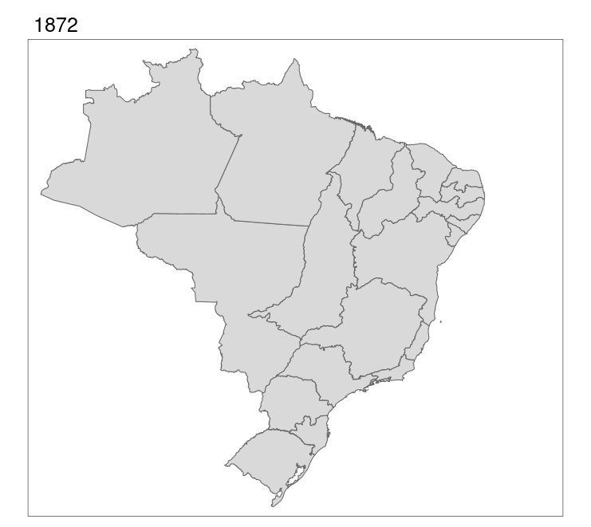

--- 
title: "Introdução ao R com aplicações em biodiversidade e conservação"
author: ""
date: "`r Sys.Date()`"
site: bookdown::bookdown_site
documentclass: book
bibliography: [book.bib, packages.bib]
biblio-style: apalike
link-citations: yes
description: "This is a minimal example of using the bookdown package to write a book. The output format for this example is bookdown::gitbook."
---
--- 
title: "Introdução ao R com aplicações em biodiversidade e conservação"
author: ""
date: "`r Sys.Date()`"
site: bookdown::bookdown_site
documentclass: book
bibliography: [book.bib, packages.bib]
biblio-style: apalike
link-citations: yes
description: "This is a minimal example of using the bookdown package to write a book. The output format for this example is bookdown::gitbook."
---

```{r setup, include=FALSE}
knitr::opts_chunk$set(
	echo = TRUE,
	message = FALSE,
	warning = FALSE
)
```

# Pré-requisitos


<!--chapter:end:index.Rmd-->

# Pré-requisitos


<!--chapter:end:01_pre_requisitos.Rmd-->

# Como usar este livro


<!--chapter:end:02_uso_livro.Rmd-->

# Perguntas em ecologia


<!--chapter:end:03_perguntas_ecologia.Rmd-->


# Introdução à linguagem R

Placeholder


## R e RStudio
## Material de R
## Funcionamento da linguagem R
## Estrutura e manipulação de dados 
### Tipos de objeto (vetor, fator, matriz, data frame, lista, funções)
## Entendendo o arquivo de ajuda, como buscar ajuda
## Instalando e carregando pacotes do CRAN e do GitHub/GitLab
## Importação e exportação de dados 
## tidyverse (readr, readxl, tibble, tidyr, dplyr, stringr, lubridate e purrr?)
## Principais erros de iniciantes e a melhor forma de pedir ajuda
### Procurando e entendendo erros
#### Certifique-se que leu e entendeu a mensagem de erro
#### Certifique-se que instalou e carregou os pacotes das funções que irá utilizar
#### Certifique-se que definiu o diretório correto de onde quer importar ou exportar seus dado
#### Certifique-se que sua planilha está com separação de decimais e colunas corretos
#### Certifique-se que os arquivos que irão ser importados não estão corrompidos
#### Certifique-se que não digitou algum comando errado
#### Certifique-se que a atribuição foi feita corretamente
#### Certifique-se que a Classe do objeto é a mesma requerida pela função
### Tentando resolver seus próprios erros
#### Leia a documentação das funções
#### Faça buscas extensivas no Google e no Stack Overflow
### Idealmente, como pedir ajuda?

<!--chapter:end:04_r_tidyverse.Rmd-->

# Gráficos

<!--chapter:end:05_graficos.Rmd-->


# Estatística básica

Placeholder


## Teste T (de Student) para duas amostras independentes
### Backgorund da análise
#### Exemplo prático 1 - Teste T para duas amostras com variâncias iguais
##### Explicação dos dados
### Análise
#### Exemplo prático 2 - Teste T para duas amostras independentes com variâncias diferentes
##### Explicação dos dados
### Análise
## Teste T para amostras pareadas
### Backgorund da análise
#### Exemplo prático 1 - Teste T para amostras pareadas
##### Explicação dos dados
### Análise
## Correlação de Pearson
### Backgorund da análise
#### Exemplo prático 1 - Correlação de Pearson
##### Explicação dos dados
### Análise
## Regressão Simples
### Backgorund da análise
#### Exemplo prático 1 - Regressão simples
##### Explicação dos dados
### Análise
## Regressão Múltipla
### Backgorund da análise
#### Exemplo prático 1 - Regressão múltipla
##### Explicação dos dados
### Análise
## Análises de Variância (ANOVA)
### Backgorund da análise
## ANOVA de um fator
#### Exemplo prático 1 - Anova de um fator
##### Explicação dos dados
### Análise
## ANOVA de dois fatores ou Anova fatorial
#### Exemplo prático 1 - Anova de dois fatores
##### Explicação dos dados
### Análise
## ANOVA em blocos aleatorizados
#### Exemplo prático 1 - Anova em blocos aleatorizados
##### Explicação dos dados
### Análise
## Análise de covariância (ANCOVA)
#### Exemplo prático 1 - ANCOVA
##### Explicação dos dados
### Análise
### Para se aprofundar

<!--chapter:end:06_analises_univariadas_lm.Rmd-->

# Análises univariadas - GLM


<!--chapter:end:07_analises_univariadas_glm.Rmd-->


# Introdução à Análises Multidimensionais

Placeholder


## Backgorund da análise
## Exemplo 1: 
### Explicação da análise
### Análise
#### Interpretação dos resultados
## Exemplo 2: 
## Backgorund da análise
## Exemplo 1: 
### Explicação da análise
### Análise
## Backgorund da análise
## Exemplo 1: 
### Explicação da análise
### Análise
### Para se aprofundar

<!--chapter:end:08_analises_multivariadas.Rmd-->


# Rarefação

Placeholder


## Background da análise
## Exemplo prático 1 - Morcegos
### Explicação
### Análise
### Interpretação dos resultados
## Exemplo prático 2 - Rarefação
### Explicação
### Análise
### Interpretação dos resultados
## Para se aprofundar

<!--chapter:end:09_rarefacao.Rmd-->


# Estimadores de Riqueza

Placeholder


## Backgorund da análise
## Estimadores baseados na abundância das espécies
### CHAO 1 - (Chao 1984, 1987): 
#### Exemplo prático - Chao 1
##### Explicação dos dados
### Análise
#### Interpretação dos resultados
### ACE - *Abundance-based Coverage Estimador* (Chao & Lee 1992, Chao et al. 2000): 
#### Exemplo prático - ACE
##### Explicação dos dados
### Análise
#### Interpretação dos resultados
## Estimadores baseados na incidência das espécies
### CHAO 2 - (Chao 1987): 
#### Exemplo prático - Chao 2
##### Explicação dos dados
### Análise
#### Interpretação dos resultados
### JACKKNIFE 1 (Burnham & Overton 1978, 1979): 
#### Exemplo prático - Jackknife 1
##### Explicação dos dados
### Análise
#### Interpretação dos resultados
### JACKKNIFE 2 (Burnham & Overton 1978, 1979, Palmer 1991): 
#### Exemplo prático - Jackknife 2
##### Explicação dos dados
### Análise
#### Interpretação dos resultados
### BOOTSTRAP (Smith & van Belle 1984): 
#### Exemplo prático - Bootstrap
##### Explicação dos dados
### Análise
#### Interpretação dos resultados
### Interpolação e Extrapolação baseadas em rarefação usando amostragens de incidência ou abundância (Chao & Jost 2012, Colwell et al. 2012): 
#### Exemplo prático 
##### Explicação dos dados
### Análise
#### Interpretação dos resultados
#### Interpretação dos resultados
### Para se aprofundar

<!--chapter:end:10_riqueza.Rmd-->


# Diversidade Taxonômica

Placeholder


## Diversidade alfa (𝛂)
## Riqueza de espécies ou número de espécies
#### Exemplo prático 1 - Riqueza de espécies
## Diversidade de espécies
#### Exemplo prático 2 - Diversidade de espécies
## Diagramas de Whittaker ou Curva de Dominância
## Números de Hill
## Diversidade beta (𝛃)
### Para se aprofundar

<!--chapter:end:11_diversidade_taxonomica.Rmd-->

# Diversidade filogenética


<!--chapter:end:12_diversidade_filogenetica.Rmd-->

# Diversidade funcional


<!--chapter:end:13_diversidade_funcional.Rmd-->

# Dados geográficos no R #dados-geograficos}

## Introdução

Nesta seção, vamos fazer uma breve introdução aos principais conceitos sobre o funcionamento de dados geográficos no R: formatos de dados vetoriais e pacotes; formatos de dados raster e pacotes; Sistemas de Referências de Coordenadas e unidades; fontes de dados geográficos e pacotes; importar e exportar dados geográficos; descrição de objetos espaciais; reprojeção de dados geográficos; e principais operações com dados geográficos. Num segundo momento, iremos criar mapas com seus principais elementos. Por fim, apresentaremos exemplos de aplicações de análises espaciais para dados ecológicos, focadas em resumir informações sobre a biodiverisdade, preparar de dados para compor variáveis preditoras, e como fazer predições espaciais contínuas de distribuição de uma espécie e riqueza de espécies.

Esse capítulo segue parte da estrutura organizada por @lovelace-etal-2019, principalmente os capítulos 2 a 8, sendo adaptado para atender aos principais requisitos que julgamos necessários a estudos ecológicos. Entretanto, não foi possível cobrir todos os assuntos sobre geoprocessamento, sendo um assunto muito extenso, que requer a leitura de livros especializados na área como Wegmann et al. (2016), Wegmann et al. (2020) e Fletcher & Fortin (2018). Outros livros sobre a análise geoespacial no R podem ser consultados no capítulo [11 - Geospatial](https://www.bigbookofr.com/geospatial.html) do [Big Book of R](https://www.bigbookofr.com/index.html).

Todas as operações serão realizadas através da linguagem R, utilizando principalmente os pacotes: *tidyverse* (Wickham et al. 2019) para o formato tidyverse, *here* (Müller 2020) para diretórios,  *sf* [@pebesma-2018] para dados vetoriais, *raster* [@hijmans-2020] para dados raster, *rgdal* para formatos geoespaciais (Bivand et al. 2021), *rnaturalearth* (South 2017) e *geobr* (Pereira & Goncalves 2020) para baixar dados vetoriais, e *ggplot2* (Wickham 2016), *ggspatial* (Dunnington 2020), *tmap* (Tennekes 2018), *mapview* (Appelhans et al. 2020), *leaflet* (Cheng et al. 2021), e *viridis* [@garnier-2018] para a composição de mapas, dentro outros.

## Pré-requisitos
Dessa forma, garanta que esses pacotes listados a seguir estejam instalados e carregados.

```{r eval=FALSE}
# instalar pacotes
install.packages(c("tidyverse", 
                   "here", 
                   "sf", 
                   "raster", 
                   "rgdal", 
                   "spData",
                   "rnaturalearth",
                   "geobr",
                   "ggplot2",
                   "ggspatial",
                   "tmap",
                   "tmaptools",
                   "grid",
                   "mapview",
                   "leaflet",
                   "viridis"), 
                 dep = TRUE)
```

```{r message=FALSE, warning=FALSE}
# carregar pacotes
library(tidyverse)
library(here)
library(sf) 
library(raster) 
library(rgdal) 
library(spData)
library(rnaturalearth)
library(geobr)
library(ggplot2)
library(ggspatial)
library(tmap)
library(tmaptools)
library(grid)
library(mapview)
library(leaflet)
library(viridis)
```

> **IMPORTANTE**: Se você estiver utilizando MacOS ou Linux, a instalação dos pacotes listados acima pode não funcionar. Esses sistemas operacionais possuem "requisitos específicos do sistema" que são geralmente descritos no `README.md` dos pacotes no GitHub. Entretanto, há várias instruções específicas que podem ser encontradas [on-line](https://rtask.thinkr.fr/installation-of-r-4-0-on-ubuntu-20-04-lts-and-tips-for-spatial-packages/). Além deste link, há posts sobre [Linux](https://geocompr.github.io/post/2020/installing-r-spatial-ubuntu/) e [MacOS](http://www.kyngchaos.com/) que podema auxiliar.

## Vetor

Dados **vetoriais** representam informações geográficas acuradas através de **pontos, linhas e polígonos** (Figura \@ref(fig:fig-vetor-tipos)). Cada uma dessas geometrias são indicadas para representar feições e/ou eventos específicos, como veremos adiante.

```{r fig-vetor-tipos, echo=FALSE, fig.height=4, fig.align='center', fig.cap="Ilustração das geometrias de ponto, linha e polígono genéricos. Adaptado de: Lovelace, Nowosad & Muenchow (2019)."}
old_par = par(mfrow = c(1, 3), pty = "s", mar = c(0, 3, 1, 0))
plot(st_as_sfc(c("POINT(5 5)")), axes = TRUE, pch = 20, cex = 2, main = "Ponto")
plot(st_as_sfc("LINESTRING(1 4, 5 5, 4 1, 2 2)"), lwd = 2, axes = TRUE, main = "Linha")
plot(st_as_sfc("POLYGON((1 4, 2 2, 4 1, 5 5, 1 4))"), col="gray", lwd = 2, axes = TRUE, main = "Polígono")
par(old_par)
```

### Pontos

**Pontos** são geometrias geralmente utilizadas para representar **eventos pontuais unitários**, como ocorrência de espécies, locais de coleta, pontos de GPS ou nascentes de rios. Esses dados são representados por um único vértice, ou seja, um par de coordenadas (longitude - X e latitude - Y), que são plotados na forma de cículos ou outro elemento que represente o evento em questão. Dessa forma, geralmente utilizamos dados tabulares com pelo menos duas colunas contendo essas coordenadas. Além disso, esses dados tabulares podem conter outras colunas com informações quantitativas ou qualitativas como número de espécies, temperatura, precipitação ou ainda categorias como tipo de habitat, que podemos representar nos pontos através de diferentes formatos, tamanhos ou cores desses pontos (Tabela \@ref(tab:tab-vetor-pontos) e Figura \@ref(fig:fig-vetor-pontos)).

```{r tab-vetor-pontos, echo=FALSE}
library(knitr)
kable(tibble::tibble(
  Id = 1:5, 
  Longitude = c(0, 1, 2, 5, 5) ,
  Latitude = c(2, 5, 3, 4, 1),
  `Número de espécies` = c(2, 3, 3, 2, 5),
  Temperatura = c(20, 22, 28, 23, 25),
  Precipitação = c(1000, 1100, 1300, 1200, 1450),
  Habitat = c("floresta", "pastagem", "floresta", "floresta", "pastagem")), 
  caption = "Dados tabulares para pontos."
)
```

```{r fig-vetor-pontos, echo=FALSE, fig.align='center', fig.cap="Geometrias de pontos e suas identificações com a tabela de dados."}
plot(st_as_sfc(c("MULTIPOINT(0 2, 1 5, 2 3, 5 4, 5 1)")), axes = TRUE, pch = 20, cex = 2, xlim = c(0, 5), ylim = c(1, 5), main = "Pontos")
text(x = c(0, 1, 2, 5, 5), 
     y = c(2, 5, 3, 4, 1) - c(rep(.3, 4), -.3), 
     labels = 1:5)
```

### Linhas

**Linhas** representam **geometrias lineares** como estradas, rios, trajetos, divisões ou distâncias. Geralmente as linhas são criadas em softwares de Sistema de Informações Geográficas (SIG) como o [QGIS](https://qgis.org/), e depois importadas para o R. As linhas são representadas por no mínimo dois vértices conectados, i.e., dois pares de coordenadas, gerando uma geometria aberta, possuindo como característica o **comprimento**. Da mesma forma que os pontos, as linhas podem possuir informações tabulares, sendo quantitativas como comprimento dessa feição, ou ainda informações qualitativas como o nome de estradas ou vazão de rios, que podem ser utilizadas para alterar o formato, tamanho ou cor dessas linhas (Tabela \@ref(tab:tab-vetor-linhas) e Figura \@ref(fig:fig-vetor-linhas)).

```{r tab-vetor-linhas, echo=FALSE, results='asis'}
kable(tibble(Id = 1:5, 
             Rodovias = paste0("rodovia_0", 1:5),
             Comprimento = c(12, 52, 5, 38, 18)),
      caption = "Dados tabulares para linhas.",
      align = "c")
```

```{r fig-vetor-linhas, echo=FALSE, fig.align='center', fig.cap="Geometrias de linhas e suas identificações com a tabela de dados."}
plot(st_as_sfc("MULTILINESTRING((1 1, 2 2), (1 3, 5 3), (1 4, 1 5), (3 5, 5 5, 5 4), (3 1, 5 1))"), 
     lwd = 2, axes = TRUE, main = "Linhas")
text(x = c(1.1, 5, 1.2, 5, 5), 
     y = c(1.3, 2.8, 5, 3.8, 1.2), 
     labels = 1:5)
```

### Polígonos

Por fim, **polígonos** representam **geometrias fechadas**, como fragmentos de vegetação, lagos ou limites geográficos, sendo mais voltado para representar feições de um mapa de uso e cobertura da terra ou limites geográficos naturais, políticos, administrativos ou regulares. Os polígonos também são criados geralmente em softwares específicos de SIG e depois importados para o R, ou podemos usar funções para criar *buffers* ou malhas de quadrículas ou hexágonos. Os polígonos são representados por no mínimo três vértices conectados, sendo que o primeiro vértice possui coordenadas idênticas ao último, de modo que essa ligação gere uma feição fechada, com características como **perímetro** e/ou **área**. Da mesma forma que os pontos e linhas, colunas podem ser associadas aos polígonos para representar informações quantitativas como perímetro e área dessa polígono, ou ainda informações qualitativas como a classe de cobertura da terra ou o nome do limite geográfico, que podem ser utilizados para alterar formatos, tamanho ou cores desses polígonos (Tabela \@ref(tab:tab-vetor-poligonos) e Figura \@ref(fig:fig-vetor-poligonos)).

```{r tab-vetor-poligonos, echo=FALSE, results='asis'}
kable(tibble(id = 1:5, 
             uso = c("floresta", "urbano", "pastagem", "agua", "cerrado"),
             area_ha = c(50, 22, 30, 25, 40),
             perimeto_m = c(700, 300, 250, 400, 500)),
      caption = "Dados tabulares para polígonos.",
      align = "c")
```

```{r fig-vetor-poligonos, echo=FALSE, fig.align='center', fig.cap="Geometrias de polígonos e suas identificações com a tabela de dados."}
plot(st_as_sfc("MULTIPOLYGON (((1 5, 2 2, 4 1, 4 4, 1 5)))"),
     axes = TRUE, col = "forestgreen", main = "Polígonos")
plot(st_as_sfc("MULTIPOLYGON (((4 1, 2 1, 2 2, 2 2, 4 1)))"),
     col = "gray", add = TRUE)
plot(st_as_sfc("MULTIPOLYGON (((4 1, 4 5, 5 5, 5 1, 4 1)))"),
     col = "yellow", add = TRUE)
plot(st_as_sfc("MULTIPOLYGON (((4 4, 4 5, 1 5, 4 4)))"),
     col = "steelblue", add = TRUE)
plot(st_as_sfc("MULTIPOLYGON (((0 1, 0 5, 1 5, 2 2, 2 1, 0 1)))"),
     col = "orange", add = TRUE)
text(x = c(2.8, 2.5, 4.5, 3.1, .7), 
     y = c(3, 1.3, 3, 4.7, 3), 
     labels = c("floresta\n(1)", "urbano\n(2)", "pastagem\n(3)", "agua\n(4)", "cerrado\n(5)"))
```

Além disso, geralmente utilizamos **polígono regulares** (buffers, quadrículas ou hexágonos) para **resumir informações** de biodiversidade ou de variáveis preditoras, que podem ser utilizadas como unidades amostrais em análises espaciais ou estatísticas, principalmente nas áreas de Ecologia Espacial, Ecologia da Paisagem, Biogeografia e Macroecologia (Tabela \@ref(tab:tab-vetor-poligonos-regulares) e Figura \@ref(fig:fig-vetor-poligonos-regulares)).

```{r tab-vetor-poligonos-regulares, echo=FALSE}
kable(tibble(id = c(1:5, "..."), 
             numero_especies = c(2, 3, 3, 2, 5, "..."),
             temperatura = c(20, 22, 28, 23, 25, "..."),
             precipitacao = c(1000, 1100, 1300, 1200, 1450, "...")),
      caption = "Dados tabulares.",
      align = "c")
```

```{r fig-vetor-poligonos-regulares, echo=FALSE, fig.height=4, fig.align='center', fig.cap="Polígonos regulares: buffers, quadrículas e hexágonos."}
old_par = par(mfrow = c(1, 3), pty = "s", mar = c(0, 3, 1, 0))

plot(st_as_sfc("MULTIPOINT(1 2, 1 5, 2 3, 4 4, 4 1)"),
     pch = 20, axes = TRUE, xlim = c(0, 5), ylim = c(0, 6), main = "Buffers")
plot(st_as_sfc("MULTIPOINT(1 2, 1 5, 2 3, 4 4, 4 1)") %>% 
       sf::st_as_sf() %>% 
       sf::st_buffer(.5),
     lwd = 2, add = TRUE)
text(x = c(1, 1, 2, 4, 4), 
     y = c(2, 5, 3, 4, 1) + .3, 
     labels = 1:5, col = "gray50")

plot(st_as_sfc("POLYGON((0 0, 0 5, 5 5, 5 0, 0 0))") %>% 
       sf::st_as_sf() %>% 
       sf::st_make_grid(cellsize = 1),
     lwd = 2, axes = TRUE, main = "Quadrículas")
text(x = rep(seq(.5, 4.5, 1), 5), 
     y = rep(seq(.5, 4.5, 1), each = 5), 
     labels = c(21:25, 16:20, 11:15, 6:10, 1:5), col = "gray50")

plot(st_as_sfc("POLYGON((.5 .5, .5 4, 4 4, 4 .5, .5 .5))") %>%
       sf::st_as_sf() %>%
       sf::st_make_grid(cellsize = 1, square = FALSE),
     lwd = 2, axes = TRUE, main = "Hexágonos")
text(x = c(seq(.5, 4.5, 1),
           seq(0, 4, 1),
           seq(.5, 4.5, 1),
           seq(0, 4, 1),
           seq(.5, 4.5, 1),
           seq(0, 4, 1)),
     y = c(rep(0.5, 5),
           rep(1.35, 5),
           rep(2.25, 5),
           rep(3.1, 5),
           rep(3.95, 5),
           rep(4.85, 5)),
     labels = c(26:30, 21:25, 16:20, 11:15, 6:10, 1:5),
     col = "gray50")

par(old_par)
```

### Tabela de atributos

Para os dados vetoriais é necessário ainda destacar um elemento fundamental: a **tabela de atributos**. A tabela de atributos é uma tabela que inclui dados **geográficos** e **dados alfanuméricos**. Os **dados geográficos** são representados por cada feição geolocalizada espacialmente (ponto, linha ou polígono), e os **dados alfanuméricos** são todos os demais dados associados a cada uma dessas feições, representado na forma de colunas (Figuras \@ref(fig:fig-vetor-pontos), \@ref(fig:fig-vetor-linhas), \@ref(fig:fig-vetor-poligonos) e \@ref(fig:fig-vetor-poligonos-regulares)).

Dessa forma, a **tabela de atributos** reúne informações sobre cada feição e pode ser utilizada para realizar de filtros ou agregações dos dados de cada feição. É nessa tabela que podemos ainda concatenar novas informações (colunas) de operações com as feições (linhas da tabela de atributos) como cálculo de comprimento, perímetro, área ou ainda outras operações com as colunas. Também podemos associar outros dados não espaciais aos dados da tabela de atributos com a junção por uma coluna identificadora.

### *sf*: principal pacote no R para dados vetoriais

Atualmente o principal pacote para trabalhar com dados vetoriais no R é o [*sf*](https://r-spatial.github.io/sf/), que implementou o *Simple Feature* no R (Pebesma 2018). Entretanto, outro pacote pode ser tão versátil quanto o *sf*, no caso o [*terra*](https://rspatial.org/terra/index.html), ainda em desenvolvimento.

O pacote *sf* facilitou muito a forma de trabalhar com vetores no R, sendo que as principais vantagens desse pacote são (Lovelace, Nowosad & Muenchow 2019):

-   rápida importação e exportação de dados
-   aprimorado desempenho de plotagem
-   objetos *sf* podem ser tratados como dataframes na maioria das operações
-   funções *sf* podem ser combinadas usando o operador `%>%` e funcionam no formato tidyverse
-   funções *sf* são consistentes e intuitivas (quase sempre começam com prefixo `st_`)

Os tipos de geometrias apresentadas são representadas por diferentes classes: `POINT`, `LINESTRING` e `POLYGON` para apenas uma feição de cada tipo de geometria; `MULTIPOINT`, `MULTILINESTRING` e `MULTIPOLYGON` para várias feições de cada tipo de geometria e; `GEOMETRYCOLLECTION` para várias feições e tipos de geometrias (Figura \@ref(fig:fig-vetor-sf-classes)).

```{r fig-vetor-sf-classes, fig.align='center', fig.cap="Tipos de classes suportadas pelo pacote *sf*. Fonte: Lovelace, Nowosad & Muenchow (2019).", out.width="100%", echo=FALSE}
include_graphics("img/sf-classes.png")
```

O pacote *sf* define um sistema de três classes hierárquicas (Tabela \@ref(tab:tab-vetor-sf-estruturas)):

-   Classe *sfg* - uma geometria única
-   Classe *sfc* - uma coluna de geometria, que é um conjunto de geometrias *sfg* e informações Sistema de Referência de Coordenadas (do inglês *Coordinate Reference Systems- CRS*)
-   Classe *sf* - uma camada, que é uma coluna de geometria *sfc* dentro de um dataframe com atributos não espaciais

```{r sf-estruturas, echo=FALSE}
kable(tibble(Classes = c("`sfg`", "`sfc`", "*sf*"), 
             Hierarquia = c("Geometria", "Coluna de geometria", "Camada"),
             Informação = c("Tipo e coordenadas", "Conjundo de `sfg` + CRS", "`sfc` + atributos")), 
      caption = "Estruturas de dados espaciais no pacote sf. Fonte: [Dorman (2021)](https://michaeldorman.github.io/R-Spatial-Workshop-at-CBS-2021/main.html).")
```

Ao olharmos as informações de um objeto da classe *sf*, podemos notar diversas informações que descrevem o mesmo:

-   *resumo do vetor*: indica o número de feições (linhas) e campos (colunas)
-   *tipo da geometria*: umas das sete classes listadas anteriormente (Figura \@ref(fig:fig-vetor-sf-classes))
-   *dimensão*: número de dimensões, geralmente duas (XY)
-   *bbox (bordas)*: coordenadas mínimas e máximas da longitude e latitude
-   *informação do CRS*: `epsg` ou `proj4string` indicando o CRS
-   *tibble*: tabela de atributos, com destaque para a coluna `geom` ou `geometry` que representa cada feição ou geometria

```{r}
data(world)
world
```

Podemos fazer um mapa simples utilizando a função `plot()` desse objeto. Para facilitar, escolheremos apenas a primeira coluna `[1]` (Figura \@ref(fig:fig-vetor-mundo)).

> IMPORTANTE: faremos mapas mais elaborados na seção xx desse capítulo.

```{r fig-vetor-mundo, fig.align='center', out.width="100%", fig.cap="Mapa vetorial do mundo."}
plot(world[1], col = viridis::viridis(100), main = "Mapa do mundo")
```

## Raster

Os dados no formato **raster** consistem em uma **matriz** (com linhas e colunas) representando **células igualmente espaçadas** (pixels; Figura \@ref(fig:fig-raster)). Esse formato de dado torna a álgebra e o processamento de mapas muito mais eficiente e rápido do que o processamento de dados vetoriais. As células dos dados raster possuem **duas informações**: 1. identificação das células (IDs das células) para especificar sua posição na matriz (Figura \@ref(fig:fig-raster) A) e; 2. valores das células (Figura \@ref(fig:fig-raster) B), que geralmente são coloridos para facilitar a interpretação da variação dos valores no espaço (Figura \@ref(fig:fig-raster) C). Além disso, valores ausentes ou não amostrados são representados por `NA`, ou seja, *not available* (Figura \@ref(fig:fig-raster) B e C).

```{r fig-raster, echo=FALSE, fig.align='center', fig.cap="Raster: (A) IDs das células, (B) valores das células, (C) células coloridas. Adaptado de: Lovelace, Nowosad & Muenchow (2019)."}
library(gridExtra)

# daods
set.seed(42)
small_ras <- raster(matrix(1:16, 4, 4, byrow = TRUE))
small_ras_val <- raster(matrix(sample.int(100, 16), 4, 4, byrow = TRUE))
small_ras_val[c(10, 15)] <- NA
polys <- rasterToPolygons(small_ras, na.rm = FALSE)

# ids das celulas
p_1 <- spplot(small_ras, colorkey = FALSE, col.regions = "white",
              main = "A. IDs das células",
              sp.layout = list(
                list("sp.polygons", polys, first = FALSE),
                list("sp.text", xyFromCell(small_ras_val, 1:ncell(small_ras)),
                     1:ncell(small_ras))
              )
)

# valor das celulas
p_2 <- spplot(small_ras_val, colorkey = FALSE, col.regions = "white",
              main = "B. Valores das céluas",
              sp.layout = list(
                list("sp.polygons", polys, first = FALSE),
                list("sp.text", xyFromCell(small_ras_val,
                                           1:ncell(small_ras_val)),
                     values(small_ras_val))
              )
)

# mapa colorido
p_3 <- spplot(small_ras_val, 
              col.regions = viridis::viridis(16),
              colorkey = FALSE,
              main = "C. Valores coloridos")

grid.arrange(p_1, p_2, p_3, ncol = 3)
```

### Tipos de raster

A **célula ou pixel** de um raster pode conter apenas um **único valor**, que pode ser **contínuo** ou **categórico** (Figura \@ref(fig:fig-raster-cont-cat)). O formato raster geralmente representa **fenômenos contínuos**, como elevação, precipitação, temperatura, ou dados espectrais de imagens de satélite, mas também pode representar **categorias** como tipos de florestas ou cobertura da terra (Figura \@ref(fig:fig-raster-cont-cat)).

```{r fig-raster-cont-cat, echo=FALSE, fig.align='center', fig.cap="Raster: (A) mapa contínuo, (B) mapa categórico. Adaptado de: Lovelace, Nowosad & Muenchow (2019)."}
# dados
set.seed(42)
small_ras_con <- raster(matrix(sample(1:100, 16) + sample(seq(.1, .9, .1), 16, rep = TRUE), 4, 4, byrow = TRUE))
small_ras_cat <- raster(matrix(sample(1:4, 16, rep = TRUE), 4, 4, byrow = TRUE))
polys_con <- rasterToPolygons(small_ras_con, na.rm = FALSE)
polys_cat <- rasterToPolygons(small_ras_cat, na.rm = FALSE)

# mapa continuo
p_1 <- spplot(small_ras_con, 
              col.regions = viridis::viridis(16),
              colorkey = FALSE,
              main = "A. Mapa contínuo",
              sp.layout = list(
                list("sp.polygons", polys_con, first = FALSE),
                list("sp.text", xyFromCell(small_ras_con,
                                           1:ncell(small_ras_con)),
                     values(small_ras_con))))

# mapa categorico
p_2 <- spplot(small_ras_cat, 
              col.regions = RColorBrewer::brewer.pal(name = "Dark2", n = 4),
              colorkey = FALSE,
              main = "B. Mapa categórico",
              sp.layout = list(
                list("sp.polygons", polys_cat, first = FALSE),
                list("sp.text", xyFromCell(small_ras_cat,
                                           1:ncell(small_ras_cat)),
                     values(small_ras_cat))))

grid.arrange(p_1, p_2, ncol = 2)
```

### *raster*: principal pacote no R para dados raster

Atualmente, o principal pacote para trabalhar com dados raster é o [*raster*](https://rspatial.org/raster/index.html) (Hijmans 2020), apesar de existir outros dois em desenvolvimento e já sendo aplicados, como o [*terra*](https://rspatial.org/terra/index.html) e o [*stars*](https://r-spatial.github.io/stars/). O pacote *raster* fornece uma ampla gama de funções para criar, importar, exportar, manipular e processar dados raster no R. O objeto raster pode assumir três classes no R: `RasterLayer`, `RasterStack` e `RasterBrick`.

A classe `RasterLayer` representa apenas uma camada raster. Para criar um raster no R podemos utilizar a função `raster::raster()`. Observando essa classe, podemos notar as seguintes informações:

-   *class*: classe raster do objeto raster
-   *dimensions*: número de linhas, colunas e células
-   *resolution*: largura e altura da célula
-   *extent*: coordenadas mínimas e máximas da longitude e latitude
-   *crs*: Sistema de Referência de Coordenadas (*CRS*)
-   *source*: fonte dos dados (memória ou disco)
-   *names*: nome das camadas
-   *values*: valores máximos e mínimos das células

```{r}
raster_layer <- raster::raster(nrows = 5, ncols = 5, 
                               res = .5,
                               xmn = -61.5, xmx = -59, ymn = -14.5, ymx = -12,
                               vals = sample(1:25, 25, rep = TRUE))
raster_layer
```

Um mapa simples do objeto raster pode ser obtido utilizando a função `plot()`, do próprio pacote *raster* (Figura \@ref(fig:fig-raster-layer)).

```{r fig-raster-layer, fig.align='center', fig.cap="Mapa simples de um `RasterLayer`."}
plot(raster_layer, col = viridis::viridis(n = 25))
```

Além da classe `RasterLayer`, há mais duas classes que trabalham com múltiplas camadas: `RasterBrick` e `RasterStack`. Elas diferem em relação ao número de formatos de arquivo suportados, tipo de representação interna e velocidade de processamento.

A classe `RasterBrick` geralmente corresponde a importação de um único arquivo de imagem de satélite multiespectral (multicamadas) ou a um único objeto com várias camadas na memória. A função `raster::brick()` cria um objeto `RasterBrick`.

```{r}
raster_layer1 <- raster_layer
raster_layer2 <- raster_layer * raster_layer
raster_layer3 <- sqrt(raster_layer)
raster_layer4 <- log10(raster_layer)

raster_brick <- raster::brick(raster_layer1, raster_layer2, raster_layer3, raster_layer4)
raster_brick
```

Ao utilizarmos a função `plot()` do pacote *raster*, podemos visualizar todos os raster contidos no objeto `RasterBrick` (Figura \@ref(fig:fig-raster-brick)).

```{r fig-raster-brick, fig.align='center', fig.cap="Mapas simples de um raster RasterBrick."}
plot(raster_brick, col = viridis::viridis(n = 25))
```

Já a classe `RasterStack` permite conectar vários objetos raster armazenados em arquivos diferentes ou vários objetos na memória. Um `RasterStack` é uma lista de objetos `RasterLayer` com a mesma extensão, resolução e CRS. Uma maneira de criá-lo é com a junção de vários objetos espaciais já existentes no ambiente do R ou listar vários arquivos raster em um diretório armazenado no disco. A função `raster::stack()` cria um objeto `RasterStack`.

Outra diferença é que o tempo de processamento para objetos `RasterBrick` geralmente é menor do que para objetos `RasterStack`. A decisão sobre qual classe `Raster` deve ser usada depende principalmente do caráter dos dados de entrada.

```{r}
raster_layer1 <- raster_layer
raster_layer2 <- raster_layer * raster_layer
raster_layer3 <- sqrt(raster_layer)
raster_layer4 <- log10(raster_layer)

raster_stack <- raster::stack(raster_layer1, raster_layer2, raster_layer3, raster_layer4)
raster_stack
```

Da mesma forma, ao utilizar a função `plot()` do pacote *raster*, podemos visualizar todos os raster contidos no objeto `RasterStack` (Figura \@ref(fig:fig-raster-stack)).

```{r fig-raster-stack, fig.align='center', fig.cap="Mapas simples de um raster RasterStack."}
plot(raster_stack, col = viridis::viridis(n = 25))
```

## Sistema de Referência de Coordenadas e Unidades

Os dados geográficos (vetor e raster) possuem ainda um outro componente fundamental, que é o **Sistema de Referência de Coordenadas**, ou do inglês *Coordinate Reference System (CRS)*. Esse componente define como os elementos espaciais (vetor e raster) representam uma feição na superfície da Terra. Esse componente é composto por dois principais conceitos: primeiro, que tipo de unidades estão sendo utilizadas para a representação geográfica, podendo assumir dois tipos - **ângulos ou metros**, que definem o **Sistema de Coordenadas Geográficas** e o **Sistema de Coordenadas Projetadas**, respectivamente. O segundo componente é o **datum**, que é a relação do sistema de coordenadas com a superfície da Terra. Esse último componente faz parte de uma área da **Cartografia** denominada **Geodésia** que estuda a forma e dimensões da Terra, campo gravitacional, e a localização de pontos fixos e sistemas de coordenadas. O livro de Lapaine et al. (2017) é um excelente material para se aprofundar nesse assunto.

### Sistema de Referência de Coordenadas Geográficas

O **Sistema de Referência de Coordenadas Geográficas** utiliza ângulos para representar feições na superfície da Terra através de dois valores: longitude e latitude. A longitude localiza-se na direção Leste-Oeste e a latitude localiza-se na direção Norte-Sul. Nesse sistema, a superfície da Terra geralmente é representada por uma superfície elipsoidal, pois a Terra é ligeiramente achatada nos polos.

### Sistema de Referência de Coordenadas Projetadas

O **Sistema de Referência de Coordenadas Projetadas** utiliza um Sistema Cartesiano de Coordenadas em uma superfície plana. Dessa forma, à partir de uma origem, traçam-se eixos x e y, e uma unidade linear como o **metro** é utilizada. Todos as projeções feitas de sistemas geográficos convertem uma superfície tridimensional em uma superfície plana bidimensional. Sendo assim, essa conversão trás consigo algum tipo de distorção em relação à porção real, como área, direção, distância ou formato, de modo que um sistema de coordenadas projetadas pode preservar somente uma ou duas dessas propriedades.

Existem três grandes grupos de projeções: cilíndricos, cônicos e planares. Na **projeção cilíndrica**, a superfície da Terra é mapeada em um **cilindro**, sendo também criada tocando a superfície da Terra ao longo de uma ou duas linhas de tangência, sendo utilizada com mais frequência para mapear todo o globo, tendo como exemplo mais conhecido a **Projeção Universal Transversa de Mercator (UTM)**. Na **projeção cônica**, a superfície da Terra é projetada em um **cone** ao longo de uma linha ou duas linhas de tangência, de modo que as distorções são minimizadas ao longo das linhas e aumentam com a distância das mesmas, sendo portanto, mais adequada para mapear áreas de latitudes médias, tendo como exemplo mais conhecido a **Projeção Cônica Equivalente de Albers** e a **Projeção Cônica Conforme de Lambert**. E na **projeção plana**, também denominada **Projeção azimutal**, o mapeamento toca o globo em um ponto ou ao longo de uma linha de tangência, sendo normalmente usado no mapeamento de regiões polares, sendo a mais comum a **Projeção Azimutal Equidistante**, a mesma utilizada na bandeira da ONU.

### Datum

Como dito anteriormente, o **datum** é a relação do sistema de coordenadas com a superfície da Terra. Ele representa o ponto de intersecção do elipsoide de referência com a supercie da Terra e o geoide (forma verdadeira da Terra), compensando as diferenças do campo gravitacional da Terra. Existem dois tipos de datum - local e geocêntrico. Em um **datum local**, como o **SAD69 - South American Datum 1969**, o elipsoide de referência é deslocado para se alinhar com a superfície em um determinado local na América do Sul. Já em um **datum geocêntrico**, como **WGS84 - World Geodetic System 1984**, o centro do elipsoide é o centro de gravidade da Terra e a precisão das projeções não é otimizada para um local específico do globo.

No Brasil, desde 2015, o [Instituto Brasileiro de Geografia e Estatística (IBGE)](https://www.ibge.gov.br/) adotou utilizar o datum **SIRGAS2000 - Sistema de Referencia Geocéntrico para las Américas 2000** para todos os mapeamentos realizados no Brasil, um esforço conjunto para adotar o mesmo datum em toda a América. Mais sobre esse datum pode ser lido aqui: [SIRGAS2000](http://www.sirgas.org/pt/sirgas-realizations/sirgas2000/).

### Sistema de Referência de Coordenadas (CRS) no R

No R, há duas formas principais de representar um **Sistema de Referência de Coordenadas**: 1. código `epsg` e 2. `proj4string`. O código EPSG (*European Petroleum Survey Group*) é uma sequência de números curta, referindo-se apenas a um CRS. O site [epsg.io](http://epsg.io/) permite consultar diversas informações sobre um código, como procurar por um código, representação de mapas e fazer transformações de CRS.

Já `proj4string` permite mais flexibilidade para especificar diferentes parâmetros, como o tipo de projeção, datum e elipsóide. Dessa forma, é possível especificar muitas projeções, ou mesmo modificar as projeções existentes, tornando a representação `proj4string` mais complexa e flexível.

Além disso, ainda é possível consultar uma extensa lista de CRSs no site [spatialreference.org](https://spatialreference.org/), que fornece descrições em diversis formatos, baseados em GDAL e Proj.4. Essa abordagem permite consultar uma URL que pode produzir uma referência espacial em um formato que seu software SIG ou o R pode utilizar como referência.

Os pacotes espaciais no R suportam uma ampla variedade de CRSs e usam a biblioteca [PROJ](https://proj.org/index.html#). A função `rgdal::make_EPSG()` retorna um data frame das projeções disponíveis, com informações dos códigos `epsg` e `proj4string` numa mesma tabela, facilitando a busca e uso de CRSs (\@ref(tab-crs)).

```{r eval=FALSE}
crs_data <- rgdal::make_EPSG()
head(crs_data)
```

```{r echo=FALSE}
kable(head(rgdal::make_EPSG()),
      caption = "Listagem inicial das projeções disponíveis no R, com informações dos códigos `epsg` e `proj4string`")
```

## Principais fontes de dados geográficos

Há muitas fontes de dados geográficos em diferentes bases de dados. Geralmente as bases de dados são disponibilizados separadamente em apenas dados vetoriais e apenas dados raster. Para dados vetoriais, grande parte dos dados disponibilizados são utilizados em mapas como limites políticos, limites de biomas ou distribuição de espécies para **polígonos**; estradas e rios para **dados lineares**, ou ainda pontos de ocorrência de espécies ou comunidades, ou medidas tomadas em campo sobre condições naturais como clima ou relevo, como **pontos**. Entretanto, é sempre recomendado o uso de **bases oficiais**, principalmente em relação à dados vetoriais de **limites políticos**. Para tanto, é sempre fundamental buscar as **bases oficiais de cada país**, entrentanto, há bases que podem ser utilizadas globalmente, como veremos.

Sobre as bases de dados raster, há uma infinidade de dados para diferentes objetivos, mas grande parte deles são relativos à condições ambientais, representando uma variável de interesse de forma contínua no espaço, como temperatura, precipitação, elevação, etc.

Existe uma compilação de dados geográficos vetoriais e raster compilada por Marcus Vinícius Alves de Carvalho e Angelica Carvalho Di Maio, chamada [GeoLISTA](http://www.clickgeo.com.br/wp-content/uploads/2018/05/GeoLISTA.pdf). Entretanto, como as bases de dados tendem à ser muito dinâmicas, é possível que muitas bases tenham surgido e desaparecido desde a listagem realizada.

Além das bases de dados, há pacotes específicos no R que fazem o download dos dados vetoriais e matriciais, facilitando a aquisição e reprodutibilidade. Para conferir uma listagem completa de pacotes para diversas análises espaciais, veja [CRAN Task View: Analysis of Spatial Data](https://cran.r-project.org/web/views/Spatial.html).

### Vetor

Dentre as bases vetoriais, destacamos as seguintes na Tabela \@ref(tab:tab-vetor-bases):

```{r tab-vetor-bases, echo=FALSE}
knitr::kable(tibble(
  `Bases de dados` = c("[IBGE](https://www.ibge.gov.br/geociencias/downloads-geociencias.html)",
                       "[FBDS](http://geo.fbds.org.br/)",
                       "[GeoBank](http://geosgb.cprm.gov.br/)",
                       "[Pastagem.org](http://maps.lapig.iesa.ufg.br)",
                       "[CanaSat](http://www.dsr.inpe.br/laf/canasat/)",
                       "[CSR Maps](http://maps.csr.ufmg.br)",
                       "[Ecoregions](https://ecoregions2017.appspot.com/)",
                       "[UN Biodiversity Lab](https://www.unbiodiversitylab.org/)",
                       "[Biodiversity Hotspots](https://zenodo.org/record/3261807#.YA8lpPv0nOY)",
                       "[IUCN Red List of Threatened Species](https://www.iucnredlist.org/resources/spatial-data-download)",
                       "[Map of Life (MOL)](https://mol.org/)",
                       "[Key Biodiversity Areas](http://www.keybiodiversityareas.org/kba-data/request)",
                       "[HydroSHEDS](https://www.hydrosheds.org/)",
                       "[Global Roads Inventory Project (GRIP)](https://www.globio.info/download-grip-dataset)",
                       "[Database of Global Administrative Areas (GADM)](https://gadm.org/)",
                       "[Natural Earth](https://www.naturaleatoriorthdata.com/)",
                       "[Protected Planet](https://www.protectedplanet.net)", 
                       "[Global Biological Information Facility (GBIF)](http://www.gbif.org)",
                       "[Species Link](http://www.splink.cria.org.br)",
                       "[Global Invasive Species Information Network (GISIN)](http://www.gisin.org)"),
  Descrição = c("Limites territoriais e censitários do Brasil", 
                "Uso da terra, APP e hidrografia - Mata Atlântica e Cerrado", 
                "Dados geológicos do Brasil",
                "Dados de pastagens e gado para o Brasil",
                "Dados de cana-de-açúcar para o Brasil",
                "Diversos dados vetoriais e raster para o Brasil",
                "Dados de biorregiões e biomas do mundo",
                "Diversas bases de dados para o mundo",
                "Dados dos limites dos Hotspots de Biodiversidade",
                "Dados dos limites das distribuições das espécies para o mundo",
                "Dados da distribuição de espécies e outros dados para o mundo",
                "Dados dos limites das Key Biodiversity Areas",
                "Informações hidrológicas do mundo",
                "Dados de estradas do mundo todo",
                "Limites de áreas administrativas do mundo",
                "Diversos limites para o mundo",
                "Limites de áreas protegidas para o mundo",
                "Dados de ocorrências de espécies para o mundo",
                "Dados de ocorrências de espécies para o Brasil",
                "Dados de ocorrências de espécies invasoras para o Mundo")
), 
caption = "Principais bases de dados vetoriais para o Brasil e o Mundo.",
booktabs = TRUE)
```

### Raster

Dentre as bases raster, destacamos as seguintes na Tabela \@ref(tab:tab-raster-bases):

```{r tab-raster-bases, echo=FALSE}
knitr::kable(tibble(
  `Bases de dados` = c("[MapBiomas](https://mapbiomas.org/)",
                       "[Bahlu](ftp://madeira.dea.ufv.br/bdados/bhalu/)",
                       "[USGS](https://www.usgs.gov/)",
                       "[SRTM](http://srtm.csi.cgiar.org/)",
                       "[Geoservice Maps](https://geoservice.dlr.de/web/maps)",
                       "[Global Forest Watch](https://www.globalforestwatch.org/)",
                       "[GlobCover](http://due.esrin.esa.int/page_globcover.php)",
                       "[Landcover](https://www.earthenv.org/landcover)",
                       "[Global Human Footprint](https://wcshumanfootprint.org/)",
                       "[GHSL - Global Human Settlement Layer](https://ghsl.jrc.ec.europa.eu/download.php)",
                       "[Land-Use Harmonization (LUH2)](https://luh.umd.edu/)",
                       "[ESA Climate Change Initiative](https://climate.esa.int/en/odp/#/dashboard)",
                       "[WorldClim](https://www.worldclim.org/)",
                       "[CHELSA](https://chelsa-climate.org/)",
                       "[EarthEnv](https://www.earthenv.org/)",
                       "[SoilGrids](https://soilgrids.org/)",
                       "[Global Wetlands](https://www2.cifor.org/global-wetlands/)",
                       "[Global Surface Water Explorer](https://global-surface-water.appspot.com/#)",
                       "[MARSPEC](http://www.marspec.org/)",
                       "[Bio-ORACLE](http://www.oracle.ugent.be/)"), 
  Descrição = c("Uso e cobertura da terra para o Brasil, Panamazonia Legal e Chaco, de 1985 a 2019", 
                "Distribuições históricas de terras agrícolas e pastagens para todo o Brasil de 1940 a 2012", 
                "Dados de diversos satélites livres para o mundo",
                "Dados de elevação para o mundo",
                "Dados de elevação e florestas para o mundo",
                "Dados de florestas para o mundo",
                "Dados de uso e cobertura da terra para todo o planeta",
                "Dados de uso e cobertura da terra para todo o planeta",
                "Dados de pegada ecológica para o mundo",
                "Dados e ferramentas abertos e gratuitos para avaliar a presença humana no planeta",
                "Dados atuais e previsões de uso da terra",
                "Arquivos globais de observação da Terra nos últimos 30 anos da Agência Espacial Europeia (ESA)",
                "Dados climáticos para o mundo",
                "Dados climáticos para o mundo",
                "Dados de cobertura da terra, nuvens, relevo e hidrografia",
                "Dados de solo para o mundo",
                "Dados de áreas úmidas para o mundo",
                "Dados de águas superficiais para o mundo",
                "Dados de condições do oceano para o mundo",
                "Dados de condições do oceano para o mundo")), 
  caption = "Principais bases de dados raster para o Brasil e o Mundo.",
  booktabs = TRUE
)
```

### Pacotes do R

Dentre os pacotes, destacamos os seguintes na Tabela \@ref(tab:tab-packages-bases):

```{r tab-packages-bases, echo=FALSE}
knitr::kable(tibble(
  Pacotes = c("[geobr](https://cran.r-project.org/web/packages/geobr/index.html)",
              "[rnaturalearth](https://cran.r-project.org/web/packages/rnaturalearth/index.html)",
              "[rworldmap](https://cran.r-project.org/web/packages/rworldmap/index.html)",
              "[spData](https://cran.r-project.org/web/packages/spData/index.html)",
              "[OpenStreetMap](https://cran.r-project.org/web/packages/OpenStreetMap/index.html)",
              "[osmdata](https://cran.r-project.org/web/packages/osmdata/index.html)",
              "[geonames](https://cran.r-project.org/web/packages/geonames/index.html)",
              "[rgbif](https://cran.r-project.org/web/packages/rgbif/index.html)",
              "[maptools](https://cran.r-project.org/web/packages/maptools/index.html)",
              "[marmap](https://cran.r-project.org/web/packages/marmap/index.html)",
              "[oce](https://cran.r-project.org/web/packages/oce/index.html)",
              "[envirem](https://cran.r-project.org/web/packages/envirem/index.html)",
              "[sdmpredictors](https://cran.r-project.org/web/packages/sdmpredictors/index.html)",
              "[metScanR](https://cran.r-project.org/web/packages/metScanR/index.html)",
              "[ClimDown](https://cran.r-project.org/web/packages/ClimDown/index.html)",
              "[rWBclimate](https://cran.r-project.org/web/packages/rWBclimate/index.html)",
              "[rnoaa](https://cran.r-project.org/web/packages/rnoaa/index.html)",
              "[RNCEP](https://cran.r-project.org/web/packages/RNCEP/index.html)",
              "[smapr](https://cran.r-project.org/web/packages/smapr/index.html)"), 
  Descrição = c("Carrega Shapefiles de Conjuntos de Dados Espaciais Oficiais do Brasil", 
                "Dados do mapa mundial da Natural Earth", 
                "Mapeando Dados Globais",
                "Conjuntos de dados para análise espacial",
                "Acesso para abrir imagens raster de mapas de ruas",
                "Baixe e importe dados do OpenStreetMap",
                "Interface para o serviço da Web de consulta espacial 'Geonames'",
                "Interface para o Global 'Biodiversity' Information Facility API",
                "Ferramentas para lidar com objetos espaciais",
                "Importar, traçar e analisar dados batimétricos e topográficos",
                "Fonte e processamento de dados oceanográficos",
                "Geração de Variáveis ENVIREM",
                "Conjuntos de dados preditor de modelagem de distribuição de espécies",
                "Encontre, Mapeie e Colete Dados e Metadados Ambientais",
                "Biblioteca de redução de escala do clima para a produção diária do modelo climático",
                "Acessa dados climáticos do Banco Mundial",
                "Dados meteorológicos 'NOAA' de R",
                "Obtenha, organize e visualize dados meteorológicos NCEP",
                "Aquisição e processamento de dados ativos-passivos (SMAP) de umidade do solo da NASA")
), 
caption = "Principais pacotes para download de dados vetoriais e raster.",
booktabs = TRUE)
```

## Importar e exportar dados geográficos

Agora que sabemos o que são dados geográficos e em quais bases de dados podemos buscar e baixar esses dados, veremos quais os principais formatos e como importá-los e exportá-los do R.

### Principais formatos de arquivos geográficos

Há diversos formatos de arquivos geográficos, alguns específicos para dados vetoriais e raster, e outros no formato de banco de dados geoespaciais, como [PostGIS](https://postgis.net/), que podem armazenar ambos.

Entretanto, todos os formatos para serem importados para o R usaram do [GDAL (*Geospatial Data Abstraction Library*)](https://gdal.org/), uma interface unificada para leitura e gravação de diversos arquivos geográficos, sendo utilizado também por uma séria de softwares de GIS como QGIS, GRASS GIS e ArcGIS.

Dentre esses formatos, destacamos na Tabela \@ref(tab:tab-formatos):
```{r tab-formatos, echo=FALSE}
knitr::kable(tibble(
  Nome = c("ESRI Shapefile", "GeoJSON", "KML", "GPX", "GeoTIFF", "Arc ASCII", "NetCDF", "BIL", "R-raster", "SQLite/SpatiaLite", "ESRI FileGDB", "GeoPackage"), 
  Extenção = c(".shp (arquivo principal)", ".geojson", ".kml", ".gpx", ".tif/.tiff", ".asc", ".nc", ".bil/.hdr", ".gri/ .grd", ".sqlite", ".gdb", ".gpkg"),
  Descrição = c("Formato popular que consiste em pelo menos quatro arquivos: .shp (feição), .dbf (tabela de atributos), .shx (ligação entre .shp e .dbf) e .prj (projeção)", "Estende o formato de troca JSON incluindo um subconjunto da representação de recurso simples", "Formato baseado em XML para visualização espacial, desenvolvido para uso com o Google Earth. O arquivo KML compactado forma o formato KMZ", "Esquema XML criado para troca de dados de GPS", "Formato raster popular. Um arquivo TIFF contendo metadados espaciais adicionais.", "Formato de texto em que as primeiras seis linhas representam o cabeçalho raster, seguido pelos valores das células raster organizadas em linhas e colunas", "NetCDF (Network Common Data Form) é um conjunto de bibliotecas de software e formatos de dados independentes para criação", "BIL (Banda intercalada por linha) são métodos comuns de organização para imagens multibanda, geralmente acompanhados por um arquivo .hdr, descrevendo atributos específicos da imagem", "Formato raster nativo do raster do pacote R", "Banco de dados relacional autônomo", "Objetos espaciais e não espaciais criados pelo ArcGIS. Permite: várias classes de recursos; topologia", "Contêiner de banco de dados leve baseado em SQLite permitindo uma troca fácil e independente de plataforma de geodados"),
  Tipo = c("Vetor", "Vetor", "Vetor", "Vetor", "Raster", "Raster", "Raster", "Raster", "Raster", "Vetor e raster", "Vetor e raster", "Vetor e raster"),
  Modelo = c("Parcialmente aberto", "Aberto", "Aberto", "Aberto", "Aberto", "Aberto", "Aberto", "Aberto", "Aberto", "Aberto", "Proprietário", "Aberto")), 
  caption = "Principais formatos de arquivos geográficos. Adaptado de: Lovelace, Nowosad & Muenchow (2019).",
  
)
```

O formato mais comum para arquivos vetoriais é o [**ESRI Shapefile**](https://doc.arcgis.com/en/arcgis-online/reference/shapefiles.htm), e para arquivos raster é o [**GeoTIFF**](https://gdal.org/drivers/raster/gtiff.html), e para dados climáticos em múltiplas camadas, geralmente há a disponibilização de dados no formato [**NetCDF**](https://www.unidata.ucar.edu/software/netcdf/). Entretanto, recentemente tivemos o surgimento do [**GeoPackage**](https://www.geopackage.org/), que possui diversas vantagens em relação aos formatos anteriores, podendo armazanar em apenas um arquivo, dados no formato vetorial, raster e também dados não-espaciais, além de possuir uma grande integração com diversos softwares e bancos de dados.

### Importar dados

As principais funções para importar dados no R são: 1) para vetores a função `sf::st_read()`, e 2) para raster a função `raster::raster()` e suas variações `raster::brick()` e `raster::stack()`. Essas funções atribuem objetos ao seu espaço de trabalho, armazenando-os na memória RAM disponível em seu hardware, sendo essa a maior limitação para trabalhar com dados geográficos no R. Por exemplo, se um arquivo raster possui mais de 8 Gb de tamamho, e seu computador possui extamente 8 Gb de RAM, é muito provável que ele não seja importado ou mesmo criado como um objeto dentro do ambiente R. Existem soluções para esses problemas, mas não as abordaremos nesse capítulo.

#### Vetor

Como vimos, os arquivos vetoriais são disponibilizados em diversos formatos. Para sabermos se um determinado formato pode ser importado ou exportado utilizando o pacote *sf*, podemos utilizar a função `sf::st_drivers()`. Uma amostra desses formatos é apresentado na Tabela \@ref(tab:tab-vetor-formatos):

```{r eval=FALSE}
head(sf::st_drivers())
```

```{r tab-vetor-formatos, echo=FALSE}
da <- head(st_drivers())
rownames(da) <- NULL
kable(da,
      caption = "Alguns formatos vetoriais importados e exportados pelo pacote *sf*.")
```

##### Importar dados vetoriais existentes

Para importar vetores no R iremos utilizar a função `sf::st_read()`. A estrutura é semelhante para todos os formatos descritos na Tabela \@ref(tab:tab-vetor-formatos), de modo que sempre preencheremos o argumento **dsn** (*data source name*) com o nome do arquivo a ser importado. Entretanto, para banco de dados, como **GeoPackage**, pode ser necessário especificar a camada que se tem interesse com um segundo argumento na função `sf::st_read()`, chamado **layer**, com o nome da camada.

Para todas as operações nesse livro usaremos os dados disponíveis para o município de Rio Claro/SP. Primeiramente, iremos baixar esses dados da [FBDS (Fundação Brasileira para o Desenvolvimento Sustentável)](https://www.fbds.org.br/), através desse [repositório de dados](http://geo.fbds.org.br/). Em 2015, a FBDS deu início ao **Projeto de Mapeamento em Alta Resoluçăo dos Biomas Brasileiros**, mapeando a cobertura da terra, hidrografia (nascentes, rios e lagos) e áreas de preservaçăo permanente (APPs). O mapeamento foi concluído para os municípios dos biomas Mata Atlântica e Cerrado. Para fazer o download dos arquivos de interesse, utilizaremos o R.

Primeiramente, iremos criar um diretório.

```{r eval=FALSE}
# criar um diretorio
dir.create(here::here("dados"))
dir.create(here::here("dados", "vetor"))
```

Em seguida, vamos fazer o download de pontos de nascentes, linhas de hidrografia e polígonos de cobertura da terra para o município de Rio Claro/SP.

```{r eval=FALSE}
# aumentar o tempo de download
options(timeout = 600)

# download
for(i in c(".dbf", ".prj", ".shp", ".shx")){
  
  # pontos de nascentes
  download.file(
    url = paste0("http://geo.fbds.org.br/SP/RIO_CLARO/HIDROGRAFIA/SP_3543907_NASCENTES", i),
    destfile = here::here("dados", "vetor", paste0("SP_3543907_NASCENTES", i)), mode = "wb")
  
  # linhas de hidrografia
  download.file(
    url = paste0("http://geo.fbds.org.br/SP/RIO_CLARO/HIDROGRAFIA/SP_3543907_RIOS_SIMPLES", i),
    destfile = here::here("dados", "vetor", paste0("SP_3543907_RIOS_SIMPLES", i)), mode = "wb")
  
  # poligonos de cobertura da terra
  download.file(
    url = paste0("http://geo.fbds.org.br/SP/RIO_CLARO/USO/SP_3543907_USO", i),
    destfile = here::here("dados", "vetor", paste0("SP_3543907_USO", i)), mode = "wb")
}
```

Agora podemos importar esses dados para o R. Primeiro vamos importar as nascentes (Figura \@ref(fig:fig-vetor-nascentes)).

```{r}
# importar pontos
rc_nas <- sf::st_read(here::here("dados", "vetor", "SP_3543907_NASCENTES.shp"), quiet = TRUE)
```

```{r fig-vetor-nascentes, fig.align='center', fig.cap="Mapa de nascentes de Rio Claro/SP."}
plot(rc_nas[1], pch = 20, col = "blue", main = NA, axes = TRUE, graticule = TRUE)
```

Agora vamos importar a hidrografia (Figura \@ref(fig:fig-vetor-hidrografia)).

```{r}
# importar hidrografia
rc_hid <- sf::st_read(here::here("dados", "vetor", "SP_3543907_RIOS_SIMPLES.shp"), quiet = TRUE)
```

```{r fig-vetor-hidrografia, fig.align='center', fig.cap="Mapa de hidrografia de Rio Claro/SP."}
plot(rc_hid[1], col = "steelblue", main = NA, axes = TRUE, graticule = TRUE)
```

E por fim, vamos importar a cobertura da terra (Figura \@ref(fig:fig-vetor-cobertura)).

```{r}
# importar cobertura
rc_cob <- sf::st_read(here::here("dados", "vetor", "SP_3543907_USO.shp"), quiet = TRUE)
```

```{r fig-vetor-cobertura, fig.align='center', fig.cap="Mapa de cobertura da terra de Rio Claro/SP."}
plot(rc_cob[5], col = c("blue", "orange", "gray30", "forestgreen", "green"), main = NA, axes = TRUE, graticule = TRUE)
```

##### Importar utilizando pacotes

Além de bases de dados, podemos importar dados de pacotes, como listado anteriormente na Tabela \@ref(tab:tab-packages-bases). Para o Brasil, o pacote mais interessante trata-se do [`geobr`](https://ipeagit.github.io/geobr/), do [Instituto de Pesquisa Econômica Aplicada (IPEA)](https://www.ipea.gov.br/portal/), que possui dados oficiais do [Instituto Brasileiro de Geografia e Estatística (IBGE))](https://www.ibge.gov.br/).

É possível listar todos os dados disponíveis no pacote através da função `geobr::list_geobr()`. Na Tabale \@ref(tab:tab-vetor-dados-geobr) é possível ver alguns dados.

```{r eval=FALSE}
# listar todos os dados do geobr
geobr::list_geobr()
```

```{r tab-vetor-dados-geobr, echo=FALSE}
knitr::kable(head(geobr::list_geobr()),
             caption = "Alguns dados disponíveis no pacote *geobr*.")
```

Como exemplo, vamos fazer o download o limite do município de Rio Claro/SP (Figura \@ref(fig:fig-vetor-rio-claro)).

```{r}
# rio claro
rc_2019 <- geobr::read_municipality(code_muni = 3543907, year = 2019, showProgress = FALSE)
```

```{r fig-vetor-rio-claro, fig.align='center', fig.cap="Mapa do limite do município de Rio Claro/SP."}
plot(rc_2019[1], col = "gray", main = NA, axes = TRUE, graticule = TRUE)
```

Já para o mundo, o pacote mais interessante trata-se do [`rnaturalearth`](https://docs.ropensci.org/rnaturalearth/), que faz o download de dados do [Natural Earth](https://www.naturaleatoriorthdata.com/). Vamos fazer o download do limite do Brasil (Figura \@ref(fig:fig-vetor-brasil)).

```{r}
# brasil
br <- rnaturalearth::ne_countries(scale = "large", country = "Brazil", returnclass = "sf")
```

```{r fig-vetor-brasil, fig.align='center', fig.cap="Mapa do limite do Brasil."}
plot(br[1], col = "gray", main = NA, axes = TRUE, graticule = TRUE)
```

##### Criar um objeto espacial de uma tabela de coordenadas

É muito comum em coletas de campo ou fontes de dados, disponibilizar **coordendas de locais de estudo** ou de **ocorrências de espécies**. Essas tabelas devem possuir duas colunas, uma para longitude e outra para latitude. Ao importá-las para o R, o formato que assumem pode ser de uma das classes: `matrix`, `dataframe` ou `tibble`, ou seja, ainda não são da classe *sf*. Nesta seção iremos ver como fazer essa conversão.

Para tanto, vamos usar os dados de comunidades de anfíbios da Mata Atlântica (Atlantic Amphibians, Vancine et al. 2018). Iremos fazer o download diretamente do site da fonte dos dados. Antes vamos criar um diretório.

```{r eval=FALSE}
# criar um diretorio
dir.create(here::here("dados", "tabelas"))
```

Em seguida, vamos fazer o download de um arquivo `.zip` e fazer o `unzip` nesse mesmo diretório, utilizando funções nativas do R.

```{r eval=FALSE}
# download
download.file(url = "https://esajournals.onlinelibrary.wiley.com/action/downloadSupplement?doi=10.1002%2Fecy.2392&file=ecy2392-sup-0001-DataS1.zip",
              destfile = here::here("dados", "tabelas", "atlantic_amphibians.zip"), mode = "wb")

# unzip
unzip(zipfile = here::here("dados", "tabelas", "atlantic_amphibians.zip"),
      exdir = here::here("dados", "tabelas"))
```

Agora iremos importar a tabela de dados para criar o objeto espacial.

```{r}
# importar tabela de locais
aa_lo <- readr::read_csv(here::here("dados", "tabelas", "ATLANTIC_AMPHIBIANS_sites.csv"))
aa_lo
```

Por fim, podemos facilmente criar um objeto espacial do tipo `MULTIPOINT` utilizando a função `sf::st_as_sf()`. Podemos ver essas coordenadas plotadas no mapa simples da Figura \@ref(fig:fig-vetor-pontos-atlantic-amphibians). É necessário antes se ater primeiramente ao argumento **coords** que deve indicar as colunas de longitude e latitude, nessa ordem; e também ao argumento **crs** para indicar o CRS correspondente dessas coordendas, que aqui sabemos que as coordenadas são geográficas e com Datum WGS84. Então podemos facilmente utilizar o código EPSG 4326 para tanto. Entretanto, se as coordenadas estiverem em metros por exemplo, teremos de nos ater à qual CRS as mesmas foram coletadas, ou seja, se são coordenadas de GPS, é preciso saber como o GPS estava configurado (Datum) e à qual zona UTM as coordenadas pertencem para definir o código EPSG correto.

```{r}
# convert para sf
aa_lo_ve <- aa_lo %>% 
  sf::st_as_sf(coords = c("longitude", "latitude"), crs = 4326)
aa_lo_ve
```

```{r fig-vetor-pontos-atlantic-amphibians, fig.align='center', fig.cap="Mapa das coordenadas do Atlantic Amphinians."}
plot(aa_lo_ve[1], pch = 20, col = "black", main = NA, axes = TRUE, graticule = TRUE)
```

##### Converter dados espaciais *sp* para *sf*

O pacote *sf* é mais recente e mais fácil de manipular objetos vetoriais no R, como vimos. Seu predecessor, o pacote *sp* possui uma classe própria e homônima. Entretanto, muito pacotes de análises espaciais ainda utilizam essa classe em suas funções, apesar dessa migração ter ocorrido recentemente. Dessa forma, a conversão entre essas classes pode ser necessária em alguns momentos.

Abaixo, veremos como podemos fazer essa conversão facilmente. Primeiramente, vamos importar um dados *sp*.

```{r}
# paises sp
co110_sp <- rnaturalearth::countries110
class(co110_sp)
```

Agora, podemos converter facilmente com a função `sf::st_as_sf()`.

```{r}
# paises sf
co110_sf <- sf::st_as_sf(co110_sp)
class(co110_sf)
```

Podemo facilmente converter esse objeto novamente para a classe *sp* com a função `sf::as_Spatial`.

```{r}
# paises sp
co110_sp <- sf::as_Spatial(co110_sf)
class(co110_sp)
```

#### Raster

Para importar dados raster no R iremos utilizar a função `raster::raster()`, `raster::brick()` ou `raster::stack()`. Para apenas uma camada raster, usaremos a função `raster::raster()`, com o argumento **x** sendo o nome do arquivo. Já para mais camadas, usaremos `raster::brick()` para um arquivo que possua múltiplas camadas, ou ainda a função `raster::stack()` para várias arquivos em diferentes camadas também no argumento **x**, sendo necessário listar os arquivos no diretório, geralmente utilizando a função `dir()` ou `list.files()`. Entretanto, para especificar uma camada, podemos utiliar o argumento **band** ou **layer** e o nome dessa camada.

##### Raster Layer
Primeiramente, vamos criar um diretório como para os dados raster.

```{r eval=FALSE}
# criar directorio
dir.create(here::here("dados", "raster"))
```

Em seguida, vamos fazer o download de dados de elevação, localizados também para o município de Rio Claro. Iremos utilizar os dados do [*Shuttle Radar Topography Mission - SRTM*](https://srtm.csi.cgiar.org/). Para saber mais sobre esses dados, recomandamos a leitura do artigo Farr et al. (2007).

```{r eval=FALSE}
# aumentar o tempo oara download
options(timeout = 600)

# download
download.file(url = "https://srtm.csi.cgiar.org/wp-content/uploads/files/srtm_5x5/TIFF/srtm_27_17.zip",
              destfile = here::here("dados", "raster", "srtm_27_17.zip"), mode = "wb")

# unzip
unzip(zipfile = here::here("dados", "raster", "srtm_27_17.zip"),
      exdir = here::here("dados", "raster"))
```

Agora podemos importar essa camada para o R, e visualizá-la em relação ao limite do município de Rio Claro/SP (Figura \@ref(fig:fig-raster-dem)).

```{r}
# importar raster
ra <- raster::raster(here::here("dados", "raster", "srtm_27_17.tif"))
ra
```

```{r fig-raster-dem, fig.align='center', fig.cap="Mapa do raster DEM em relação ao limite do município de Rio Claro/SP."}
plot(ra, col = viridis::viridis(10))
plot(rc_2019[1], col = NA, add = TRUE)
```

##### Raster Stack

Além dos dados de elevação, dados de temperatura e precipitação podem ser obtidos do [WorldClim](https://www.worldclim.org/). Para saber mais sobre esses dados, recomandamos a leitura do artigo Fick & Hijmans (2017).

```{r eval=FALSE}
# download
download.file(url = "https://biogeo.ucdavis.edu/data/worldclim/v2.1/base/wc2.1_10m_bio.zip",
              destfile = here::here("dados", "raster", "wc2.0_10m_bio.zip"), mode = "wb")

# unzip
unzip(zipfile = here::here("dados", "raster", "wc2.0_10m_bio.zip"),
      exdir = here::here("dados", "raster"))
```

Para importar essa série de camadas, primeiramente iremos listar os arquivos e depois importar no formato `RasterStack` ((Figura \@ref(fig:fig-raster-wc)).

```{r}
# listar arquivos
fi <- dir(path = here::here("dados", "raster"), pattern = "wc") %>% 
  grep(".tif", ., value = TRUE)
fi

# importar
st <- raster::stack(here::here("dados", "raster", fi))
st
```

```{r fig-raster-wc, fig.align='center', fig.cap="Mapas dos rasters WorldClim para o mundo."}
plot(st[[1:2]], col = viridis::viridis(10))
```

### Exportar dados

Saber a melhor forma de exportar dados geográficos de objetos recém-criados do R é fundamental, principalmente porque essa ação irá depender do tipo de dado (vetor ou raster), classe do objeto (por exemplo, multiponto ou RasterLayer) e tipo e quantidade de informações armazenadas (por exemplo, tamanho do objeto, intervalo de valores).

#### Vetor

Para dados vetoriais, a principal função utilizada é a `sf::st_write()`. Essa função permite gravar objetos sf em vários formatos de arquivos vetoriais, `.shp`, `.gpkg` ou `.geojson`. O formato a ser exportado vai influenciar na velocidade do processo de gravação.

Os argumentos dessa função será o **obj** que é o objeto sf criado no ambiente R, e o **dsn** será o *data source name*, ou seja, o nome que o arquivo terá ao ser exportado do R, de modo que o complemento **.shp**, por exemplo, irá definir que o arquivo terá a extensão `ESRI Shapefile`. Entretanto, esse formato pode ser definido também utilizando o argumento **driver**, com as possibilidades listadas nesse [site](https://gdal.org/drivers/vector/index.html).

```{r eval=FALSE}
# exportar o vetor de rio claro no formato esri shapefile
sf::st_write(obj = rc_2019, dsn = here::here("dados", "vetor", "rio_claro.shp"))
```

Ou podemos exportar no formato de `GeoPackage`. Entretando, aqui é interessante acrescentar um argumento chamado **layer** para definir o nome das camadas a serem exportadas no mesmo arquivo `GeoPackage`.

```{r eval=FALSE}
# exportar o vetor de rio claro no formato geopackage
sf::st_write(obj = rc_2019, dsn = here::here("dados", "vetor", "vetores.gpkg"), layer = "rio_claro")
```

Sobre esse formato, há algo muito interessante que podemos fazer: podemos agrescentar outros arquivos vetoriais ao mesmo arquivo já criado. Como exemplo, iremos exportar o limite do Brasil para o mesmo arquivo.

```{r eval=FALSE}
# exportar o vetor do brasil no formato geopackage
sf::st_write(obj = br, dsn = here::here("dados", "vetor", "vetores.gpkg"), layer = "brasil")
```

#### Raster

Para exportar dados raster utilizamos geralmente a função `raster::writeRaster()`. Exportar dados raster é um pouco mais complexo que dados vetoriais. Teremos de definir se iremos exportar arquivos em **uma camada ou várias**, **quantidade de informações por pixel**, e ainda **diferentes formatos de saída**. Um ponto fundamental: arquivos raster escritos em discos geralmente ocupam bastante espaço, e dessa forma há parâmetros específicos para certos tipos de dados, que detalharemos a seguir.

Na função `raster::writeRaster()`, o argumento **x** diz respeito ao objeto raster no ambiente R. O argumento **filename** é nome do arquivo que será exportado do R, podendo ou não possuir a extensão que se pretende que o arquivo tenha. O argumento **format** é o formato do arquivo, sendo as principais possibilidades resumidas na Tabela \@ref(tab:tab-raster-formatos), e para saber das possibilidade suportadas, use a função `raster::writeFormats()`. O argumento **bylayer** diz se de um objeto com múltiplas camadas, cada uma delas será exportada em um arquivo diferente.

```{r tab-raster-formatos, echo=FALSE}
knitr::kable(tibble(
  `Tipo de arquivo` = c("raster", "ascii", "SAGA", "IDRISI", "CDF", "GTiff", "ENVI", "EHdr", "HFA"), 
  `Nome longo` = c("Formato pacote raster", "ESRI Ascii", "SAGA GIS", "IDRISI", "netCDF (requer ncdf4)", "GeoTiff (requer rgdal)", "ENVI .hdr", "ESRI .hdr", "Erdas imagem (.img)"),
  Extensão = c(".grd", ".asc", ".sdat", ".rst", ".nc", ".tif", ".envi", ".bil", ".img"),
  `Suporte a múltiplas camadas` = c("Sim", "Não", "Não", "Não", "Sim", "Sim", "Sim", "Sim", "Sim")), 
  caption = "Principais formatos de arquivos raster exportados do R.",
  
)
```

Dentre os argumentos adicionais, temos ainda o *datatype*, que faz referência à um dos nove tipos de dados detalhados na Tabela \@ref(tab:tab-raster-tipos), sendo que o tipo de dado determina a representação de bits (quantidade de informação) do objeto raster exportado e depende da faixa de valores do objeto raster em cada pixel. Quanto mais valores um tipo de dado puder representar, maior será o arquivo exportado no disco, dessa forma, é interessante utilizar um tipo de dado que diminua o tamanho do arquivo à ser exportado, dependendo do tipo de dados em cada pixel. Para a função `raster::writeRaster()`, o default é *FLT4S*, o que pode ocupar mais espaço em disco do que o necessário, dependendo do tipo de dados do objeto raster no R.

```{r tab-raster-tipos, echo=FALSE}
knitr::kable(tibble(
  `Tipo de dado` = c("LOG1S", "INT1S", "INT1U", "INT2S", "INT2U", "INT4S", "INT4U", "FLT4S", "FLT8S"), 
  `Valor mínimo` = c("FALSE (0)",	"-127",	"0", "-32.767", "0", "-2.147.483.647", "0", "-3,4e+38", "-1,7e+308"),
  `Valor máximo` = c("TRUE (1)",	"127",	"255", "32.767", "65534", "2.147.483.647", "42.94.967.296", "3,4e+38", "1,7e+308")), 
  caption = "Tipos de dados suportados pelo pacote raster.")
```

Outros argumentos de suporte são: **overwrite** para sobreescrever um arquivo que já exista, *progress* para mostrar uma barra de progresso da exportação como "text" ou "window", e **options** que permite opções do GDAL. Para esse último, quando exportar especificamente para o formato `GeoTIFF`, podemos utilizar `options = c("COMPRESS=NONE", "TFW=YES")` para que haja compressão do arquivo, diminuindo consideravelmente seu tamanho (cerca de um terço), aliado à um arquivo auxiliar `.tfw` para ser carregado em softwares específicos de SIG, como ArcGIS.

Para exportar apenas uma camada `RasterLayer`, podemos utilizar a função `raster::writeRaster()` em um formato mais simples.

```{r eval=FALSE}
# diretorio
dir.create(here::here("dados", "raster", "exportados"))

# exportar raster layer
raster::writeRaster(ra, 
                    filename = here::here("dados", "raster", "exportados", "elevation"),
                    format = "GTiff",
                    datatype = "INT2S",
                    options = c("COMPRESS=NONE", "TFW=YES"),
                    progress = "text",
                    overwrite = TRUE)
```

Para mais de uma camada `RasterBrick` ou `RasterStack`, podemos utilizar a função `raster::writeRaster()` com mais argumentos, como o `bylayer = TRUE`.

```{r eval=FALSE}
raster::writeRaster(x = st, 
                    filename = here::here("dados", "raster", "exportados", names(st)),
                    bylayer = TRUE, 
                    format = "GTiff",
                    datatype = "INT2S",
                    options = c("COMPRESS=NONE", "TFW=YES"),
                    progress = "text",
                    overwrite = TRUE)
```

## Descrição de objetos espaciais

Muitas vezes iremos precisar **verificar as informações** dos objetos geográficos importados para o R. Apesar de chamar o objeto trazer grande parte das informações que precisamos, existem funções específicas que nos auxiliam nesse processo de descrição dos objetos.

### Vetor

Podemos acessar as **informações geográficas** e a **tabela de atributos** de um objeto importado como vetor simplesmente chamando o **nome do objeto** no R.

```{r}
# rio claro
rc_2019
```

Mas também podemos acessar **informações geográficas** com funções específicas, como tipo de geometria, limites geográficos do vetor (extensão), sistema de referência de coordenadas (CRS), e a tabela de atributos.

```{r}
# tipo de geometria
sf::st_geometry_type(rc_2019)

# extensao
sf::st_bbox(rc_2019)

# crs
sf::st_crs(rc_2019)

# acessar a tabela de atributos
rc_2019_tab <- sf::st_drop_geometry(rc_2019)
rc_2019_tab
```

### Raster

Da mesma forma, podemos acessar as **informações dos dados raster** chamando o **nome do objeto**.

```{r}
ra
```

Além disso, podemos selecionar informações desse objeto com funções específicas, tanto para `RasterLayer` quanto para `RasterBrick` ou `RasterStack`, como classe, dimensões (número de linhas, colunas e camadas), número de camadas, número de linhas, número de colunas, número de células, resolução (largura e altura do tamanho do pixel), extensão (limites geográficos), sistema de referência de coordenadas (CRS), nome das camadas e extrair os valores de todos os pixels.

```{r}
# classe
class(ra)

# dimensoes
dim(ra)

# numero de camadas
nlayers(ra)

# numero de linhas
nrow(ra)

# numero de colunas
ncol(ra)

# numero de celulas
ncell(ra)

# resolucao
res(ra)

# extensao
extent(ra)

# projecao ou crs
projection(ra)

# nome
names(ra)

# valores
getValues(ra) %>% head
values(ra) %>% head
ra[] %>% head
```

## Reprojeção de dados geográficos

Em algumas situações é necessário alterar o CRS de um objeto espacial para um novo CRS. A reprojeção é justamente a transformação de coordenadas de um CRS para outro: **geográficos** ('lon/lat', com unidades em graus de longitude e latitude) e **projetados** (normalmente com unidades de metros a partir de um datum).

Geralmente iremos precisar fazer essa operação para transformar camadas para o **mesmo CRS**, de modo que possam ser exibidas conjuntamente, ou ainda que as camadas possuem **CRS projetado** para realizar alguma **operação espacial entre camadas** ou ainda quando precisamos **calcular áreas, formatos ou distâncias**, como métricas de paisagem, por exemplo. Existe uma infinidade de projeções e um excelente material de consulta é o livro de Lapaine et al. (2017).

Podemos verificar o CRS de uma camada através da função `sf::st_crs()` ou `raster::projection()` e `raster::crs()`, ou ainda saber se a mesma possui um CRS geográfico ou não, com a função `sf::st_is_longlat()`. Já para reprojetar um objeto *sf* usamos a função `sf::st_transform()` e para um objeto raster usamos a função `raster::projectRaster()`.

```{r}
# projecao de vetores
sf::st_crs(rc_2019)

# projecao de raster
raster::projection(ra)
raster::crs(ra)

# verificar se o crs e geografico
sf::st_is_longlat(rc_2019)
```

As funções `sf::st_transform()` e `raster::projectRaster()` possuem dois parâmetros importantes: **x** que é a camada a ser reprojetada e o **crs** que é o CRS alvo. O argumento **crs** pode ser especificado de uma das quatro maneiras: 1) um código EPSG (por exemplo, 4326), 2) um string PROJ4 (por exemplo, "+ proj = longlat + datum = WGS84 + no_defs"), 3) um string WKT, ou 4) um objeto crs de outra camada, conforme retornado por `sf::st_crs()` ou `raster::crs()`. Esas informações de EPSG, PROJ4 e WKT pode ser acessadas nas bases: [epsg.io](http://epsg.io/) e [spatialreference.org](https://spatialreference.org/).

Dentre os possíveis CRSs a serem utilizados, alguns são mais comuns para CRSs geográficos e projetados. Para **CRSs geográficos**, o mais comum para o mundo é o **World Geodetic System 1984 (WGS84)**, ou seja, geográfico com datum WGS84. Para o Brasil, o CRS adotado é o [**Sistema de Referencia Geocéntrico para las Américas 2000 (SIRGAS 2000)**](http://www.sirgas.org/pt/sirgas-realizations/sirgas2000/), ou seja, geográfico com datum SIRGAS2000.

Para **CRSs projetados**, essa escolha vai depender da extenção e localização da área de interesse no globo terrestre. Aqui destacaremos os principais, para três escalas: global, regional e local. Para a **escala global**, geralmente usa-se umas dessas projeções, dependendo do objetivo: 1) Projeção de Mollweide, 2) Projeção de Winkel Tripel, 3) Projeção de Eckert IV, 4) Projeção Azimutal de Lambert. Para a **escala regional**, como um hemisfério, geralmente usa-se a Projeção Cônica de Albers. Por fim, para a **escala local**, usa-se geralmente a Projeção Universal Transverse Mercator (UTM), um conjunto de CRSs que divide a Terra em 60 cunhas longitudinais e 20 segmentos latitudinais, como pode ser visto neste [link](http://www.dmap.co.uk/utmworld.htm).

Os principais CRSs são descritos na Tabela \@ref(tab:tab-crs).

```{r tab-crs, echo=FALSE}
knitr::kable(tibble(
  CRS = c("World Geodetic System 1984 (WGS84)", 
          "Sistema de Referencia Geocéntrico para las Américas 2000 (SIRGAS 2000)",
          "Projeção de Mollweide", 
          "Projeção de Winkel Tripel", 
          "Projeção de Eckert IV", 
          "Projeção Azimutal de Lambert",
          "Projeção Cônica de Albers",
          "Projeção Universal Transverse Mercator (UTM)"),
  `Tipo de CRS` = c("Geográfico", 
                    "Geográfico", 
                    "Projetado", 
                    "Projetado", 
                    "Projetado", 
                    "Projetado", 
                    "Projetado", 
                    "Projetado"),
  Descrição = c("CRS geográfico mais comum para o mundo", 
                "CRS geográfico oficial para o Brasil", 
                "CRS projetado que  preserva as relações de área", 
                "CRS projetado com mínimo de distorção para área, direção e distância", 
                "CRS projetado que presenva a área e com meridianos elípticos", 
                "CRS projetado que preserva os tamanhos relativos e senso de direção a partir do centro", 
                "CRS projetado para escala regional, mantendo a área constante em toda sua superfície", 
                "CRS projetado para escala local, distorcendo áreas e distâncias com gravidade crescente com a distância do centro da zona UTM"),
  epsg.io = c("[EPSG:4326](http://epsg.io/4326)", 
              "[EPSG:4674](http://epsg.io/4674)",
              "[ESRI:54009](https://epsg.io/54009)", 
              NA, 
              "[EPSG:54012](https://epsg.io/54012)", 
              NA, 
              NA, 
              "[EPSG:31983](https://epsg.io/31983)"),
  spatialreference.org = c("[EPSG:4326](https://spatialreference.org/ref/epsg/4326/)",
                           "[EPSG:4674](https://spatialreference.org/ref/epsg/4674/)",
                           "[SR-ORG:7099](https://spatialreference.org/ref/sr-org/7099/)",
                           "[SR-ORG:7291](https://spatialreference.org/ref/sr-org/7291/)",
                           "[ESRI:54012](https://spatialreference.org/ref/esri/54012/)",
                           NA,
                           "[SR-ORG:7823](https://spatialreference.org/ref/sr-org/7823/)",
                           "[EPSG:31983](https://spatialreference.org/ref/epsg/31983/)")), 
  caption = "Principais CRSs utilizados.")
```

### Vetor

Como dissemos anteriormente, para reprojetar um vetor, utilizamos a função `sf::st_transform()`, observando os argumentos **x** que é a camada a ser reprojetada, e o **crs** que é o CRS alvo.

Vamos reprojetar o limite do município de Rio Claro/SP do **CRS geográfico SIRGAS2000** para o **CRS projetado SIRGAS2000/UTM23S**, com os efeitos da transformação podendo ser notados na Figura \@ref(fig:fig-vetor-crs-trans).

```{r}
# converter crs
rc_2019_sirgas2000_utm23s <- sf::st_transform(x = rc_2019, crs = 31983)
```

```{r fig-vetor-crs-trans, echo=FALSE, fig.align='center', fig.cap="Mapas dos limites do município de Rio Claro/SP com CRS geográfico SIRGAS2000 e com CRS projetado SIRGAS2000/UTM23S."}
library(tidyverse)
p1 <- ggplot() +
  geom_sf(data = rc_2019) +
  coord_sf(datum = sf::st_crs(4674)) +
  labs(x = "Longitude", y = "Latitude", title = "SIRGAS2000/Geográfico") + 
  theme_bw() +
  theme(axis.text.x = element_text(size = 7),
        axis.text.y = element_text(size = 7, angle = 90, hjust = .5),
        panel.grid = element_line(size = .3, color = "black", linetype = 2))

p2 <- ggplot() +
  geom_sf(data = rc_2019) +
  coord_sf(datum = sf::st_crs(31983)) +
  labs(x = "X", y = "Y", title = "SIRGAS2000/UTM23S") + 
  theme_bw() +
  theme(axis.text.x = element_text(size = 7),
        axis.text.y = element_text(size = 7, angle = 90, hjust = .5),
        panel.grid = element_line(size = .3, color = "black", linetype = 2))

gridExtra::grid.arrange(p1, p2, nrow = 1)
```

Podemos ainda utilizar o formato `proj4string` no argumento **crs** para fazer a transformação. Vamos primentamente plotar o mundo em WGS84/Geográfico (Figura \@ref(fig:fig-vetor-mundo-wgs84)).

```{r fig-vetor-mundo-wgs84, fig.align='center', fig.cap="Mapa do mundo com CRS geográfico e datum WGS8."}
plot(co110_sf[1], col = "gray",  main = "WGS84/Geográfio", graticule = TRUE)
```

Agora, iremos reprojetar utilizando a Projeção de Mollweide (Figura \@ref(fig:fig-vetor-mundo-moll)).

```{r}
# projecao de mollweide 
co110_sf_moll <- sf::st_transform(x = co110_sf, crs = "+proj=moll")
```

```{r fig-vetor-mundo-moll, fig.align='center', fig.cap="Mapa do mundo com CRS Projeção de Mollweide."}
plot(co110_sf_moll[1], col = "gray", main = "Projeção de Mollweide", graticule = TRUE)
```

Ou ainda utilizar a Projeção Azimutal de Lambert com alguns parâmetros ajustados para centrar a projeção no Brasil (\@ref(fig:fig-vetor-mundo-laea)).

```{r}
# projecao de mollweide 
co110_sf_laea <- sf::st_transform(x = co110_sf, 
                                  crs = "+proj=laea +x_0=0 +y_0=0 +lon_0=-50 +lat_0=0")
```

```{r fig-vetor-mundo-laea, fig.align='center', fig.cap="Mapa do mundo com CRS Projeção Azimutal de Lambert centrado no Brasil."}
plot(co110_sf_laea[1], col = "gray", main = "Projeção Azimutal de Lambert", graticule = TRUE)
```

### Raster

A reprojeção de objetos raster não é uma tarefa tão simples quanto a reprojeao de vetores. Em vetores, a reprojeção altera as coordenadas de cada vértice. Entretanto, como rasters são compostos de células retangulares do mesmo tamanho, a reprojeção do raster envolve a **criação de um novo objeto raster**, envolvendo duas operações espaciais separadas: 1) reprojeção vetorial dos centróides celulares para outro CRS (i.e., muda a **posição** e **tamanho** do pixel) e, 2) cálculo de novos valores de pixel por meio de reamostragem (i.e., muda o **valor** do pixel).

A função `raster::projectRaster()` possui alguns parâmetros que necessitam de algumas especificações. O argumento **from** que é objeto raster de entrada para que sofra a reprojeção. O argumento **to** é um objeto raster do qual todas as propriedade CRSs, como extenção e resolução serão associadas ao objeto raster indicado em **from**. O argumento **res** permite ajustar a resolução do pixel de saída do objeto raster reprojetado.

O argumento **crs** aceita apenas as definições de `proj4string` extensas de um CRS em vez de códigos EPSG concisos. Contudo, é possível usar um código `EPSG` em uma definição de `proj4string` com `+init=epsg:EPSG`. Por exemplo, pode-se usar a definição `+init=epsg:4326` para definir CRS para WGS84 (código EPSG de 4326). A biblioteca `PROJ` adiciona automaticamente o resto dos parâmetros e os converte em `+init=epsg:4326 +proj=longlat +datum=WGS84 + no_defs + ellps=WGS84 + towgs84=0,0,0`.

O argumento **method** permite escolher entre os métodos *"ngb" (vizinho mais próximo)* ou *"biliniar" (interpolação bilinear)*, sendo o primeiro mais indicado para reprojeção de **rasters categóricos**, pois os valores estimados devem ser iguais aos do raster original. O método *"ngb"* define cada novo valor de célula para o valor da célula mais próxima (centro) do raster de entrada. Já o método *"biliniar"* é indicado para **raster contínuos** e calcula o valor da célula de saída com base nas quatro células mais próximas no raster original, sendo a média ponderada da distância dos valores dessas quatro células.

Aqui, vamos reprojetar os dados de elevação para Rio Claro/SP. Para que esse processo seja mais rápido, iremos ajustar a extensão do raster para o limite do município usando a função `raster::crop()` (Figura \@ref(fig:fig-raster-crop)). Essa função será melhor explicada na seção xx.

```{r}
# ajuste do limite
ra_rc <- raster::crop(x = ra, y = rc_2019)
ra_rc
```

```{r fig-raster-crop, fig.align='center', fig.cap="Ajuste da extensão do raster de elevação para o município de Rio Claro/SP."}
plot(ra_rc, col = viridis::viridis(10))
plot(rc_2019[1], col = NA, lwd = 2, add = TRUE)
```

Primeiramente, vamos reprojetar indicando uma projeção e sem especificar o tamanho da célula (Figura \@ref(fig:fig-raster-reproj)). Note que o tamanho da célula vai se ajustar para valores diferentes, sendo portanto, pixels retangulares.

```{r}
# reprojecao
ra_rc_sirgas2000_utm23s <- raster::projectRaster(from = ra_rc, crs = "+init=epsg:31983", method = "bilinear")
ra_rc_sirgas2000_utm23s
```

```{r fig-raster-reproj, fig.align='center', fig.cap="Reprojeção do raster de elevação para SIRGAS2000/UTM23S sem especificar o tamanho da célula."}
plot(ra_rc_sirgas2000_utm23s, col = viridis::viridis(10))
plot(rc_2019_sirgas2000_utm23s[1], col = NA, lwd = 2, add = TRUE)
```

Agora vamos reprojetar especificando o tamanho da célula (Figura \@ref(fig:fig-raster-reproj-celula)). Dessa forma, todas as células terão o mesmo, i.e., 90 m.

```{r}
# reprojecao
ra_rc_sirgas2000_utm23s <- raster::projectRaster(from = ra_rc, crs = "+init=epsg:31983", method = "bilinear", res = 90)
ra_rc_sirgas2000_utm23s
```

```{r fig-raster-reproj-celula, fig.align='center', fig.cap="Reprojeção do raster de elevação para SIRGAS2000/UTM23S especificado por um objeto e informando o tamanho da célula."}
plot(ra_rc_sirgas2000_utm23s, col = viridis::viridis(10))
plot(rc_2019_sirgas2000_utm23s[1], col = NA, lwd = 2, add = TRUE)
```

Vamos também reprojetar uma camada mundial da média de temperatura anual, indicando o tamanho da célula para 25.000 m (Figura \@ref(fig:fig-raster-reproj-celula-mundo)).

```{r}
# reprojecao
bio01_moll <- raster::projectRaster(st[[1]], crs = "+proj=moll", res = 25000, method = "bilinear")
bio01_moll
```

```{r fig-raster-reproj-celula-mundo, fig.align='center', fig.cap="Reprojeção do raster de média de temperatura anual para Projeção de Mollweide informando o tamanho da célula."}
plot(bio01_moll, col = viridis::viridis(10))
plot(co110_sf_moll[1], col = NA, add = TRUE)
```

## Principais operações com dados geográficos

Nesta seção veremos as principais funções para realizar operações com dados geográficos. Essas operações estão separadas conforme Lovelace, Nowosad & Muenchow (2019): **Operações de atributos**, **Operações espaciais**, e **Operações geométricas**.

### Operações de atributos

São modificação de objetos espaciais baseado em **informações não espaciais** associadas a dados geográficos, como a **tabela de atributos** ou **valores das células e nome** dos rasters.

#### Vetor

As principais **operações de atributos vetoriais** são com respeito à tabela de atributos, sendo elas: 1) filtro, 2) junção, 3) agregação, e 4) criação e/ou alteração de atributos. A lista de possíveis operações é longa, então apresentaremos algumas operações utilizando as princiais funções e listamos as demais funções e suas operações, que irão depender de objetivos diversos.

Quase todas as operações serão as mesmas realizadas pelo pacote *dplyr* em uma tabela de dados, sendo algumas operações específicas para **alterar apenas a tabela de atributos** e outras que **refletem operações nas feições**, ou seja, irão alterar através da tabela de atributos as características das feições. Essas funções e suas operações são descritas com detalhes na Tabela (\@ref(tab:tab-vetor-operacoes-atributos)).

```{r tab-vetor-operacoes-atributos, echo=FALSE}
knitr::kable(tibble(
  Funções = c("`filter()`", 
              "`slice()`", 
              "`n_sample()`", 
              "`group_by()`", 
              "`summarise()`", 
              "`select()`", 
              "`pull()`", 
              "`rename()`", 
              "`mutate()`", 
              "`*_join()`"),
  `Onde atua` = c("Feições", 
                  "Feições", 
                  "Feições", 
                  "Feições", 
                  "Feições", 
                  "Atributos",
                  "Atributos",
                  "Atributos",
                  "Atributos",
                  "Atributos"),
  Descrição = c("Selecionar feições por valores",
                "Selecionar feições pela posição na tabela de atributos",
                "Amostrar feições na tabela de atributos",
                "Agrupar feições por valores da tabela de atributos",
                "Operações com valores das feições na tabela de atributos, que acabam por dissolver as feições",
                "Selecionar colunas da tabela de atributos",
                "Selecionar uma coluna da tabela de atributos como vetor",
                "Renomear uma coluna da tabela de atributos",
                "Criar uma coluna ou alterar os valores da tabela de atributos",
                "Diversas funções para juntar dados de outras tabelas de dados à tabela de atributos")), 
  caption = "Principais funções para realizar operações de atributos e suas descrições.")
```

Para exemplificar as operações de atributos, vamos utilizar os dados de nascentes, hidrologia e cobertura da terra para o município de Rio Claro/SP.

##### Filtro
Vamos iniciar fazendo o **filtro de feições pela tabela de atributos**, que permite selecionar feições pelos seus valores atribuídos, utilizando a função `dplyr::filter()`. Aqui vamos selecionar as feições de floresta do mapa de cobertura da terra para Rio Claro/SP (Figura \@ref(fig:fig-vetor-opat-filtro)).

```{r}
# filtro
rc_cob_floresta <- rc_cob %>% 
  dplyr::filter(CLASSE_USO == "formação florestal")
```

```{r fig-vetor-opat-filtro, fig.align='center', fig.cap="Filtro da classe floresta para o mapeamento de cobertura da terra para o município de Rio Claro/SP."}
plot(rc_2019_sirgas2000_utm23s$geom, col = "gray", main = NA, axes = TRUE, graticule = TRUE)
plot(rc_cob_floresta$geometry, col = "forestgreen", add = TRUE)
```

##### Junção
Acreditamos que uma das funções mais úteis das operações de atributos seja a **junção**, referida em inglês como *join*, através das funções `dplyr::*_join()`. Nela, usamos uma coluna **identificadora** para **atribuir dados de outra tabela de dados**. Como exemplo, vamos criar uma tabela de dados e atribuir esses novos nomes de cobertura da terra à tabela de atributos do objeto vetorial.

```{r}
# dados
da_classes <- tibble::tibble(CLASSE_USO = rc_cob$CLASSE_USO, 
                             classe = c("agua", "antropico", "edificado", "floresta", "silvicultura"))
da_classes
```

```{r}
# juncao
rc_cob_classes <- dplyr::left_join(rc_cob, da_classes, by = "CLASSE_USO") %>% 
  sf::st_drop_geometry()
rc_cob_classes
```

##### Agregação
Outra função bastante útil é a **agregação de atributos**. Apesar de existir uma função que realiza a **união de feições**, a junção das funções `dplyr::group_by()` e `dplyr::summarise()` realizam uma tarefa semelhante. Aqui vamos agregar as nascentes para Rio Claro/SP, i.e., juntar cada ponto que estava numa linha da tabela de atributos de modo que todos fiquem numa mesma linha, com o valor da quantidade de nascentes (Figura \@ref(fig:fig-vetor-opat-agregar)).

```{r}
# agregar
rc_nas_n <- rc_nas %>% 
  dplyr::group_by(MUNICIPIO, HIDRO) %>% 
  dplyr::summarise(n = n())
rc_nas_n
```

```{r fig-vetor-opat-agregar, fig.align='center', fig.cap="Agregação das nascentes para o município de Rio Claro/SP."}
plot(rc_2019_sirgas2000_utm23s$geom, col = "gray", main = NA, axes = TRUE, graticule = TRUE)
plot(rc_nas_n$geometry, pch = 20, col = "blue", add = TRUE)
```

##### Manipulação de colunas na tabela de atributos
Por fim, é muito comum em análises de softwares SIG a **criação de novas colunas na tabela de atributos**. Aqui, podemos utilizar a função `dplyr::mutate()` para criar essas novas colunas, assim como atualizar os valores de colunas existentes. Em nosso exemplo, iremos fazer uma composição das colunas **CLASSE_USO** e **AREA_HA** na coluna **classe_area**.

```{r}
# criar coluna
rc_cob_cob_col_area <- rc_cob %>% 
  dplyr::mutate(classe_area = paste0(CLASSE_USO, " (", AREA_HA, " ha)")) %>% 
  sf::st_drop_geometry()
rc_cob_cob_col_area
```

Duas funções são bastante interessantes de serem integradas junto com a manipulação de tabelas de atributos. Elas calculam propriedades geométricas numéricas dos vetores de linhas (comprimento) e polígonos (área): `sf::st_length()` e `sf::st_area()`. Essas funções calculam essas propriedades em metros para comprimento e metros quadrados para área, independentemente do CRS. Para tanto, vamos utilizar as linhas de hidrografia e os polígonos de cobertura da terra para Rio Claro/SP, e atribuir esses valores à tabela de atributos de ambos os objetos espaciais, utilizando em conjunto a função `dplyr::mutate()`.

```{r}
# comprimento de linhas
rc_hid_comp <- rc_hid %>% 
  dplyr::mutate(com = sf::st_length(.))
rc_hid_comp
```

```{r}
# area de poligonos
rc_cob_area <- rc_cob %>% 
  dplyr::mutate(area_m2 = sf::st_area(.))
rc_cob_area
```

#### Raster

Devido a **estrutura espacial** do rater ser **formada por uma ou mais superfícies contínuas**, as manipulações como subconjunto e outras operações em objetos raster funcionam de uma maneira diferente do que em objetos vetoriais. Veremos aqui as três principais: 1) subconjunto de células usando o operador `[]`, já para subconjunto de camadas `RasterStack` ou `RasterBrick` podemos utilizar funções ou os operadores `[[]]` e `$`, 2) renomear nomes das camdas, e 3) resumir informações de todos os pixels.

Podemos fazer um **subconjunto de células** utilizando dentro dos operadores `[]` valores para indicar a **posição da linha e coluna de um raster**, ou ainda a **posição de uma célula** utilizando apenas um número. Essas operações resultarão em valores diferentes para `RasterLayer` e `RasterBrick` ou `RasterStack`.

##### Subconjunto
```{r}
# raster - linha 1 e columna 1
ra[1, 1]

# celula 1
ra[1]

# stack - linha 1 e columna 1
st[1, 1]

# celula 1
st[1]
```

Para **selecionar uma camada** de um `RasterBrick` ou `RasterStack` podemos utilizar as funções `raster::subset()` ou `raster::raster()` com o argumento **layer** indicando a ordem ou o nome da camada, além dos operadores `[[]]` e `$` (Figura \@ref(fig:fig-raster-stack-subset)).

```{r}
# selecao de camada num objeto stack utilizando a funcao subset
st_bio01 <- raster::subset(st, "wc2.1_10m_bio_1")
st_bio01

# selecao de camada num objeto stack utilizando a funcao raster
st_bio01 <- raster::raster(st, layer = 1)
st_bio01

# selecao de camada num objeto stack utilizando os operadores [[]] e o nome
st_bio01 <- st[["wc2.1_10m_bio_1"]]
st_bio01

# selecao de camada num objeto stack utilizando os operadores [[]] e a posicao
st_bio01 <- st[[1]]
st_bio01

# selecao de camada num objeto stack utilizando o operador $
st_bio01 <- st$wc2.1_10m_bio_1
st_bio01
```

```{r fig-raster-stack-subset, fig.align='center', fig.cap="Camada BIO01 selecionada pelas operações de subconjunto acima do stack de variáveis bioclimáticas."}
raster::plot(st_bio01, col = viridis::viridis(10))
```

##### Renomear
Podemos ainda **renomear camadas** dos raster `StackLayer` utilizando a função `names()`.

```{r}
# nomes
names(ra_rc)

# renomear
names(ra_rc) <- "elevacao"

# nomes
names(ra_rc)
```

E essa operação também funciona para `StackBrick` e `StackStack`.

```{r}
# nomes
names(st)

# renomear
names(st) <- c("bio01", paste0("bio", 10:19), paste0("bio0", 2:9))

# nomes
names(st)
```

##### Resumir
Muitas vezes queremos fazer **cálculos** para todos as células de um raster. Podemos **resumir informações de todos os pixels** fazendo cálculos simples com todos os pixels de cada camada com a função `raster::cellStats()`, sendo x **x** o argumento do objeto raster e **stat** o nome da função resumo, como "mean" ou "sum".

```{r}
# media de todas as celulas de altitude
raster::cellStats(x = ra_rc, stat = mean)

# media de todas as celulas de cada camada bioclimatica
raster::cellStats(x = st, stat = mean)
```

Ou ainda, podemos analisar a **frequência com que cada valor dos pixels**, utilizand a função `raster::freq()`.

```{r}
# frequencia das celulas
raster::freq(x = ra_rc) %>% head()

# frequencia das celulas
raster::freq(x = st[[1]]) %>% head()
```

### Operações espaciais

São modificação de objetos espaciais baseado em **informações espaciais**, como **localização e formato**. Seria impossível abordar todas as operações realizáveis, então listaremos as principais e demonstraremos algumas para dados vetoriais e raster.

#### Vetor
As principais operações espaciais para dados vetoriais são: 1) filtro espacial, 2) junção espacial, 3) agregação espacial e 4) distância espacial. Apresentaremos essas operações utilizando as princiais funções utilizando os dados de nascentes, hidrologia e cobertura da terra para o município de Rio Claro/SP.

##### Filtro espacial
Filtros espaciais são operações que realizam **seleção de feições espaciais entre dois objetos espaciais (x e y)**. Existe uma grande quantidade de funções para realizar filtros espaciais no R, e isso difere muito entre os objetivos, como podemos ver na Tabela (\@ref(tab:tab-filtro-espacial), Pebesma & Bivand 2020). Essas funções verificam se cada feição em x mantém a relação em y. Ao especificar o parâmetro **sparse** = FALSE, as funções retornam uma matriz lógica (`TRUE` e `FALSE`).

```{r tab-filtro-espaial, echo=FALSE}
knitr::kable(tibble::tibble(
  Função = c("`sf::st_contains()`", 
             "`sf::st_contains_properly()`", 
             "`sf::st_covers()`", 
             "`sf::st_covered_by()`", 
             "`sf::st_crosses()`", 
             "`sf::st_disjoint()`", 
             "`sf::st_equals()`", 
             "`sf::st_equals_exact()`", 
             "`sf::st_intersects()`", 
             "`sf::st_is_within_distance()`", 
             "`sf::st_within()`", 
             "`sf::st_touches()`", 
             "`sf::st_overlaps()`", 
             "`sf::st_relate()`"), 
  Descrição = c("Nenhum dos pontos de x está fora de y", 
                "x contém y, e y não tem pontos em comum com a fronteira de x", 
                "Nenhum ponto de y se encontra no exterior de x", 
                "Inverso de `sf::st_covers()`", 
                "x e y têm alguns, mas não todos os pontos internos em comum", 
                "x e y não têm pontos em comum", 
                "x e y são geometricamente iguais; o número de pedido dos nós pode ser diferente; idêntico a x contém y xND x dentro de y", 
                "x e y são geometricamente iguais e têm ordem de nó idêntica", 
                "x e y não são separados", 
                "x está mais perto de y do que uma determinada distância", 
                "Nenhum dos pontos de y está fora de x", 
                "x e y têm pelo menos um ponto limite em comum, mas nenhum ponto interno", 
                "x e y têm alguns pontos em comum; a dimensão destes é idêntica à de x e y", 
                "Dado um padrão, retorna se x e y aderem a este padrão"),
  `Função inversa` = c("`st_within`", 
                       NA,
                       "`st_covered_by`", 
                       NA, 
                       NA, 
                       "`st_intersects`", 
                       NA, 
                       NA, 
                       "`st_disjoint`", 
                       NA, 
                       "`st_contains`", 
                       NA, 
                       NA, 
                       NA)),
  caption = "Principais pacotes para composição de mapas no R.")
```

Em nosso exemplo, utilizaremos a função `sf::intersects()` para filtrar as nascentes dentro de floresta para Rio Claro/SP. Essa funções vai retornar a resposta binária se as nascentes estão (1) ou não (empty) dentro dos polígonos de floresta.

```{r}
# filtro espacial
sf::st_intersects(x = rc_nas, y = rc_cob_floresta)
```

Podemos usar essa mesma função em conjunto com a função `dplyr::filter()` para filtrar as nascentes dentro de florestas.
```{r} 
# filtro espacial - interno
rc_nas_floresta_int <- rc_nas %>% 
  dplyr::filter(sf::st_intersects(x = ., y = rc_cob_floresta, sparse = FALSE))
```

Ou ainda podemos utilizar o operador `[]` para realizar esse filtro, como podemos notar na Figura \@ref(fig:fig-vetor-filtro-espacial-interno).

```{r}
# filtro espacial com [] - interno
rc_nas_floresta_int <- rc_nas[rc_cob_floresta, ]
```

```{r fig-vetor-filtro-espacial-interno, fig.align='center', fig.cap="Nascentes dentro de florestas no município de Rio Claro/SP."}
plot(rc_2019_sirgas2000_utm23s$geom, col = "gray", main = NA, axes = TRUE, graticule = TRUE)
plot(rc_cob_floresta$geometry, col = "forestgreen", add = TRUE)
plot(rc_nas_floresta_int$geometry, col = "blue", pch = 20, cex = 1, add = TRUE)
```

Entretanto, muitas vezes queremos fazer o filtro de feições que estão fora de feições de outro objeto espacial. Para isso, podemos usar a função `sf::st_disjoint()` ou ainda utilizando o operador `[]`, mas com o argumento **op**, nesse caso utilizando a mesma função como operação (Figura \@ref(fig:fig-vetor-filtro-espacial-externo)).

```{r}
# filtro espacial - externo
rc_nas_floresta_ext <- rc_nas %>% 
  dplyr::filter(sf::st_disjoint(x = ., y = rc_cob_floresta, sparse = FALSE))

# filtro espacial com [] - externo
rc_nas_floresta_ext <- rc_nas[rc_cob_floresta, , op = st_disjoint]
```

```{r fig-vetor-filtro-espacial-externo, fig.align='center', fig.cap="Nascentes fora de florestas no município de Rio Claro/SP."}
plot(rc_2019_sirgas2000_utm23s$geom, col = "gray", main = NA, axes = TRUE, graticule = TRUE)
plot(rc_cob_floresta$geometry, col = "forestgreen", add = TRUE)
plot(rc_nas_floresta_ext$geometry, col = "steelblue", pch = 20, cex = 1, add = TRUE)
```

##### Junção espacial

Outra operação muito usada dentro de análises espaciais é a junção espacial ou do inglês *spatial join*. A ideia base é muito semelhante com a junção baseada em atributos, mas aqui iremos **atribuir o valor da tabela de atributos das feições de um objeto espacial y às feições que fazem intersecção com um objeto espacial x**, de modo que esses valores sejam armazenados na tabela de atributos do segundo objeto espacial.

Para exemplificar, vamos atribuir os valores dos polígonos de cobertura da terra aos pontos de nascentes para Rio Claro/SP, fazendo um agrupamento pela tabela de atributos para permitir criar o mapa da Figura \@ref(fig:fig-vetor-juncao-espacial).

```{r}
# juncao espacial
rc_nas_cob_jun <- rc_nas %>% 
  sf::st_join(x = ., y = rc_cob) %>% 
  dplyr::group_by(CLASSE_USO) %>% 
  dplyr::summarise(n = n())
```

```{r fig-vetor-juncao-espacial, fig.align='center', fig.cap="Junção espacial da cobertura da terra para as nascentes no município de Rio Claro/SP."}
# plot
plot(rc_2019_sirgas2000_utm23s$geom, col = "gray", main = NA, axes = TRUE, graticule = TRUE)
plot(rc_nas_cob_jun[1], col = c("blue", "orange", "gray30", "forestgreen", "green"), pch = 20, add = TRUE)
```

##### Agregação espacial 
Muitas vezes queremos contabilizar quantos pontos ou agregar valores de pontos para polígonos. Podemos agregamos esses usando as funções `dplyr::group_by()` e `dplyr::summarise` ou utilizar a função `aggregate()`. Nesse exemplo, vamos contabilizar quantas nascentes há por cada polígono de cobertura da terra para o município de Rio Claro/SP (Figura \@ref(fig:fig-vetor-agregacao-espacial)).

```{r}
# agregacao espacial
rc_cob_nas_agre <- rc_nas %>% 
  aggregate(x = ., by = rc_cob, FUN = length)
```

```{r fig-vetor-vetor-agregacao-espacial, fig.align='center', fig.cap="Agregação espacial contabilizando o número de nascentes para cada classe de cobertura da terra no município de Rio Claro/SP."}
plot(rc_cob_nas_agre[1], axes = TRUE, graticule = TRUE, main = NA)
```

##### Distância espacial
A distância espacial é a distância calculada em duas dimensões (2D) entre um objeto espacial x e y baseado no CRS e para cada feição dos objetos espaciais. Para realizar esse cálculo, utilizamos a função `sf::st_distance()`. Em nosso exemplo, vamos calcular a distância das nascentes até a floresta mais próxima, e adicionando essa informação para cada ponto na tabela de atributos com a função `dplyr::mutate()`, para o município de Rio Claro/SP (Figura \@ref(fig:fig-vetor-distancia-espacial)).

```{r}
rc_nas_dist_flo <- rc_nas %>% 
  dplyr::mutate(dist_flo = sf::st_distance(rc_nas, rc_cob_floresta))
```

```{r fig-vetor-fig-vetor-distancia-espacial, fig.align='center', fig.cap="Distância espacial das nascentes até a floresta mais próxima no município de Rio Claro/SP."}
plot(rc_2019_sirgas2000_utm23s$geom, col = "gray", main = NA, axes = TRUE, graticule = TRUE)
plot(rc_cob_floresta$geometry, col = "forestgreen", add = TRUE)
plot(rc_nas_dist_flo[7], pch = 20, add = TRUE)
```

#### Raster

As principais **operações espaciais para dados raster** podem ser classificas, segundo @lovelace-etal-2019, em: 1) operações locais (por célula), 2) operações focais (por bloco de multiplas células regulares - e.g. 3x3), 3) operações zonais (por bloco de multiplas células irregulares) e 4) operações globais (por um ou vários rasters inteiros). Cada uma delas é aplicada para objetivos e escalas espaciais específicas. Para os exemplos desta seção, utilizaremos o dado raster de elevação para o município de Rio Claro/SP.

##### Operações locais

As **operações locais** contemplam todas as **operações realizadas célula a célula** em uma ou várias camadas de um objeto raster. A **álgebra de raster** é uma das mais comuns, simples e poderosas. Com ela podemos fazer operações simples através de **operadores aritméticos** (soma, subtração, multiplicação, divisão ou potenciação) entre dois ou mais objetos raster, ou utilizar **funções** para alterar todos os valores dos pixels como, por exemplo, as funções `lo10()` ou `sqrt()`, ou ainda a função `raster::scale()` para padronizar os valores dos rasters. (Figura \@ref(fig:fig-raster-local-aritmetico)).

```{r}
# soma
ra_rc2 <- ra_rc + ra_rc

# log10
ra_rc_log10 <- log10(ra_rc)
```

```{r fig-raster-local-aritmetico, fig.align='center', fig.cap="Rasters de soma e log10 do mapa de elevação para Rio Claro/SP."}
par(mfrow = c(1, 2))

raster::plot(ra_rc2, col = viridis::viridis(10))
plot(rc_2019$geom, col = NA, border = "red", lwd = 2, add = TRUE)

raster::plot(ra_rc_log10, col = viridis::viridis(10))
plot(rc_2019$geom, col = NA, border = "red", lwd = 2, add = TRUE)

par(mfrow = c(1, 1))
```

Além das operação aritméticas, a **álgebra de rasters** também permite **operações lógicas**, como criar um novo raster (binário - composto por 1 quando a operação lógica é verdadeira, e 0 quanto é falsa), onde todas as células são maiores ou menores que um valor específico, no nosso caso, buscamos todos os pixels acima de 600 metros em Rio Claro/SP (Figura \@ref(fig:fig-raster-local-logico)).

```{r}
# acima de 600
ra_rc_acima_600 <- ra_rc > 600
```

```{r fig-raster-local-logico, fig.align='center', fig.cap="Operação local lógica mostrando todos os pixels acima de 600 metros de elevação para Rio Claro/SP."}
raster::plot(ra_rc_acima_600, col = viridis::viridis(10))
plot(rc_2019$geom, col = NA, border = "red", lwd = 2, add = TRUE)
```

Além das operadores aritméticas, também podemos usar as funções `raster::calc()` (uma camada) e `raster::overlay()` (duas ou mais camadas) para **realizar operações em todas as células**. Elas funcionam com a criação de uma **função específica** através da função `function()`, para esta que seja aplicada em todas as células do raster. Essas funções são muito eficientes, portanto, são preferíveis para grandes conjuntos de dados raster. Além disso, eles permitem armazenar diretamente no disco após a realização da operação. Exemplificaremos calculando o produto de todos os pixels por eles mesmos do raster de elevação de Rio Claro/SP (Figura \@ref(fig:fig-raster-local-calc)).

```{r}
# produto dos pixel - calc
ra_rc_prod <- raster::calc(x = ra_rc, fun = function(x){x * x})
ra_rc_prod 
```

```{r fig-raster-local-calc, fig.align='center', fig.cap="Operação locais multiplicação de todos os pixels por eles mesmos de elevação para Rio Claro/SP."}
raster::plot(ra_rc_prod, col = viridis::viridis(10))
plot(rc_2019$geom, col = NA, border = "red", lwd = 2, add = TRUE)
```

A **precição de mapas** raster é outra aplicação extremamente útil de operações locais. A partir da relação entre **variáveis respostas** (e.g, pontos no espaço, como ocorrência ou riqueza de espécies), e **variáveis preditoras** (rasters  contínuos de elevação, pH, precipitação, temperatura, cobertura da terra ou classe de solo), criamos **modelos** usando funções como `lm()`, `glm()`, `gam()` ou uma técnica de aprendizado de máquina, e fazemos **predições espaciais** aplicando os **coeficientes estimados** aos valores dos raster preditores (consulte a seção xx).

Por fim, a **reclassificação de rasters** é outra operação muito comum quando trabalhamos com esse tipo de objeto espacial. Nela é realizada a classificação de intervalos de valores numéricos em grupos, e.g. agrupar um modelo digital de elevação em classes. A função que faz essa operação é a `raster::reclassify()`. Ela possui dois argumentos: **x** que é o raster a ser reclassificado, e o segundo **rcl**, para o qual devemos construir uma matriz de reclassificação, onde a primeira coluna é a extremidade inferior, a segunda coluna é a extremidade superior, e a terceira coluna representa o novo valor para os intervalos das colunas um e dois. Vamos reclassificar o raster de elevação de Rio Claro/SP para os intervalos 400–600, 600–800 e 800–1000 que são reclassificados para os valores 1, 2 e 3, respectivamente (Figura \@ref(fig:fig-raster-local-reclassificacao)).

```{r}
# matriz de reclassificacao
rcl  <- matrix(c(400,600,1, 
                 600,800,2, 
                 800,1000,3), 
               ncol = 3, byrow = TRUE)

# reclassificao
ra_rc_rcl <- raster::reclassify(x = ra_rc, rcl = rcl)
```

```{r fig-raster-local-reclassificacao, fig.align='center', fig.cap="Operação local de reclassificação para três classes de elevação para Rio Claro/SP."}
raster::plot(ra_rc_rcl, col = viridis::viridis(3))
plot(rc_2019$geom, col = NA, border = "red", lwd = 2, add = TRUE)
```

##### Operações focais 

As **operações focais** levam em consideração uma célula central e seus vizinhos. A vizinhança (também chamada de janela móvel - *moving window*) tipicamente é considera de células de 3 por 3 (célula central e seus oito vizinhos), mas pode assumir outra forma. A operação focal aplica uma função de agregação a todas as células dentro da vizinhança especificada, e usa a saída correspondente como o novo valor para a célula central e segue para a próxima célula central e seus vizinhos. 

Essa operação é realizada através da função `raster::focal()`. O parâmetro **x** especifica o raster de entrada, o parâmetro **w** define a janela móvel por uma matriz cujos valores correspondem a pesos, e por fim o parâmetro **fun** especifica a função que desejamos aplicar às céluas, como `min()`, `max()`, `sum()`, `mean()`, `sd()` ou `var()`. Existem diversas aplicações dessa operação para dados raster, como no processamento de imagens de satélite (ver mais em Wegmann et al. 2016). Outra utilizade é para o  cálculo de características topográficas, como declividade, aspecto e direções de fluxo. Para calcular essas métricas, podemos utilizar a função `raster::terrain()`.

Para nosso exemplo, vamos realizar o cálculo do desvio padrão da elevação e a métrica de aspecto (orientação da vertente) para a elevação em Rio Claro/SP (Figura \@ref(fig:fig-raster-focal)).

```{r}
# janela movel
ra_rc_focal_sd <- raster::focal(x = ra_rc, w = matrix(1, nrow = 3, ncol = 3), fun = sd)

# declividade
ra_rc_asp <- raster::terrain(x = ra_rc, opt = "aspect")
```

```{r fig-raster-focal, fig.align='center', fig.cap="Cálculo do desvio padrão da elevação para uma janela de 3x3 e do aspecto para Rio Claro/SP."}
par(mfrow = c(1, 2))

raster::plot(ra_rc_focal_sd, col = viridis::viridis(10))
plot(rc_2019$geom, col = NA, border = "red", lwd = 2, add = TRUE)

raster::plot(ra_rc_asp, col = viridis::viridis(10))
plot(rc_2019$geom, col = NA, border = "red", lwd = 2, add = TRUE)

par(mfrow = c(1, 1))
```

##### Operações zonais

As **operações zonais** aplicam uma função de agregação a várias células de uma raster. Geralmente usa-se um segundo raster categórico para definir as zonas, de modo que as células raster que definem a zona não precisam ser vizinhas, como na operação focal. O resultado de uma operação zonal é uma tabela de resumo agrupada por zona, explicando porque essa operação também conhecida como estatística zonal. Isso é um contraste com as operações focais que retornam um objeto raster.

A operação zonal é realizada através da função `raster::zonal()`, que recebe de entrada no argumento **x** o raster contínuo, em **z** o raster categórico, e em **fun** a função que irá resumir as células. Em nosso exemplo, vamos calcular a diversas medidas resumo da elevação com a função `summary()` para cada classe de elevação que criamos anteriormente na seção xx.

```{r}
# estatistica zonal
ra_rc_zonal <- data.frame(raster::zonal(ra_rc, ra_rc_rcl, fun = "summary"))
colnames(ra_rc_zonal) <- c("zona", "min", "1qt", "mediana", "media", "3qt", "max")
ra_rc_zonal
```

##### Operações globais

As **operações globais** usa todo o conjunto de dados raster representando uma única zona. As operações globais mais comuns são **estatísticas descritivas** para todo todos os pixels do raster, utilizando a função `raster::cellStats()` ou `raster::freq()`. Além das estatísticas descritivas, podemos gerar **rasters de distância**, que calcula a distância de cada célula a uma ou um grupo células-alvo específica, utilizando a função `raster::distance()`. 

Em nosso exemplo, vamos selecionar a classe 1 do raster classificado de elevação e calcular a distância Euclidiana (Figura \@ref(fig:fig-raster-global)).

```{r}
# distancia
ra_rc_abaixo_500 <- raster::calc(x = ra_rc, fun = function(x) ifelse(x < 500, 1, NA))
ra_rc_global_dist <- raster::distance(ra_rc_abaixo_500)
```

```{r fig-raster-global, fig.align='center', fig.cap="Raster de distância Euclidiana dos pixels abaixo de 500 m de elevação para Rio Claro/SP."}
plot(ra_rc_global_dist, col = viridis::viridis(10))
plot(ra_rc_abaixo_500, add = TRUE, col = "white", legend = FALSE)
plot(rc_2019$geom, col = NA, border = "red", lwd = 2, add = TRUE)
```

### Operações geométricas
As **operações geométricas** realizam modificação em objetos espaciais baseado na **geometria do vetor ou do raster** e na **interação e conversão entre vetor-raster**. As **operações geométricas vetoriais** podem ser **unárias**, funcionam em uma única geometria, ou **binárias**, que modificam uma geometria com base na forma de outra. Ainda podemos fazer transformações para **alterar os tipos vetores**, que irá refletir se as feições são únicas ou múltiplas. As **operações geométricas em rasters** envolvem mudar a posição, tamanho e número dos pixels subjacentes e atribuir-lhes novos valores. Por fim, podemos ainda fazer operações de **interações e conversões raster-vetor** para ajustar rasters à vetores, assim como converter um objeto espacial vetorial para raster e vice-versa.

#### Vetor

Como dissemos, as **operações geométricas em vetores** irão criar ou alterar a geometria de objetos da classe `sf` em uma **única geometria (unárias)**: 1) simplificação, 2) centróides, 3) pontos aleatoriotórios, 4) buffers, 5) polígono convexo, 7) polígonos de Voronoi, 7) quadrículas e hexágonos; ou que **modificam uma geometria com base na forma de outra (binárias)**: 8) união e 9) recortes; e que fazem **transformações de tipo**.

Para exemplificar as operações geométricas com vetores, vamos utilizar os dados do limite, nascentes, hidrologia e cobertura da terra para o município de Rio Claro/SP.

##### Simplificação

A **simplificação** possui o intuito de generalizar linhas ou polígonos, diminuindo assim suas complexidades em relação ao número de vértices. É utilizada para representação em mapas menores ou mapas interativos (seção xx), ou ainda quando um objeto é muito grande. A função utilizada é a `sf::st_simplify()`, que usa o argumento **dTolerance** para controlar o nível de generalização nas unidades do mapa. Em nosso exemplo, simplificaremos a hidrografia (Figura \@ref(fig:fig-vetor-simplificacao)).

```{r}
# simplificacao
rc_hid_simplificado <- sf::st_simplify(x = rc_hid, dTolerance = 1000)
```

```{r fig-vetor-simplificacao, fig.align='center', fig.cap="Simplificação da hidrografia para Rio Claro/SP."}
plot(rc_2019_sirgas2000_utm23s$geom, col = "gray", main = NA, axes = TRUE, graticule = TRUE)
plot(rc_hid$geometry, col = "steelblue", lwd = 2, add = TRUE)
plot(rc_hid_simplificado$geometry, col = adjustcolor("black", .7), add = TRUE)
```

##### Centroides

A operação de **centroides** identifica o centro de objetos geográficos, geralmente o centro de massa das feições. É utilizado para gerar um ponto simples para representações complexas ou para estimar a distância entre polígonos. Podemos calculá-los com a função `sf::st_centroids()`, ou com a a função `sf::st_point_on_surface()` para garantir que caiam dentro dos polígonos. Aqui calcularemos o centroide do município de Rio Claro/SP (Figura \@ref(fig:fig-vetor-centroide)).   

```{r}
# centroides
rc_2019_sirgas2000_utm23s_cent <- sf::st_centroid(rc_2019_sirgas2000_utm23s)
```

```{r fig-vetor-centroide, fig.align='center', fig.cap="Centroide do limite do muniípio de Rio Claro/SP."}
plot(rc_2019_sirgas2000_utm23s$geom, col = "gray", main = NA, axes = TRUE, graticule = TRUE)
plot(rc_2019_sirgas2000_utm23s_cent$geom, cex = 3, pch = 20, add = TRUE)
```

##### Pontos aleatoriotórios 

Por vezes precisamos criar algum padrão aleatoriotório dentro de um contexto espacial. Isso pode ser realizado de diversas formas. Uma delas é a criação de **pontos aleatoriotórios** para dentro de um polígono. Podemos realizar essa operação com a função `sf::st_sample()`. Para essa função, dois argumentos são utilizados: **x** uma geometria de entrada e o **size** indicando o número de pontos à ser criado. Outro argumento bastante interessante é o **type**, indicando o tipo de amostragem espacial. Para nosso exemplo, vamos fixar a amostragem utilizando a função `set.seed()` e sortear 30 pontos para o limite do município de Rio Claro/SP.

```{r}
# fixar amostragem
set.seed(42)

# pontos aleatoriotorios
rc_2019_sirgas2000_utm23s_pontos_aleatorios <- sf::st_sample(rc_2019_sirgas2000_utm23s, size = 30)
```

```{r fig-vetor-pontos-aleatoriotorios, fig.align='center', fig.cap="Sorteio de 30 pontos aleatoriotório para Rio Claro/SP."}
plot(rc_2019_sirgas2000_utm23s$geom, col = "gray", main = NA, axes = TRUE, graticule = TRUE)
plot(rc_2019_sirgas2000_utm23s_pontos_aleatorios, pch = 20, add = TRUE)
```

##### Buffer

Buffers são **polígonos que representam a área dentro de uma determinada distância** de um elemento geométrico, independentemente de ser um ponto, linha ou polígono. O buffer é comumente utilizado para **análise de dados geográficos**, geralmente sendo entendio como uma unidade amostral, **delimitando uma porção no entorno de algum elemento ou evento**, como as condições climáticas ou da estrutura da paisagem para uma amostragem, ou as características de cobertura da terra ao longo de um corpo d'água, geralmente entendido como a Área de Preservação Permanente (APP). Em suma, o buffer é fundamental para a área de Ecologia Espacial, assim como Ecologia da Paisagem, dentro outras aplicações. 

A função utilizada para criar buffers é a `sf::st_buffer()`, que requer pelo menos dois argumentos: **x** uma geometria de entrada e o **dist** uma distância para o buffer, fornecido nas unidades do CRS da geometria de entrada. Em nosso exemplo, vamos criar buffers de 1000 metros para os 30 pontos aleatoriotórios criados anteriormente para o município de Rio Claro/SP (Figura \@ref(fig:fig-vetor-buffer)).   

```{r}
# buffer
rc_2019_sirgas2000_utm23s_pontos_aleatorios_buffer <- sf::st_buffer(x = rc_2019_sirgas2000_utm23s_pontos_aleatorios, dist = 1000)
```

```{r fig-vetor-buffer, fig.align='center', fig.cap="Buffers de 500 metros no entorno das nascentes que caem em florestas para o município de Rio Claro/SP."}
plot(rc_2019_sirgas2000_utm23s$geom, col = "gray", main = NA, axes = TRUE, graticule = TRUE)
plot(rc_2019_sirgas2000_utm23s_pontos_aleatorios_buffer, col = NA, lwd = 2, border = "red", add = TRUE)
plot(rc_2019_sirgas2000_utm23s_pontos_aleatorios, pch = 20, cex = 1, add = TRUE)
```

##### Polígono convexo

Uma análise bastante comum, principalmente realizada pela IUCN, é a criação de **polígonos convexos**, para definir a extensão de ocorrência de uma espécie (*Extent of occurrence* - EOO). Nesse sentido, essa operação irá ligar os pontos externos de um conjuntos de pontos e criar um polígono à partir deles. Podemos criar esse polígono com a função `sf::st_convex_hull()`. Um único passo que precisamos adiantar é utilizar a função `sf::st_union()` para unir todos os pontos e criar um objeto *sf* `MULTIPOINT`, mas que já iremos explicar com mais detalhes. Vamos utilizar os pontos aleatoriotórios que criamos anteriormente para criar o polígono convexo Figura \@ref(fig:fig-vetor-convexo)).

```{r}
# poligono convexo
rc_2019_sirgas2000_utm23s_convexo <- rc_2019_sirgas2000_utm23s_pontos_aleatorios %>% 
  sf::st_union() %>% 
  sf::st_convex_hull()
```

```{r fig-vetor-convexo, fig.align='center', fig.cap="Polígono convexo para os 10 pontos criados aleatoriotoriamente para Rio Claro/SP."}
plot(rc_2019_sirgas2000_utm23s$geom, col = "gray", main = NA, axes = TRUE, graticule = TRUE)
plot(rc_2019_sirgas2000_utm23s_convexo, col = NA, lwd = 2, border = "red", add = TRUE)
plot(rc_2019_sirgas2000_utm23s_pontos_aleatorios, pch = 20, cex = 1, add = TRUE)
```

##### Polígonos de Voronoi

Por fim, uma outra forma de criar polígonos para resumir dados espaciais é através do **Polígonos de Voronoi** ou **Diagrama de Voronoi**. Nele, polígonos irregulares são criados à partir da proximidade de pontos, de modo a estimar uma área de abrangência no entorno dos mesmos (Okabe et al. 2000). Esses polígonos podem ser criado com a função `sf::st_voronoi()`, mas precisamos novamente utilizar a função `sf::st_union()` para unir todos os pontos e criar um objeto *sf* `MULTIPOINT`. Vamos utilizar os pontos aleatoriotórios que criamos anteriormente para criar o polígono de Voronoi Figura \@ref(fig:fig-vetor-voronoi)).

```{r}
# poligono de voronoi
rc_2019_sirgas2000_utm23s_voronoi <- rc_2019_sirgas2000_utm23s_pontos_aleatorios %>% 
  sf::st_union() %>% 
  sf::st_voronoi()
```

```{r fig-vetor-voronoi, fig.align='center', fig.cap="Polígono de Voronoi para os 10 pontos criados aleatoriotoriamente para Rio Claro/SP."}
plot(rc_2019_sirgas2000_utm23s$geom, col = "gray", main = NA, axes = TRUE, graticule = TRUE)
plot(rc_2019_sirgas2000_utm23s_voronoi, col = NA, lwd = 2, border = "red", add = TRUE)
plot(rc_2019_sirgas2000_utm23s_pontos_aleatorios, pch = 20, cex = 1, add = TRUE)
```

##### Quadrículas e hexágonos

Muitas vezes precisamos criar **unidades espaciais idênticas e igualmente espaçadas** para resumir informações dispersas por toda a nossa área de estudo. Uma prática muito comum é a criação de um gride de **pontos ou quadrículas** em toda a área de estudo, e depois utilizar essas geometrias para **associar ou resumir informações espacializadas** (exemplo na seção xx), como a IUCN utiliza para a análise de área de ocupação (*Are of occupancy* - AOO). Além das quadrículas, uma outra geometria que se tornou bastante comum para as finalidades descritas, é a criação de **hexágonos**, que além de serem mais esteticamente atraentes, possuem uma explicação matemática de sua funcionadade para análises espaciais (Birch et al. 2007).

A função utilizada para criar esses grides é a `sf::st_make_grid()`, que requer pelo menos dois argumentos: **x** uma geometria de entrada e o **cellsize** indicando o tamanho do gride a ser criado, fornecido nas unidades do CRS da geometria de entrada. Há diversos outros argumentos, mas os mais importantes são o **square** que irá definir se o gride será de quadriculas ou de hexagonos, e o **what** que irá definir se iremos gerar polígonos, cantos ou centroides. Em nosso exemplo, vamos criar quadrículas e hexágonos de 2000 metros de lado o município de Rio Claro/SP (Figura \@ref(fig:fig-vetor-quad) e Figura \@ref(fig:fig-vetor-hex)).
Podemos ainda utilizar as funções de filtros espaciais (Tabela \@ref(tab:tab-filtro-espacial)) para definir como iremos selecionar esses elementos para a área de estudo. Aqui utilizamos a função `sf::st_intersects()`.

```{r}
# quadriculas
rc_2019_sirgas2000_utm23s_grid <- sf::st_make_grid(x = rc_2019_sirgas2000_utm23s, cellsize = 2000, what = "polygons") %>%
  sf::st_as_sf() %>%
  dplyr::filter(sf::st_intersects(x = ., y = rc_2019_sirgas2000_utm23s, sparse = FALSE))

# centroides das quadriculas
rc_2019_sirgas2000_utm23s_grid_cent <- rc_2019_sirgas2000_utm23s %>% 
  sf::st_make_grid(cellsize = 2000, what = "centers") %>%
  sf::st_as_sf() %>%
  dplyr::filter(sf::st_intersects(x = ., y = sf::st_union(rc_2019_sirgas2000_utm23s_grid), sparse = FALSE))
```

```{r fig-vetor-quad, fig.align='center', fig.cap="Quadrículas de 2000 metros e centroides para Rio Claro/SP."}
plot(rc_2019_sirgas2000_utm23s$geom, col = "gray", main = NA, axes = TRUE, graticule = TRUE)
plot(rc_2019_sirgas2000_utm23s_grid, col = NA, border = "red", lwd = 2, add = TRUE)
plot(rc_2019_sirgas2000_utm23s_grid_cent, pch = 20, add = TRUE)
```

```{r}
# hexagonos
rc_2019_sirgas2000_utm23s_hex <- rc_2019_sirgas2000_utm23s %>% 
  sf::st_make_grid(cellsize = 2000, square = FALSE) %>% 
  sf::st_as_sf() %>%
  dplyr::filter(sf::st_intersects(x = ., y = rc_2019_sirgas2000_utm23s, sparse = FALSE))

# centroides de hexagonos
rc_2019_sirgas2000_utm23s_hex_cent <- rc_2019_sirgas2000_utm23s %>% 
  sf::st_make_grid(cellsize = 2000, square = FALSE, what = "centers") %>% 
  sf::st_as_sf() %>% 
  dplyr::filter(sf::st_intersects(x = ., y = sf::st_union(rc_2019_sirgas2000_utm23s_hex), sparse = FALSE))
```

```{r fig-vetor-hex, fig.align='center', fig.cap="Hexágonos de 2000 metros e centroides para Rio Claro/SP."}
plot(rc_2019_sirgas2000_utm23s$geom, col = "gray", main = NA, axes = TRUE, graticule = TRUE)
plot(rc_2019_sirgas2000_utm23s_hex, col = NA, border = "red", lwd = 2, add = TRUE)
plot(rc_2019_sirgas2000_utm23s_hex_cent, pch = 20, add = TRUE)
```

##### União ("dissolver")

Como vimos na seção xx, a **agregação por atributos** podemos dissolver as geometrias de polígonos no mesmo grupo pelos valores da tabela de atributos, onde, naquele exemplo, contabilizamos quantas nascentes há por cada polígono de cobertura da terra para o município de Rio Claro/SP (Figura \@ref(fig:fig-vetor-agregacao-espacial)).

Nesta seção, vamos utilizar a função `sf::st_union()` para **unir diversas feições em uma só**, dissolvendo os limites entre elas. Vamos utilizar de exemplo os buffers que criamos a partir dos pontos aleatórios (Figura \@ref(fig:fig-vetor-uniao)).

```{r}
# uniao
rc_2019_sirgas2000_utm23s_pontos_aleatorios_buffer_uniao <- sf::st_union(rc_2019_sirgas2000_utm23s_pontos_aleatorios_buffer)
```

```{r fig-vetor-uniao, fig.align='center', fig.cap="União - dissolução - dos buffers criados a partir de pontos aleatórios para Rio Claro/SP."}
plot(rc_2019_sirgas2000_utm23s$geom, col = "gray", main = NA, axes = TRUE, graticule = TRUE)
plot(rc_2019_sirgas2000_utm23s_pontos_aleatorios_buffer_uniao, col = adjustcolor("blue", .1), add = TRUE)
```

##### Recorte ("clipar")

O recorte realiza um **subconjunto espacial** envolvendo dois objetos espaciais. O recorte é **aplicado somente a linhas e polígonos**, ou seja, usaremos linhas e polígonos para recortar linhas ou polígonos. Esse recorte pode ser realizado de três formas: 1) **intersecção** (subconjunto das geometrias sobrepostas entre os dois objetos), 2) **diferença** (subconjunto das geometrias do primeiro objeto sem sobreposição com o segundo objeto), e 3) **diferença simétrica** (apenas as geometrias não sobrepostas entre os dois objetos). Respectivamente para cada uma dessas operações temos funções específicas: `sf::st_intersection()`, `sf::st_difference()` e `sf::st_sym_difference()`.

Para nosso exemplo, faremos o recorte da hidrogradia em relação aos buffers criados para os 30 pontos aleatórios em Rio Claro/SP. Primeiramente, iremos fazer o recorte para dentro dos buffers com a função `sf::st_intersection()` (Figura \@ref(fig:fig-vetor-interseccao)).

```{r}
# recorte - interseccao
rc_hid_interseccao <- sf::st_intersection(x = rc_hid, y = rc_2019_sirgas2000_utm23s_pontos_aleatorios_buffer_uniao)
```

```{r fig:fig-vetor-interseccao, fig.align='center', fig.cap="Recorte da hidrografia para dentro dos buffers dos 30 aleatórios para Rio Claro/SP."}
plot(rc_2019_sirgas2000_utm23s$geom, col = "gray", main = NA, axes = TRUE, graticule = TRUE)
plot(rc_2019_sirgas2000_utm23s_pontos_aleatorios_buffer_uniao, col = adjustcolor("blue", .1), add = TRUE)
plot(rc_hid_interseccao$geometry, col = "blue", add = TRUE)
```

Para nosso segundo exemplo, realizamos o recorte da hidrogradia em relação aos buffers, mas agora para fora dos buffers utilizando a função `sf::st_difference()` (Figura \@ref(fig:fig-vetor-interseccao)).

```{r}
# recorte - diferenca
rc_hid_diferenca <- sf::st_sym_difference(x = rc_hid, y = rc_2019_sirgas2000_utm23s_pontos_aleatorios_buffer_uniao)
```

```{r fig-vetor-difereca, fig.align='center', fig.cap="Recorte da hidrografia para fora dos buffers dos 30 aleatórios para Rio Claro/SP."}
plot(rc_2019_sirgas2000_utm23s$geom, col = "gray", main = NA, axes = TRUE, graticule = TRUE)
plot(rc_2019_sirgas2000_utm23s_pontos_aleatorios_buffer_uniao, col = adjustcolor("blue", .1), add = TRUE)
plot(rc_hid_diferenca$geometry, col = "blue", add = TRUE)
```

##### Transformações de tipo

Esse tópico possui muitas funcionalidades, que são exploradas no tópico "5.2.7 Type transformations" de @lovelace-etal-2019. Aqui, nosso interesse principal é em relação à transformação dos tipos de objetos espaciais da classe **sf**: `MULTIPOINT`, `MULTILINESTRING` e `MULTIPOLYGON`, para `POINT`, `LINESTRING` e `POLYGON`. Muitas vezes as feições de nossos objetos, i.e., as linhas da tabela de atributos, estão agrupadas em apenas um linha da tabela. Quando o objeto espacial está nesse formato, geralmente em alguma classe dessas (`MULTIPOINT`, `MULTILINESTRING` e `MULTIPOLYGON`), não temos como realizar operações para cada feição, e precisamos separá-las cada uma em uma linha para que operações como o cálculo de comprimento ou área seja possível para cada feição (veja seção xx).

Dessa forma, podemos utilizar a função `sf::st_cast()` para fazer essas transformações e atribuir cada feição à uma linha da tabela de atributos. Como exemplo, vamos separar os fragmentos de floresta e calcular a área para cada feição em hectares (Figura \@ref(fig:fig-vetor-tipo)).

```{r}
# transformacao de tipo
rc_cob_floresta_polygon <- rc_cob_floresta %>% 
  sf::st_cast("POLYGON") %>% 
  dplyr::mutate(area_ha = sf::st_area(.)/1e4 %>% round(2))
```

```{r fig-vetor-tipo, fig.align='center', fig.cap="Recorte da hidrografia para fora dos buffers dos 30 aleatórios para Rio Claro/SP."}
plot(rc_2019_sirgas2000_utm23s$geom, col = "gray", main = NA, axes = TRUE, graticule = TRUE)
plot(rc_cob_floresta_polygon["area_ha"], col = viridis::viridis(100),  add = TRUE)
```

#### Raster

As **operações geométricas em rasters** envolvem mudar a posição, tamanho e número dos pixels subjacentes e atribuir novos valores, geralmente aumentando ou diminuindo o tamanho dos pixels. Essas operações permitem **alinhar rasters de diversas fontes**, fazendo com que compartilhem uma correspondência entre pixels, permitindo que eles sejam processados todos juntos, ou simplesmente permita a realização de análises que demorariam muito, caso os rasters possuam um tamanho de pixel muito pequeno. Importante frisar que essas operação funcionam para as três classes dos objetos raster: `RasterLayer`, `RasterBrick` e `RasterStack`.

Para exemplificar as operações geométricas com rasters, vamos utilizar os dados de para o município de Rio Claro/SP e bioclimáticos para o mundo.

##### Agregação

Na **agregação de rasters** iremos aumentar o tamanho dos pixels (diminuindo a resolução), agregando os valores dos pixels em um pixel maior. Podemos realizar essa operação com a função `raster::aggregate()`, que possui três argumentos: **x** corresponde ao objeto raster de entrada, **fact** é o fator de agregação e corresponde ao número que definirá como novo tamanho do pixel (e.g. se um raster tem resolução de 90 m, um fator de agregação de 10, fará com o novo raster tenha a resolução de 900 m) e **fun** é a função utilizada para realizar a agregação dos pixels (Figura \@ref(fig:fig-raster-agregacao)).

```{r}
# agregacao - aumentar o tamanho do pixel
ra_rc_sirgas2000_utm23s_agre_media <- raster::aggregate(x = ra_rc_sirgas2000_utm23s, fact = 10, fun = "mean")
ra_rc_sirgas2000_utm23s_agre_media
```

```{r fig-raster-agregacao, fig.align='center', fig.cap="Agregação (aumento do pixel para 900 metros) utilizando a média para o raster de elevação para Rio Claro/SP."}
raster::plot(ra_rc_sirgas2000_utm23s_agre_media, col = viridis::viridis(10))
plot(rc_2019_sirgas2000_utm23s$geom, col = NA, border = "red", lwd = 2, add = TRUE)
```

##### Desagregação

De modo contrátio, na **desagregação de rasters** iremos diminuir o tamanho dos pixels (aumentar a resolução), preenchendo com novos valores. Podemos realizar essa operação com a função `raster::desaggregate()`, que assim como a função anterior, possui três argumentos: **x** corresponde ao objeto raster de entrada, **fact** é o fator de desagregação e corresponde ao número que definirá como novo tamanho do pixel (e.g. se um raster tem resolução de 90 m, um fator de desagregação de 2, fará com o novo raster tenha a resolução de 9 m) e **method** é a função utilizada para realizar a desagregação dos pixels (Figura \@ref(fig:fig-raster-desagregacao)).

```{r}
# desagregacao - diminuir o tamanho do pixel
ra_rc_desg_bil <- raster::disaggregate(x = ra_rc_sirgas2000_utm23s, fact = 10, method = "bilinear")
ra_rc_desg_bil
```

```{r fig-raster-desagregacao, fig.align='center', fig.cap="Desagregação (diminuição do pixel para 9 metros) utilizando o método bilinear para o raster de elevação para Rio Claro/SP."}
raster::plot(ra_rc_desg_bil, col = viridis::viridis(10))
plot(rc_2019_sirgas2000_utm23s$geom, col = NA, border = "red", lwd = 2, add = TRUE)
```

##### Alinhamento de rasters

Muitas vezes queremos ir além de ajustar o tamanho do pixel e ajustar as camadas rasters, ajustando também a **extensão, número e origem dos pixels** para várias camadas rasters, principalmente se precisamos criar objetos das classes `RasterBrick` ou `RasterStack`. Dessa forma, podemos utilizar a função `raster::compareRaster()` para comparar os rasters em relaçao a extensão, número de linhas e colunas, projeção, resolução e origem (ou um subconjunto dessas comparações).

Podemos utilizar a função `raster::resample()` para fazer esse alinhamento, ou ainda a função `gdalUtils::align_rasters()`. Para nosso exemplo, vamos ajustar uma camada bioclimática (BIO01) à camada de elevação para Rio Claro/SP (Figura \@ref(fig:fig-raster-reamostragem)).

```{r}
# desagregacao - diminuir o tamanho do pixel
st_rc <- raster::resample(x = st$bio01, y = ra_rc, method = "bilinear")
st_rc
```

```{r fig-raster-reamostragem, fig.align='center', fig.cap="Reamostragem (alinhamento dos raster) utilizando o método bilinear para alinhar o raster bioclimático ao de elevação para Rio Claro/SP."}
raster::plot(st_rc, col = viridis::viridis(10))
plot(rc_2019_sirgas2000_utm23s$geom, col = NA, border = "red", lwd = 2, add = TRUE)
```

#### Interações raster-vetor

Por fim, podemos ainda fazer operações da **interação entre objetos vetoriais e raster**, como **ajustes da extensão** do raster para vetores (corte e máscara), **extração dos valores** dos pixels para vetores (pontos, linhas e polígonos), e **estatísticas zonais** dos valores dos pixels dos raster para um vetor (polígonos).

##### Cortes e máscaras

Muitas vezes precisamos **ajustar o tamanho** de um objeto raster à uma área menor de interesse, geralmente definido por um objeto vetorial. Para realizar essa operação, dispomos de duas funções: `raster::crop()` e `raster::mask()`, sendo que ambos os objetos precisam estar no mesmo CRS. 

A primeira delas ajusta o raster à extensão do vertor. Como exemplo, vamos retomar o raster de elevação original baixado do site xx e importado na seção xx (). Primeiramente, vamos usar a função `raster::crop()` para ajustar esse raster à extensão do limite do município de Rio Claro/SP (Figura \@ref(fig:fig-raster-corte)).

```{r}
# crop - adjuste da extensão
ra_rc_crop <- raster::crop(ra, rc_2019)
```

```{r fig-raster-corte, fig.align='center', fig.cap="Ajuste da extensão do raster de elevação para a extensão de Rio Claro/SP."}
raster::plot(ra_rc_crop, col = viridis::viridis(10))
plot(rc_2019$geom, col = NA, border = "red", lwd = 2, add = TRUE)
```

Para ajustar o raster ao limite do município de Rio Claro/SP, vamos usar a função `raster::mask()`. É importante notar que essa função preenche com `NAs` os pixels que estão fora do limite do polígono e não ajusta a extensão (Figura \@ref(fig:fig-raster-corte)).

```{r}
# mask - adjuste ao limite
ra_rc_mask <- raster::mask(ra, rc_2019)
```

```{r fig-raster-mascara, fig.align='center', fig.cap="Ajuste do raster de elevação para ao limite do Rio Claro/SP."}
raster::plot(ra_rc_mask, col = viridis::viridis(10))
plot(rc_2019$geom, col = NA, border = "red", lwd = 2, add = TRUE)
```

Para ajustar o raster à extensão e ao limite do município de Rio Claro/SP, precisamos utilizar conjuntamente as funções `raster::crop()` e `raster::mask()` (Figura \@ref(fig:fig-raster-corte-mascara)).

```{r}
# crop e mask - ajuste da extensão e do limite
ra_rc_crop_mask <- ra %>% 
  raster::crop(rc_2019) %>% 
  raster::mask(rc_2019)
```

```{r fig-raster-corte-mascara, fig.align='center', fig.cap="Ajuste da extensão e do limite do raster de elevação para Rio Claro/SP."}
raster::plot(ra_rc_crop_mask, col = viridis::viridis(10))
plot(rc_2019$geom, col = NA, border = "red", lwd = 2, add = TRUE)
```

A função `raster::mask()` possui um argumento chamado **inverse**, que cria uma máscara inversa ao limite, preenchendo com `NA` o pixels internos ao limite do polígono, como podemos ver para o raster de elevação e o limite de Rio Claro/SP (Figura \@ref(fig:fig-raster-corte-mascara-inverso)).

```{r}
# crop e mask inversa - ajuste da extensão e do limite inverso
ra_rc_crop_mask_inv <- ra %>% 
  raster::crop(rc_2019) %>% 
  raster::mask(rc_2019, inverse = TRUE)
```

```{r fig-raster-corte-mascara-inverso, fig.align='center', fig.cap="Operação focal para uma janela de 3x3 pixels calculando o desvio padrão de elevação para Rio Claro/SP."}
# plot
raster::plot(ra_rc_crop_mask_inv, col = viridis::viridis(10))
plot(rc_2019$geom, col = NA, border = "red", lwd = 2, add = TRUE)
```

##### Extração

A interação entre raster-vetor de **extração** é o processo que identifica e retorna valores associados de pixels de um raster com base em um objeto vetorial. É uma operação extramamente comum em análises geográficas, principalmente para associar valores de raster ambientais (contínuos ou categóricos) à pontos de ocorrência ou amostragem. Os valores retornados irão depender do tipo vetor (pontos, linhas ou polígonos) e de argumentos da função `raster::extract()` que alteram o funcionamento da extração.

Em nosso exemplo, vamos extrar os valores de elevação do raster de elevação para as nascentes do município de Rio Claro/SP (Figura \@ref(fig:fig-raster-extracao)).

```{r}
# extracao
rc_nas_ele <- rc_nas %>% 
  dplyr::mutate(elev = raster::extract(x = ra_rc_sirgas2000_utm23s, y = .))
```

```{r fig-raster-extracao2, fig.align='center', fig.cap="Extração dos valores de elevação para as nascentes de Rio Claro/SP."}
# plot
plot(rc_nas_ele["elev"], pch = 20, main = NA, axes = TRUE, graticule = TRUE)
```

Além da extração dos valores totais, podemos resumir os valores dos pixels com a mesma operação de extração, utilizando ainda a função `raster::extract()`, mas utilizando uma função para resumir os valores dos pixels para um polígono, operação também denominada de **estatística zonal**. Já vimos que ela pode ser realizada entre rasters na seção xx, mas aqui a realizaremos para rasters e vetores. 

Para o exemplo, vamos calcular a elevação média dos valores de elevação para os hexágonos que criamos para todo o limite de Rio Claro/SP( Figura \@ref(fig:fig-raster-zonas)).

```{r}
# extracao - estatistica por zonas
rc_2019_sirgas2000_utm23s_hex_alt <- rc_2019_sirgas2000_utm23s_hex %>% 
  dplyr::mutate(elev_mean = raster::extract(x = ra_rc_sirgas2000_utm23s, y = rc_2019_sirgas2000_utm23s_hex, fun = mean, na.rm = TRUE))
```

```{r fig-raster-zonas, fig.align='center', fig.cap="Extração dos valores de elevação e resumo pela média para os hexágonos de Rio Claro/SP."}
# plot
plot(rc_2019_sirgas2000_utm23s_hex_alt["elev_mean"], pch = 20, main = NA, axes = TRUE, graticule = TRUE)
```

#### Conversões raster-vetor

Por fim, podemos ainda fazer operações de **conversão entre objetos vetoriais para raster e vice-versa**. Nessas operações, podemos resumir ou transformar objetos vetoriais (pontos, linhas ou polígonos) para rasters, escolhendo um raster previamente existente, processo denominado **rasterização**. Também podemos realizar o processo inverso, i.e., transformar o raster em um vetor, podendo esse vetor ser um gride pontos, linhas ou polígonos, operação chamada de **vetorização**.

##### Rasterização

A conversão de vetor para raster pode ser realizada de **pontos para rasters**. Nesse processo, podemos utilizar uma função para **resumir os dados pontuais** para os pixels do raster que iremos criar. Para essa operação, podemos utilizar a função `raster::rasterize()`, com o argumento **x** sendo o vetor de entrada, **y** o raster base, **field** a coluna ou campo da tabela de atributos do ojeto vetorial para os quais os valores serão utilizados e **fun** a função utilizada para agregação dos dados.

Aqui, vamos contabilizar a quantidade de nascentes por pixel, utilizando como base o raster para o qual mudamos a resolução para 900 metros (\@ref(fig:fig-raster-rasterizacao-pontos)).

```{r}
# rasterizar pontos
rc_nas_rasterizacao <- raster::rasterize(x = rc_nas, y = ra_rc_sirgas2000_utm23s_agre_media, field = 1, fun = "count")
```

```{r fig-raster-rasterizacao-pontos, fig.align='center', fig.cap="Rasterização das nascentes, com a operação de contabilização para Rio Claro/SP."}
raster::plot(rc_nas_rasterizacao, col = viridis::viridis(10))
plot(rc_nas$geometry, pch = 20, cex = .5, col = adjustcolor("gray", .5), add = TRUE)
```

Além de pontos, podemos também rasterizar linhas. Aqui vamos contanilizar as linhas da hidrografia simplificada para Rio Claro/SP (Figura \@ref(fig:fig-raster-rasterizacao-linhas)).

```{r}
# rasterizar linhas
rc_hid_rasterizacao <- raster::rasterize(x = rc_hid_simplificado,
                                         y = ra_rc_sirgas2000_utm23s_agre_media,
                                         field = 1, fun = "count")
```

```{r fig-raster-rasterizacao-linhas, fig.align='center', fig.cap="Rasterização da hidrografia, com a operação de contabilização para Rio Claro/SP."}
raster::plot(rc_hid_rasterizacao, col = viridis::viridis(10))
plot(rc_hid_simplificado$geom, col = "gray", add = TRUE)
```

Podemos ainda rasterizar polígonos, de modo que cada pixel do raster a ser criado irá receber o valor da tabela de atributos, ou uma análise pelo vizinho mais próximo no caso de um campo categórico, como a cobertura da terra, que também vai depender da resolução do raster base e do tamanho da feição do polígono. Para nosso exemplo, antes de criar o raster vamos transforma a coluna de classe de cobertura da terra em `factor` (Figura \@ref(fig:fig-raster-rasterizacao-poligonos)). Entretanto, essa operação tente a demorar muito no caso de polígonos, sendo que dois pacotes tentar a acelerar esse processo (*fasterize* e *gdalUtils*), com suas funções para essa operação sendo: `fasterize::fasterize()` e `gdalUtils::gdal_rasterize()`.

```{r}
# rasterizar poligonos
rc_cob_rasterizacao <- rc_cob %>% 
  dplyr::mutate(classe = as.factor(CLASSE_USO)) %>% 
  raster::rasterize(x = ., y = ra_rc_sirgas2000_utm23s_agre_media, field = "classe")
```

```{r fig-raster-rasterizacao-poligonos, fig.align='center', fig.cap="Operação focal para uma janela de 3x3 pixels calculando o desvio padrão de elevação para Rio Claro/SP."}
raster::plot(rc_cob_rasterizacao, col = viridis::viridis(10))
plot(rc_cob$geom, add = TRUE)
```

##### Vetorização

A operação inversa à rasterização é a **vetorização**, na qual iremos converter um raster em um vetor, sendo que esse vetor irá receber os valores dos pixels. O vetor em questão pode ser **pontos** (geralmente um gride de pontos), **linhas** (geralmente isolinhas ou linhas de contorno), ou **polígonos** (geralmente esse polígonos sendo dissolvidos). Existem funções específicas para cada uma dessas conversões, sendo elas: `raster::rasterToPoints()`, `raster::rasterToContour()` e `raster::rasterToPolygons()`, respectivamente. Para a última função, ainda dispomos de uma alternativa mais veloz `spex::polygonize()`.

Em nosso exemplo, vamos vetorizar o raster de elevação para Rio Claro/SP, criando um gride de pontos, sendo os pontos os centroides de cada pixels \@ref(fig:fig-raster-vetorizacao-pontos)).

```{r}
# vetorizacao de pontos
ra_rc_sirgas2000_utm23s_agre_media_pontos <- raster::rasterToPoints(ra_rc_sirgas2000_utm23s_agre_media, spatial = TRUE) %>% 
  sf::st_as_sf()
```

```{r fig-raster-vetorizacao, fig.align='center', fig.cap="Vetorização do raster de elevação criando pontos para Rio Claro/SP."}
raster::plot(ra_rc_sirgas2000_utm23s_agre_media, col = viridis::viridis(10, alpha = .8))
plot(ra_rc_sirgas2000_utm23s_agre_media_pontos, pch = 20, cex = .7, main = FALSE, add = TRUE)
plot(rc_2019_sirgas2000_utm23s$geom, col = NA, border = "red", lwd = 2, add = TRUE)
```

Nesse exemplo, vamos vetorizar o raster de elevação para Rio Claro/SP novamente, mas agora criando isolinhas, de modo que entre as linhas os pixels terão os valores mostrados nas linhas \@ref(fig:fig-raster-vetorizacao-linhas)).

```{r}
# vetorizacao de linhas
ra_rc_sirgas2000_utm23s_agre_media_linhas <- raster::rasterToContour(x = ra_rc_sirgas2000_utm23s_agre_media) %>% 
  sf::st_as_sf()
```

```{r fig-raster-vetorizacao-linhas, fig.align='center', fig.cap="Vetorização do raster de elevação criando isolinhas para Rio Claro/SP."}
raster::plot(ra_rc_sirgas2000_utm23s_agre_media, col = viridis::viridis(10, alpha = .8))
contour(ra_rc_sirgas2000_utm23s_agre_media, labcex = 1, main = FALSE, add = TRUE)
plot(rc_2019_sirgas2000_utm23s$geom, col = NA, border = "red", lwd = 2, add = TRUE)
```

Por fim, vamos vetorizar o raster de cobertura da terra criado anteriormente para Rio Claro/SP, criando polígonos não dissolvendo e dissolvidos \@ref(fig:fig-raster-vetorizacao-poligonos)).

```{r}
# vetorizacao de poligonos
rc_cob_rasterizacao_poligonos <- raster::rasterToPolygons(rc_cob_rasterizacao) %>% 
  sf::st_as_sf()

# vetorizacao de poligonos dissolvendo
rc_cob_rasterizacao_poligonos_dissolvidos <- raster::rasterToPolygons(rc_cob_rasterizacao, dissolve = TRUE) %>% 
  sf::st_as_sf()
```

```{r fig-raster-vetorizacao-poligonos, fig.align='center', fig.cap="Vetorização do raster de cobertura da terra para Rio Claro/SP, não dissolvendo e dissolvendos os polígonos."}
par(mfrow = c(1, 2))
raster::plot(rc_cob_rasterizacao, col = viridis::viridis(10))
plot(rc_cob_rasterizacao_poligonos$geometry, col = NA, border = "gray", lwd = 1, main = FALSE, add = TRUE)

raster::plot(rc_cob_rasterizacao, col = viridis::viridis(10))
plot(rc_cob_rasterizacao_poligonos_dissolvidos$geometry, col = NA, border = "gray", lwd = 1, main = FALSE, add = TRUE)
par(mfrow = c(1, 1))
```

## Visualização de dados geográficos - Mapas

Um dos pontos finais de toda a análise envolvendo a manipulação de dados geográficos será imprescindível a apresentação de um mapa com as informações de interesse espacializadas. Mas antes, é necessário ter conhecimento de alguns elementos mínimos para a composição de um mapa informativo. Além disso, o R nos permite criar alguns tipos diferentes de mapas com algumas características a depender do tipo de dado, animação ou interação, sendo os mais comuns os estáticos, mas podemos por vezes para melhor apresentação, criar mapas animados e/ou interativos. Por fim, veremos as melhores formas de exportar mapas para diferentes formatos.

### Elementos de um mapa

Um mapa pode ser composto de vários elementos, tendo estes os intuito de auxiliar a visualização e entendimento de seu conteúdo. Apesar disso, nem todos os elementos necessitam estar presentes em todos os layouts, sendo que os mesmos devem atendem à necessidade das representações, podendo ser muitas vezes omitidos.

Os principais elementos de um mapa geralmente são compostos por: **mapa principal** (ocupando quase toda a área da figura), **mapa secundário** (geralmente muito menor que o mapa principal e com o intuito de mostrar a localização do mapa principal num contexto mais amplo, como país ou continente), **título** (para resumir o intuito do mapa), **legenda** (apresentando as informações detalhadas das classes ou escala de valores, geralmente identificando as cores e/ou texturas), **barra de escala** (representando quantas unidades do mapa representam do mundo real), **indicador de orientação (Norte)** (indicando o norte geográfico, podendo ser representado por uma flecha, bússula ou compasso), **gride de coordenadas** (coordenadas presentes nas laterais), **descrição do CRS** (indicando qual o CRS), **informações de origem** (informações sobre a fonte dos dados representados no mapa), além de **outros elementos auxiliares** (como elementos textuais e figuras extras).

Podemos visualizar esses elementos resumidos na Figura \@ref(fig:fig-mapa-elementos).

```{r fig-mapa-elementos, fig.align='center', fig.cap="Principais elementos de um mapa.", out.width="100%", echo=FALSE}
library(tmap)
library(geobr)
library(rnaturalearth)
library(grid)

sa <- rnaturalearth::ne_countries(continent = "South America")
br <- rnaturalearth::ne_countries(country = "Brazil")
bi <- geobr::read_biomes(showProgress = FALSE) %>%
  dplyr::filter(name_biome != "Sistema Costeiro")

sa_map <- tm_shape(sa) +
  tm_polygons() +
  tm_shape(br) +
  tm_polygons(col = "gray50")

tm_shape(bi, bbox = c(-74, -35, -27, 10)) +
  tm_polygons(col = "name_biome",
              pal = c("darkgreen", "orange", "orange4", "forestgreen", "yellow", "yellow3"),
              border.col = "black",
              title = "Legenda") +
  tm_compass() +
  tm_scale_bar(text.size = .6) +
  tm_graticules(lines = FALSE) +
  tm_credits("CRS: SIRGAS2000/Geo", position = c(.63, .13)) +
  tm_credits("Fonte: IBGE (2019)", position = c(.63, .09)) +
  tm_layout(title = "Biomas do Brasil",
            title.position = c(.25, .95),
            title.size = 1.8,
            title.fontface = "bold",
            legend.frame = TRUE,
            legend.position = c("left", "bottom"),
            legend.title.fontface = "bold")
print(sa_map, vp = viewport(.815, .875, wi = .2, he = .2))
```

### Principais pacotes para composição de mapas

Há uma grande quantidade de pacotes para a composição de mapas no R. Aqui listamos os que consideramos principais (Tabela \@ref(tab:tab-mapa-pacotes)).

```{r tab-mapa-pacotes, echo=FALSE}
knitr::kable(tibble::tibble(
  Pacote = c("[ggplot2](https://cran.r-project.org/web/packages/ggplot2/index.html)", 
             "[ggspatial](https://cran.r-project.org/web/packages/ggspatial/index.html)", 
             "[ggmap](https://cran.r-project.org/web/packages/ggmap/index.html)", 
             "[tmap](https://cran.r-project.org/web/packages/tmap/index.html)", 
             "[leaflet](https://cran.r-project.org/web/packages/leaflet/index.html)",
             "[plotly](https://cran.r-project.org/web/packages/plotly/index.html)",
             "[cartography](https://cran.r-project.org/web/packages/cartography/index.html)",
             "[googleway](https://cran.r-project.org/web/packages/googleway/index.html)",
             "[mapview](https://cran.r-project.org/web/packages/mapview/index.html)",
             "[rasterVis](https://cran.r-project.org/web/packages/rasterVis/index.html)",
             "[cartogram](https://cran.r-project.org/web/packages/cartogram/index.html)",
             "[geogrid](https://cran.r-project.org/web/packages/geogrid/index.html)",
             "[geofacet](https://cran.r-project.org/web/packages/geofacet/index.html)",
             "[globe](https://cran.r-project.org/web/packages/globe/index.html)",
             "[linemap](https://cran.r-project.org/web/packages/linemap/index.html)"), 
  Descrição = c("Cria visualizações de dados elegantes usando a gramática de gráficos",
                "Estrutura de dados espaciais para ggplot2",
                "Visualização espacial com ggplot2",
                "Mapas temáticos",
                "Cria mapas da web interativos com a biblioteca JavaScript 'Leaflet'",
                "Cria gráficos interativos da Web por meio de 'plotly.js'",
                "Cartografia temática",
                "Acessa APIs do Google Maps para recuperar dados e mapas de plotagem",
                "Visualização interativa de dados espaciais em R",
                "Métodos de visualização para dados raster",
                "Crie cartogramas com R",
                "Transforme polígonos geoespaciais em grades regulares ou hexagonais",
                "'ggplot2' Utilitários de facetação para dados geográficos",
                "Plot 2D and 3D Views of the Earth, Including Major Coastline",
                "Line Maps")),
  caption = "Principais pacotes para composição de mapas no R.")
```

### Mapas estáticos

Mapas estáticos são mapas simples e fixos para visualização de dados, sendo o tipo mais comum de saída visual. No início da composição de mapas no R, esse era o único tipo de mapa que a linguagem permitia produzir, principalmente utilizando o pacote sp (Pebesma e Bivand 2005). No entanto, com o advento de ferramentas de visualização dinâmica para o R, como componentes de HTML, os mapas puderam ser compostos de forma dinâmica.

Neste tópico abordaremos funções simples para composição de mapas, como o `plot()`, além de pacotes para composição de mapas mais elaborados, como os pacotes ggplot (Wickham 2016) e tmap (Tennekes 2018).

#### Função `plot()`

A função genérica `plot()` é a maneira mais rápida de compor mapas estáticos utilizando objetos espaciais vetoriais e raster, funcionando para ambos pacotes que apresentamos anteriormente (sf e raster). Apesar da simplicidade, essa função geralmente tende a criar mapas com relativa velocidade, nos auxiliando principalmente em fases iniciais de desenvolvimento de um projeto, por exemplo. Essa função oferece dezenas de argumentos em base R, permitindo alguns ajustes limitados, com resultados bastante interessantes.

Como dito anteriormente, a função `plot()` vai funcionar diferentemente dependendo da classe do objeto espacial. Para objetos espaciais sf, a função vai plotar um mapa para cada coluna da tabela de atributos. Vamos usar de exemplo nosso mapa de biomas mostrado como exemplo de elementos principais de um mapa, podendo inclusive selecionar apenas a coluna de características geoespaciais (`geom`).

Primeiramente, vamos fazer o download dos dados de limites de biomas, retirando os sistemas costeiros, usando o pacote geobr.

```{r}
# biomas
biomas <- geobr::read_biomes(showProgress = FALSE) %>%
  dplyr::filter(name_biome != "Sistema Costeiro")
biomas
```

Agora, quando utilizamos a função `plot()` para um objeto da classe sf, temos os três mapas indicando cada coluna da tabela de atritos (Figura \@ref(fig:fig-vetor-map-plot)).

```{r fig-vetor-map-plot, fig.align='center', fig.cap="Mapa feito com a função `plot()` de um objeto sf.", out.width="100%"}
plot(biomas)
```

Selecionando as colunas desse objeto, podemos escolher a informação da coluna que queremos plotar, por exemplo, apenas a geometria. Além disso, podemos acrescentar os argumentos **col** para colorir e **main** para o título, além dos argumentos **axes** e **graticule** para adicionar as coordenadas e quadrículas. A legenda pode ser adicionada com a função `legend()` (Figura \@ref(fig:fig-vetor-map-plot-selecao)).

```{r fig-vetor-map-plot-selecao}
plot(biomas$geom, 
     col = c("darkgreen", "orange", "orange4", "forestgreen", "yellow", "yellow3"), 
     main = "Biomas do Brasil", axes = TRUE, graticule = TRUE)
legend(x = -75, y = -20, pch = 15, cex = .7, pt.cex = 2.5, legend = biomas$name_biome, 
       col = c("darkgreen", "orange", "orange4", "forestgreen", "yellow", "yellow3"))
```

Para a classe dos objetos espaciais raster, a função `plot()` vai plotar um mapa para o tipo `RasterLayer` e quantos mapas houverem no objeto e couberem no espaço de plot para `RasterBrick` e `RasterStack`. Além disso, para essa classe, essa função provê também uma escala de cores automática dos valores e uma legenda de cor 'terrain'. Vamos fazer o mapa da camada raster de elevação para os limites do município de Rio Claro/SP (Figura \@ref(fig:fig-raster-layer-mapa)).

```{r fig-raster-layer-mapa, fig.align='center', fig.cap="Mapa feito com a função `plot()` de um objeto raster.", out.width="100%"}
plot(ra_rc)
plot(rc_2019[1], col = NA, lwd = 2, add = TRUE)
```

Agora vamos plotar objetos da classe `RasterStack`, alterando a cor para 'viridis', usando a função `viridis()` do pacote homônimo. Vamos fazer o mapa de duas camadas raster bioclimáticas para o mundo (Figura \@ref(fig:fig-raster-stack-mapa)).

```{r fig-raster-stack-mapa, fig.align='center', fig.cap="Mapa feito com a função `plot()` de um objeto raster.", out.width="100%"}
plot(st[[1:2]], col = viridis::viridis(10))
```

Para exportar esses mapas podemos utilizar as funções `png()` ou `pdf()`, indicando os argumentos para ter as configurações que desejamos. Vamos exportar, à título de exemplo, a última figura.

```{r, eval=FALSE}
# diretorio
dir.create(here::here("dados", "mapas"))

# exportar mapa
png(filename = here::here("dados", "mapas", "elev_rc.png"), width = 20, height = 20, units = "cm", res = 300)
plot(ra_rc)
plot(rc_2019[1], col = NA, lwd = 2, add = TRUE)
dev.off()
```

#### Pacotes *ggplot2* e *ggspatial*

Como discutimos no capítulo xx sobre gráficos, o pacote *ggplot2* utiliza a gramática de gráficos para composição de figuras no R (Wilkinson 1999, Wickhan 2016). Para cada classe de objeto geográfico há funções específicas para os dados: para objetos sf `geom_sf()` e para objetos raster `geom_raster()`.

Além do pacote *ggplot2*, podemos utilizar o pacote ggspatial para acrescentar elementos geográficos como a **barra de escala** e o **indicador de orientação (Norte)**, através das funções `annotation_scale()` e `annotation_north_arrow()`, respectivamente, além de outras funções específicas que não abordaremos aqui.

A estrutura de composição das funções do pacote *ggplot2* vai funcionar parecido com a estruturação de gráficos já vista no capítulo XX, de modo que a cada função iremos utilizando o sinal de `+` para acrescentar outra camada. Iremos indicar os dados com a função `ggplot()` e a coluna da tabela de atributos que queremos representar com a função `aes()`. Em seguida, utilizamos a função `geom_sf()` para indicar que trata-se de um objeto sf.

Além dessas funções, podemos ainda a fazer alterações nos mapas através das funções: `scale_*()` que vai alterar as características indicadas em `aes()`, `coord_*()` que vai alterar construção do mapa em relação à coordenadas, `facet_*()` que altera a disposição de vários mapas, e `theme_*()` e `theme()` que irão alterar características relacionadas ao tema, como fontes e legenda. Podemos ainda utilizar as funções `annotate()` para adicionar textos e `labs()` para alterar o título principal, da legenda e dos eixos.

Vamos demonstrar esse o funcionamento através do código que compos o mapa de biomas, apresentado no inicial  dessa seção (Figura \@ref(fig:fig-vetor-mapa-ggplot2)).

```{r fig-vetor-mapa-ggplot2, fig.align='center', fig.cap="Mapa vetorial com o pacote *ggplot2*.", out.width="100%"}
# dados
bi <- geobr::read_biomes(showProgress = FALSE) %>%
  dplyr::filter(name_biome != "Sistema Costeiro")

# mapa
map_biomas_ggplot2 <- ggplot(data = bi) +
  aes(fill = name_biome) +
  geom_sf(color = "black") +
  scale_fill_manual(values = c("darkgreen", "orange", "orange4", 
                               "forestgreen", "yellow", "yellow3")) +
  annotation_scale(location = "br") +
  annotation_north_arrow(location = "br", which_north = "true",
                         pad_x = unit(0, "cm"), pad_y = unit(.5, "cm"),
                         style = north_arrow_fancy_orienteering) +
  annotate(geom = "text", label = "CRS: SIRGAS2000/Geo", x = -38, y = -31, size = 2.5) +
  annotate(geom = "text", label = "Fonte: IBGE (2019)", x = -39, y = -32.5, size = 2.5) +
  labs(title = "Biomas do Brasil", fill = "Legenda", x = "Longitude", y = "Latitude") +
  theme_bw() +
  theme(title = element_text(size = 15, face = "bold"),
        legend.title = element_text(size = 10, face = "bold"),
        legend.position = c(.15, .25),
        legend.background = element_rect(colour = "black"),
        axis.title = element_text(size = 10, face = "plain"))
map_biomas_ggplot2
```

Para objetos raster, o uso do pacote *ggplot2* para compor mapas requer um passo preliminar. Primeiramente, vamos criar um data frame com os dados do raster com as linhas sendo os pixels e as colunas sendo a coordenada central da longitude e latitude, além dos valores de cada camada. E esse passo pode ser realizado com a função `raster::rasterToPoints()`. 

Uma vez que temos esses dados organizados, podemos utilizar as funções `ggplot()` para indicar o data frame, e as colunas com a função `aes()`. Em seguida, utilizamos a função `geom_raster()` para indicar que trata-se de um objeto raster. Além dessas funções, podemos ainda utilizar as demais funções para alterar as características do mapa. Entretanto, devemos nos atentar para a função `coord_*()` e escolher aquela que vai fazer a construção do mapa em relação à coordenadas e resolução das células.

Como exemplo, vamos compor o mapa de elevação para Rio Claro/SP, adicionando também o limite do município (Figura \@ref(fig:fig-raster-mapa-ggplot2)).

```{r fig-raster-mapa-ggplot2, fig.align='center', fig.cap="Mapa raster com o pacote *ggplot2*.", out.width="100%"}
# dados
ra_rc_da <- raster::rasterToPoints(ra_rc) %>% 
  tibble::as_tibble()
head(ra_rc_da)

# mapa
map_elev_rc_ggplot2 <- ggplot() +
  geom_raster(data = ra_rc_da, aes(x = x, y = y, fill = elevacao)) +
  geom_sf(data = rc_2019, color = "red", fill = NA, size = 1.3) +
  scale_fill_viridis_c() +
  coord_sf() +
  annotation_scale(location = "br",
                   pad_x = unit(.5, "cm"), pad_y = unit(.7, "cm"),) +
  annotation_north_arrow(location = "br", which_north = "true",
                         pad_x = unit(.4, "cm"), pad_y = unit(1.3, "cm"),
                         style = north_arrow_fancy_orienteering) +
  annotate(geom = "text", label = "CRS: WGS84/Geo", x = -47.51, y = -22.53, size = 3) +
  labs(title = "Elevação de Rio Claro/SP", fill = "Elevação (m)", x = "Longitude", y = "Latitude") +
  theme_bw() +
  theme(title = element_text(size = 15, face = "bold"),
        legend.title = element_text(size = 10, face = "bold"),
        legend.position = c(.2, .25),
        legend.background = element_rect(colour = "black"),
        axis.title = element_text(size = 10, face = "plain"),
        axis.text.y = element_text(angle = 90, hjust = .4))
map_elev_rc_ggplot2
```

Para exportar mapas criados com o pacote *ggplot2*, podemos utilizar a funç]ao `ggplot2::ggsave()`, indicando os argumentos para ter as configurações que desejamos. Vamos exportar, à título de exemplo, a última figura.

```{r, eval=FALSE}
# exportar mapa ggplot2
ggsave(filename = here::here("dados", "mapas", "elev_rc_ggplot2.png"), plot = map_elev_rc_ggplot2, width = 20, height = 20, units = "cm", dpi = 300)
```

#### Pacote tmap

O pacote tmap é um pacote direcionado a criação de mapas, com uma sintaxe concisa que permite a criação de mapas com o mínimo de código, muito similar ao pacote *ggplot2* (Tennekes 2018). Ele também pode gerar mapas estáticos ou interativos usando o mesmo código, apenas mudando a forma de visualização com a função `tmap_mode()`. Por fim, o pacote tmap aceita diversas classes espaciais, incluindo objetos raster, de forma bastante simples. Mais sobre o pacote pode ser lido [aqui](https://mtennekes.github.io/tmap/). Novamente, atentar para a instalação extra em [Linux](https://geocompr.github.io/post/2020/installing-r-spatial-ubuntu/) e [MacOS](http://www.kyngchaos.com).

Todas as funções do pacote tmap iniciam-se com `tm_*`, facilitando seu uso. A cada função iremos utiliz o sinal de `+` para acrescentar outra camada, da mesma forma que o ggplot2. A principal função, em que todos os objetos espaciais são dados de entrada, é `tm_shape()`. A partir dela, podemos seguir com funções específicas para vizualização de objetos sf, como `tm_polygons()`, `tm_borders()`, `tm_fill()`, `tm_lines()`, `tm_dots()` ou `tm_bubbles()`; ou com funções para objetos raster como `tm_raster()`. Ainda há funções como `tm_text()` para representação de textos das feições, e `tm_scale_bar()`, `tm_compass()` e `tm_graticules()`, para adicionar **barra de escala**, **indicador de orientação (Norte)** e **gride de coordenadas**. Por fim, a função `tm_credits()` adiciona um texto descritivo e a função `tm_layout()` faz diversas mudanças nos detalhes do mapa. 

Uma funcionalidade muito interessante do pacote *tmap* é o uso da função `tmaptools::palette_explorer()` para escolher as paletas de cores disponíveis. Essa funçãor requer que os pacotes *shiny* e *shinyjs* estejam instalados, e quando executada, retorna uma aba onde é possível editar e escolher algumas paletas de cores nativas do  *tmap*.

Diversos parâmetros podem ser acrescentados à funções de composição do tmap, mas não as detalharemos aqui, pois todas são descritas nos vignettes do pacote: [tmap: get started!](https://cran.r-project.org/web/packages/tmap/vignettes/tmap-getstarted.html) e [tmap: version changes](https://cran.r-project.org/web/packages/tmap/vignettes/tmap-changes.html).

Vamos seguir com a composição do mapa de biomas para o Brasil (Figura \@ref(fig-vetor-mapa-tmap)).

```{r fig-vetor-mapa-tmap, fig.align='center', fig.cap="Mapa vetorial com o pacote *tmap*.", out.width="100%"}
map_biomas_tmap <- tm_shape(bi, bbox = c(-74, -35, -27, 10)) +
  tm_polygons(col = "name_biome",
              pal = c("darkgreen", "orange", "orange4", "forestgreen", "yellow", "yellow3"),
              border.col = "black",
              title = "Legenda") +
  tm_compass() +
  tm_scale_bar(text.size = .6) +
  tm_graticules(lines = FALSE) +
  tm_credits("CRS: SIRGAS2000/Geo", position = c(.63, .13)) +
  tm_credits("Fonte: IBGE (2019)", position = c(.63, .09)) +
  tm_layout(title = "Biomas do Brasil",
            title.position = c(.25, .95),
            title.size = 1.8,
            title.fontface = "bold",
            legend.frame = TRUE,
            legend.position = c("left", "bottom"),
            legend.title.fontface = "bold")
map_biomas_tmap
```

Além disso, o pacote tmap nos permite adicionar de forma simples um mapa secundário, provendo uma localização regional de interesse (Figura \@ref(fig:fig-vetor-mapa-sec-tmap)).

```{r fig-vetor-mapa-sec-tmap, fig.align='center', fig.cap="Mapa vetorial primário e secundário com o pacote *tmap*.", out.width="100%"}
# dados
sa <- rnaturalearth::ne_countries(continent = "South America")
br <- rnaturalearth::ne_countries(country = "Brazil")
bi <- geobr::read_biomes(showProgress = FALSE) %>%
  dplyr::filter(name_biome != "Sistema Costeiro")

# mapa secundario
map_biomas_sa <- tm_shape(sa) +
  tm_polygons() +
  tm_shape(br) +
  tm_polygons(col = "gray50")

# juntando os mapas
map_biomas_tmap
print(map_biomas_sa, vp = viewport(.815, .875, wi = .2, he = .2))
```

Como exemplo de mapa raster, vamos compor novamente o mapa de elevação para Rio Claro/SP, adicionando também o limite do município (Figura \@ref(fig:fig-raster-mapa-tmap)).

```{r fig-raster-mapa-tmap, fig.align='center', fig.cap="Mapa raster com o pacote *tmap*.", out.width="100%"}
map_elev_rc_tmap <- tm_shape(ra_rc) +
  tm_raster(pal = "viridis", title = "Elevação (m)") +
  tm_shape(rc_2019) +
  tm_borders(col = "red", lwd = 2) +
  tm_compass(position = c(.9, .08)) +
  tm_scale_bar(text.size = .6, position = c(.67, 0)) +
  tm_graticules(lines = FALSE) +
  tm_credits("CRS: WGS84/Geo", position = c(.67, .06)) +
  tm_layout(title = "Elevação Rio Claro/SP",
            title.size = 1.3,
            title.fontface = "bold",
            legend.title.size = .8,
            legend.text.size = .6,
            legend.frame = TRUE,
            legend.position = c(.01, .01),
            legend.title.fontface = "bold")
map_elev_rc_tmap
```

Para exportar mapas criados com o pacote *tmap*, podemos utilizar a função `tmap::tmap_save()`, indicando os argumentos para ter as configurações que desejamos. Vamos exportar, à título de exemplo, a última figura.

```{r, eval=FALSE}
# exportar mapa tmap
tmap::tmap_save(tm = map_elev_rc_tmap, filename = here::here("dados", "mapas", "elev_rc_tmap.png"), width = 20, height = 20, units = "cm", dpi = 300)
```

### Mapas animados

Podemos montar facetados para mostrar como padrões espaciais de variáveis variam ao longo do tempo, como por exemplo, os limites do Brasil ao longo do tempo (Figura \@ref(fig:fig-vetor-brasil-tmap-facted)). Entretanto essa a abordagem possui algumas desvantagens, as facetas podem ficar muito pequenas quando há muitas delas.

```{r fig-vetor-brasil-tmap-facted, fig.align='center', fig.cap="Mapa vetor facetado dos estados brasileiros ao longo do tempo com o pacote *tmap*.", out.width="100%"}
# dados
br_anos <- NULL
for(i in c(1872, 1900, 1911, 1920, 1933, 1940, 1950, 1960, 1970, 1980, 1991, 2001, 2010, 2019)){
  br_anos <- geobr::read_state(code_state = "all", year = i, showProgress = FALSE) %>% 
    dplyr::mutate(year = i) %>% 
    dplyr::bind_rows(br_anos, .)
}

# numero de estados ao longo do tempo
br_anos$year %>% table

# mapa facetado
map_brasil_tmap <- tm_shape(br_anos) + 
  tm_polygons() + 
  tm_facets(by = "year", nrow = 4)
map_brasil_tmap
```

Uma solução é a composição de mapas animados. Apesar de dependerem da publicação digital, os mapas animados podem aprimorar relatórios físicos à medida que o vínculo a uma página da web contendo a versão animada torna-se simples. Existem várias maneiras de gerar animações em R, uma forma é com o pacote *gganimate* e *ggplot2*. Entretanto, aqui veremos a criação de mapas animados com *tmap*.

Podemos criar mapas animados alterando dois argumentos da função `tm_facets()`:

- trocando o **by** = "year" por **along** = "year"
- indicando o **free.coords** = FALSE

Por fim, podemos exportar o mapa animado no formato de .gif utilizando a função `tmap::tmap_animation()`, indicando a taxa de atualização com o argumento **delay** (Figura \@ref(fig:fig-vetor-brasil-tmap-animated)).

```{r eval=FALSE}
# mapa animado
map_brasil_tmap_ani <- tm_shape(br_anos) + 
  tm_polygons() + 
  tm_facets(along = "year", free.coords = FALSE)

# exportar
tmap::tmap_animation(tm = map_brasil_tmap_ani, filename = here::here("dados", "mapas", "elev_rc_tmap_ani.gif"), delay = 30)
```

```{r fig-vetor-brasil-tmap-animated, fig.align='center', fig.cap="Mapa vetor animado dos estados brasileiros ao longo do tempo com o pacote *tmap*.", out.width="100%", echo=FALSE, warning=FALSE}

```

### Mapas interativos

Mapas interativos podem assumir muitas formas, sendo que a mais comum e útil é a capacidade de deslocar e ampliar qualquer parte de um conjunto de dados geográficos sobreposto em um "mapa da web". Diversos pacotes nos permitem criar esse tipo de mapa, sendo mais comuns e que vamos explorar nesta seção serão o *tmap*, *mapview* e *leaflet*. É importante destacar ainda que esses mapas irão ser compostos numa janela especial do RStudio chamada "Viewer".

#### Pacote tmap

Um recurso exclusivo do *tmap* é sua capacidade de criar mapas estáticos e interativos usando o mesmo código. Os mapas podem ser visualizados interativamente em qualquer ponto mudando para o modo de visualização, usando a função `tmap::tmap_mode(mode = "view")` (Figura \@ref(fig:fig-raster-mapa-tmap-int)).

```{r eval=FALSE}
# mudar o modo de exibicao do tmap
tmap::tmap_mode(mode = "view")
map_elev_rc_tmap_int <- map_elev_rc_tmap
map_elev_rc_tmap_int
```

```{r fig-raster-mapa-tmap-int, fig.align='center', fig.cap="Mapa vetorial interativo com o pacote *tmap*.", out.width="100%", echo=FALSE}
knitr::include_url("img/fig-raster-mapa-tmap-int.html")
```

Para exportar mapas interativos criados com o pacote *tmap*, podemos utilizar novamente a função `tmap::tmap_save()`, indicando a extensão como `.html`.

```{r, eval=FALSE}
# exportar mapa tmap interativo
tmap::tmap_save(tm = map_elev_rc_tmap_int, 
                filename = here::here("dados", "mapas", "elev_rc_tmap_int.html"))
```

#### Pacote mapview

O pacote *mapview* cria rapidamente mapas interativos simples com a função `mapvew::mapview()` (Figura \@ref(fig:fig-raster-mapa-mapview-int)). Entretanto, outras características podem ser mudadas para criar mapas bem elaborados, como pode ser visto através do [site do pacote](https://r-spatial.github.io/mapview).

```{r eval=FALSE}
map_elev_rc_mapview_int <- mapview::mapview(ra_rc, col.regions = viridis::viridis(100))
map_elev_rc_mapview_int
```

```{r fig-raster-mapa-mapview-int, fig.align='center', fig.cap="Mapa vetorial interativo com o pacote *mapview*.", out.width="100%", echo=FALSE}
knitr::include_url("img/fig-raster-mapa-mapview-int.html")
```

Para exportar mapas interativos criados com o pacote *mapview*, podemos utilizar a função `mapivew::mapshot()`, indicando a extensão como `.html`.

```{r, eval=FALSE}
# exportar mapa tmap interativo
mapview::mapshot(x = map_elev_rc_mapview_int, 
                 url = here::here("dados", "mapas", "elev_rc_mapview_int.html"))
```

#### Pacote leaflet

O *leaflet* é o pacote de mapeamento interativo mais utilizado e completo em R. Esse pacote fornece uma interface utilizando a biblioteca JavaScript e muitos argumentos podem ser compreendidos lendo a documentação da [biblioteca original](leafletjs.com).

Mapas interativos usando esse pacote são criados utilizando a função `leaflet::leaflet()`. O resultado dessa função é um objeto da classe leaflet, que pode ser alterado por outras funções deste pacote, permitindo que várias camadas e configurações de controle sejam adicionadas interativamente (Figura \@ref(fig:fig-raster-mapa-leaflet-int)).

Mais sobre o pacote *leaflet* pode ser consultado em seu [site](https://rstudio.github.io/leaflet/) e [CheatSheet](https://raw.githubusercontent.com/rstudio/cheatsheets/master/leaflet.pdf).

```{r fig-raster-mapa-leaflet-int, fig.align='center', fig.cap="Mapa vetorial interativo com o pacote *leaflet*.", out.width="100%", warning=FALSE}
# paleta de cores
pal <- colorNumeric(viridis::viridis(10), raster::values(ra_rc))

# mapa
map_elev_rc_leaflet_int <- leaflet() %>%
  addProviderTiles("CartoDB.Positron") %>% 
  addRasterImage(ra_rc, colors = pal, opacity = .8) %>%
  addLegend(pal = pal, values = raster::values(ra_rc), title = "Elevação (m)") %>% 
  addPolygons(data = rc_2019, col = "red", fill = NA)
map_elev_rc_leaflet_int
```

Para exportar mapas interativos criados com o pacote *leaflet*, podemos utilizar novamente a função `mapivew::mapshot()`, indicando a extensão como `.html`.

```{r, eval=FALSE}
# exportar mapa tmap interativo
mapview::mapshot(x = map_elev_rc_leaflet_int, 
                 url = here::here("dados", "mapas", "elev_rc_leaflet_int.html"))
```

## Exemplos de aplicações de análises geográficas para dados ecológicos

Agora que vimos os conceitos e aplicações básicas de manejo e visualização de dados geográficos, podemos avançar para realizar três exemplos de aplicações para dados ecológicos. Para isso, usaremos novamente os dados de comunidades de anfíbios da Mata Atlântica (Atlantic Amphibians, Vancine et al. 2018). Primeiramente, veremos como resumir informações de biodiversidade (número de ocorrências e riqueza) para hexágonos. Num segundo momento, veremos como associar dados ambientais para coordenadas de espécies ou comunidades. Por fim, iremos realizar predições espaciais contínuas de adequabilidade de habitat e número de espécies.

### Resumir informações de biodiversidade para unidades espaciais

Resumir informações para unidades espaciais é um passo muito frequente em análises em Macroecologia, Biogeogradia ou Ecologia da Paisagem. Nesta seção, iremos contabilizar o número de ocorrências e a riqueza de anfíbios para hexágonos na Mata Atlântica.

Primeiramente, vamos importar e preparar os dados de biodiversidade que usaremos nesses exemplos. Vamos começar importanto os locais de amostragens de anfíbios na Mata Atlântica e selecionando apenas as colunas de interesse.

```{r}
# importar locais
aa_locais <- readr::read_csv(here::here("dados", "tabelas", "ATLANTIC_AMPHIBIANS_sites.csv")) %>%
  dplyr::select(id, longitude, latitude, species_number)
```

Agora vamos importar as espécies das comunidades, selecionando apenas as espécies com nomes válidos, e transformando a coluna de indivíduos para 1, para compor posteriormente uma matriz de comunidades de espécies.

```{r}
# importar especies
aa_especies <- readr::read_csv(here::here("dados", "tabelas", "ATLANTIC_AMPHIBIANS_species.csv")) %>%
  tidyr::drop_na(valid_name) %>% 
  dplyr::select(id, valid_name, individuals) %>% 
  dplyr::distinct(id, valid_name, .keep_all = TRUE) %>% 
  dplyr::mutate(individuals = tidyr::replace_na(individuals, 1),
                individuals = ifelse(individuals > 0, 1, 1))
```

Podemos agora juntar a tabela de locais, que possui as coordenadas à tabela de espécies. Em seguida convertemos essa única tabela na classe vetor sf.

```{r}
# join das coordenadas e classe sf
aa_especies_locais_ve <- aa_especies %>% 
  dplyr::left_join(aa_locais) %>% 
  dplyr::relocate(longitude, latitude, .after = 1) %>% 
  dplyr::mutate(lon = longitude, lat = latitude) %>% 
  sf::st_as_sf(coords = c("lon", "lat"), crs = 4326)
```

Agora vamos baixar o limite do Bioma da Mata Atlântica para o Brasil, converter o GCS para WGS84/Geo e ajustar sua extensão para remover as ilhas.

```{r}
# mata atlantica
mata_atlantica <- geobr::read_biomes(showProgress = FALSE) %>% 
  dplyr::filter(name_biome == "Mata Atlântica") %>% 
  sf::st_transform(crs = 4326) %>% 
  sf::st_crop(xmin = -55, ymin = -30, xmax = -34, ymax = -5)
```

Podemos vericar se as coordenadas e o limite do bioma estão todos corretos compondo um mapa preliminar, usando o pacote *tmap* (Figura \@ref(fig:fig-vetor-aa-ma)).

```{r fig-vetor-aa-ma, fig.align='center', fig.cap="Mapa dos locais do Atlantic Amphibians e do limite da Mata Atlântica.", out.width="100%", warning=FALSE}
# mapa
tm_shape(mata_atlantica, bbox = aa_especies_locais_ve) +
  tm_polygons() +
  tm_shape(aa_especies_locais_ve) +
  tm_bubbles(size = .1, col = "forestgreen")
```

Como o limite utilizado para reunir informações das comunidade de anfíbios foi o mais abrangente possível (Muylaert et al. 2018, Vancine et al. 2018), iremos selecionar apenas os locais que caem dentro do limite da Mata Atlântica que estamos utilizando aqui.

```{r}
# selecionar os locais dentro do limite
aa_especies_locais_ve_ma <- aa_especies_locais_ve[mata_atlantica, ]
```

Podemos refazer o mapa mostrando as coordenadas retiradas em vermelho e as que ficaram em verde (Figura \@ref(fig:fig-vetor-aa-ma-sel)).

```{r fig-vetor-aa-ma-sel, fig.align='center', fig.cap="Mapa dos locais do Atlantic Amphibians que caem dentro do limite da Mata Atlântica.", out.width="100%", warning=FALSE}
# mapa
tm_shape(mata_atlantica, bbox = aa_especies_locais_ve) +
  tm_polygons() +
  tm_shape(aa_especies_locais_ve) +
  tm_bubbles(size = .1, col = "red") +
  tm_shape(aa_especies_locais_ve_ma) +
  tm_bubbles(size = .1, col = "forestgreen")
```

O próximo passo é criar um gride de hexágonos para o Bioma da Mata Atlântica. Usaremos a função `sf::st_make_grid()` que pode criar quadrículas ou hexágonos. Esses exágonos terão a área equicalente à quadríulas de 1º de tamanho (aproximadamente 110 km). Usaremos a função `sf::st_area()` para calcular as áreas dos hexágonos e a função `tibble::rowid_to_column()` para criar uma identificação para cada feição.

```{r}
# criar os hexagonos
mata_atlantica_hex <- sf::st_make_grid(x = mata_atlantica, 
                                       cellsize = 1, 
                                       square = FALSE) %>% 
  sf::st_as_sf() %>% 
  dplyr::mutate(areakm2 = sf::st_area(.)/1e6) %>% 
  tibble::rowid_to_column("id_hex")

# selecionar os hexagonos para dentro do limite da mata atlantica
mata_atlantica_hex <- mata_atlantica_hex[mata_atlantica,]
```

Podemos conferir os hexágonos criados fazendo um mapa (Figura \@ref(fig:fig-vetor-aa-ma-sel-hex)).

```{r fig-vetor-aa-ma-sel-hex, fig.align='center', fig.cap="Mapa dos hexágonos para o limite da Mata Atlântica.", out.width="100%", warning=FALSE}
# mapa
tm_shape(mata_atlantica, bbox = mata_atlantica_hex) +
  tm_polygons() +
  tm_shape(mata_atlantica_hex) +
  tm_borders()
```

Podemos agora associar as espécies aos hexágonos fazendo um "join" espacial, utilizando a função `sf::st_join()`.

```{r}
mata_atlantica_hex_especies <- sf::st_join(x = mata_atlantica_hex, 
                                           y = aa_especies_locais_ve_ma,
                                           left = TRUE)
```

Por fim, podemos agregar os dados para ter o número de ocorrências e de espécies por hexágono.

```{r}
mata_atlantica_hex_especies_oco_riq <- mata_atlantica_hex_especies %>% 
  dplyr::group_by(id_hex) %>% 
  dplyr::summarise(ocorrencias = length(valid_name[!is.na(valid_name)]),
                   riqueza = n_distinct(valid_name, na.rm = TRUE))
```

Finalmente podemos compor o mapa final mostrando os hexágonos com cores e valores do número de ocorrências e de espécies \@ref(fig:fig-vetor-aa-ma-sel-hex-oco-riq)).

```{r fig-vetor-aa-ma-sel-hex-oco-riq, fig.align='center', fig.cap="Mapa com o número de ocorrências e riqueza de anfíbios para hexágonos no limite da Mata Atlântica.", out.width="100%", warning=FALSE}
# mapa de ocorrencias
mapa_oco <- tm_shape(mata_atlantica_hex_especies_oco_riq) +
  tm_polygons(title = "Ocorrência de anfíbios", col = "ocorrencias", 
              pal = "-RdYlBu", style = "pretty") +
  tm_text("ocorrencias", size = .4) +
  tm_graticules(lines = FALSE) +
  tm_compass() +
  tm_scale_bar() +
  tm_layout(legend.title.size = 2,
            legend.title.fontface = "bold",
            legend.position = c("left", "top"))

# mapa de riqueza
mapa_riq <- tm_shape(mata_atlantica_hex_especies_oco_riq) +
  tm_polygons(title = "Riqueza de anfíbios", col = "riqueza", 
              pal = "-Spectral", style = "pretty") +
  tm_text("riqueza", size = .4) +
  tm_graticules(lines = FALSE) +
  tm_compass() +
  tm_scale_bar() +
  tm_layout(legend.title.size = 2,
            legend.title.fontface = "bold",
            legend.position = c("left", "top"))

# uniao dos mapas
tmap_arrange(mapa_oco, mapa_riq)
```

### Atribuição de dados climáticos para pontos

Atribuir informações ambientais à ocorrências é um passo fundamental para diversas análises. Nesta seção, iremos atribuir os valores das variáveis bioclimáticas aos locais de amostragem de anfíbios na Mata Atlântica.

Já realizamos o download das variáveis bioclimáticas na seção xx. Vamos importar novamente esses dados, primeiramente listando as camadas e depois importando com a função `raster:stack()`.

```{r}
# listar arquivos
fi <- dir(path = here::here("dados", "raster"), pattern = "wc") %>% 
  grep(".tif", ., value = TRUE)

# importar
var <- raster::stack(here::here("dados", "raster", fi))

# renomear
names(var) <- c("bio01", paste0("bio", 10:19), paste0("bio0", 2:9))
```

Da seção antetior, já temos o objeto com a tabela de coordenadas dos locais de amostragem das comunidades de anfíbios. Vamos agora criar um objeto vetorial das coordenadas e em seguida selecionar os locais dentro do limite do bioma da Mata Atlântica.

```{r}
# importar locais
aa_locais_ve <- aa_locais %>% 
  dplyr::mutate(lon = longitude, lat = latitude) %>% 
  sf::st_as_sf(coords = c("lon", "lat"), crs = 4326)

# selecionar locais para o limite
aa_locais_ve
```

Usaremos agora a função `raster::extract()` para extrair e associar os valores das variáveis bioclimáticas para os locais de amostragem.

```{r}
# extract
aa_locais_ve_var <- aa_locais_ve %>% 
  dplyr::mutate(raster::extract(var, ., df = TRUE)) %>% 
  dplyr::select(-ID) %>% 
  dplyr::relocate(bio02:bio09, .after = bio01)
```

Podemos ver esses dados na Tabela \@ref(tab:tab-aa-var).

```{r tab-aa-var, echo=FALSE}
aa_locais_ve_var %>% 
  sf::st_drop_geometry() %>% 
  dplyr::select(id:bio05) %>% 
  dplyr::slice(1:6) %>% 
  knitr::kable(caption = "Dados extraídos e atribuídos aos locais de amostragens de comunidades de anfíbios na Mata Atlântica")
```

Podemos ainda fazer mapas para espacializar essas variáveis (Figura \@ref(fig:fig-vetor-aa-var)).

```{r fig-vetor-aa-var, fig.align='center', fig.cap="Mapa mostrando os valores das variáveis bioclimáticas (BIO01:BIO06) para os locais amostrados de comunidades de anfíbios para hexágonos no limite da Mata Atlântica.", out.width="100%", warning=FALSE}
# mapa
aa_locais_ve_var %>% 
  dplyr::select(bio01:bio06) %>% 
  tidyr::gather(var, val, -geometry) %>% 
  tm_shape() +
  tm_bubbles(size = .1, col = "val", pal = "-Spectral") +
  tm_facets("var", free.scales = TRUE) +
  tm_layout(legend.outside = FALSE)
```

### Predições espaciais de objetos raster
O pacote raster além de permitir realizar manejo e visualização de dados raster no R, também permite a extrapolação de ajuste de análises, como GLMs, GAMs dentre outras. Aqui, faremos uma pequena demostração utilizando a função `raster::predict()` predizendo o resultado de dois ajustes de GLMs para a presença/ausência de uma espécie de anuro e a extrapolação do número de espécies de anfíbios para o Bioma da Mata Atlântica.

Para ajutar um GLM para dados de presença/ausência, podemos usar a tabela já criada anteriormente, com as espécies e as coordenadas, e fazer um join com a última que criamos com os dados bioclimáticos. 

```{r}
aa_locais_ve_var_especies <- aa_especies %>% 
  dplyr::left_join(., sf::st_drop_geometry(aa_locais_ve_var), by = "id")
```

Agora, vamos selecionar ocorrências da espécie *Haddadus binotatus*, atribuindo **1** quando ela ocorre e **0** quando ela não ocorre. Essa espécie é relativamente comum na serrapilheira de florestas da Mata Atlântica, e recebe esse nome em homenagem a um grande pesquisador de anfíbios da Mata Atlântica, o Prof. Célio Fernando Baptista Haddad, e que foi meu orientador. 
```{r}
aa_locais_ve_var_especies_hb <- aa_locais_ve_var_especies %>% 
  dplyr::mutate(pa = ifelse(valid_name == "Haddadus binotatus", 1, 0), .after = individuals) %>% 
  dplyr::distinct(id, .keep_all = TRUE)
```

Vamos utilizar apenas as variáveis não correlacionadas para o índice de correlação de Pearson para r < 0,7.

```{r}
# correlacao
corr <- aa_locais_ve_var_especies_hb %>% 
  dplyr::select(bio01:bio19) %>% 
  cor() %>% 
  caret::findCorrelation(.7, names = TRUE)

# selecao das variaveis nao correlacionadas
aa_locais_ve_var_especies_hb_cor <- aa_locais_ve_var_especies_hb %>% 
  dplyr::select(pa, bio01:bio19) %>% 
  dplyr::select(-c(corr))
```

Agora sim, podemos ajustar um modelo simples da presença e ausência dessa espécie, utilizando as variáveis não correlacionadas, através de um GLM para a família **binomial** (para mais detalhes volte para o capítulo xx).
```{r}
# ajustar glm
modelo_pa <- glm(formula = pa ~ ., data = aa_locais_ve_var_especies_hb_cor, family = binomial("logit"))
```

Antes de fazermos a predição da distribuição potencial da espécie é fundamental que o objeto raster esteja ajustado para o limite da Mata Atlântica. Para isso vamos utilizar as funções `raster::crop()` e `raster::mask()` para fazer esse ajuste \@ref(fig:fig-raster-bio-ajuste)).

```{r}
# ajuste da extensao e limite
var_mata_atlantica <- var %>% 
  raster::crop(mata_atlantica) %>% 
  raster::mask(mata_atlantica)
```

```{r fig-raster-bio-ajuste, fig.align='center', fig.cap="Mapa de dois rasters ajustados ao limite da Mata Atlântica.", out.width="100%"}
# map
tm_shape(var_mata_atlantica[[c(1, 4)]]) +
  tm_raster(pal = "viridis", title = c("bio01", "bio12")) +
  tm_facets(free.scales.raster = TRUE)
```

Agora podemos fazer a predição desse modelo para todo o bioma da Mata Atlântica. Essa função vai utilizar os coeficinetes do modelo ajustado para gerar um raster de predição para todos os pixels da Mata Atlântica.

```{r}
# predicoes
modelo_pa_pred <- raster::predict(model = modelo_pa, object = var_mata_atlantica)
modelo_pa_pred
```

Por fim, no último passo podemos usar as ocorrências para tornar esse modelo binário, ou seja, apenas com valores 0 ou 1. Para isso vamos extrair os valores da predição para as ocorrências da espécies e escolher o menor como sendo o corte. A partir desse valor consideraremos o pixels com 1 e abaixo como 0 (Pearson et al. 2007). 

```{r}
# menor valor da predicao
menor_valor <- modelo_pa_pred %>% 
  raster::extract(aa_locais_ve_var_especies_hb[, c("longitude", "latitude")]) %>% 
  min(na.rm = TRUE)

# selecao dos pixels de presenca/ausencia potencial
modelo_pa_pred_corte <- modelo_pa_pred >= menor_valor
```

Por fim, vamos produzir dois mapas mostrando os valores das precições e o mapa binário.
\@ref(fig:fig-raster-pred-modelo-bin)).

```{r fig-raster-pred-modelo-bin, fig.align='center', fig.cap="Mapa da predição contínua e binária do modelo ajustado para a presença/ausência da espécie *Haddadus binotatus* na Mata Atlântica.", out.width="100%", warning=FALSE}
# ocorrencias de hb
hb <- aa_locais_ve_var_especies_hb %>% 
  dplyr::filter(pa == 1) %>% 
  sf::st_as_sf(coords = c("longitude", "latitude"), crs = 4326)

# mapa predicao continua
mapa_pred_cont <- tm_shape(modelo_pa_pred) +
  tm_raster(title = "Predição contínua", pal = "-Spectral") +
  tm_shape(hb) +
  tm_bubbles(size = .2) +
  tm_graticules(lines = FALSE) +
  tm_compass() +
  tm_scale_bar() +
  tm_layout(legend.title.size = 2,
            legend.title.fontface = "bold",
            legend.position = c("left", "top"))

# mapa predicao binaria
mapa_pred_bin <- tm_shape(modelo_pa_pred_corte) +
  tm_raster(title = "Predição binária", pal = "-Spectral", 
            labels = c("Potencialmente ausente", "Potencialmente presente")) +
  tm_shape(hb) +
  tm_bubbles(size = .2) +
  tm_graticules(lines = FALSE) +
  tm_compass() +
  tm_scale_bar() +
  tm_layout(legend.title.size = 2,
            legend.title.fontface = "bold",
            legend.position = c("left", "top"))

# uniao dos mapas
tmap_arrange(mapa_pred_cont, mapa_pred_bin)
```

Em nossa segunda análise, vamos predizer os dados de riqueza para todo o bioma da Mata Atlântica. Para isso, temos de retirar as variáveis correlacionadas.

```{r}
# correlacao
corr <- aa_locais_ve_var %>% 
  sf::st_drop_geometry() %>% 
  dplyr::select(bio01:bio19) %>% 
  cor() %>% 
  caret::findCorrelation(.7, names = TRUE)

# selecao das variaveis nao correlacionadas
aa_locais_var_cor <- aa_locais_ve_var %>% 
  sf::st_drop_geometry() %>% 
  dplyr::select(species_number, bio01:bio19) %>% 
  dplyr::select(-c(corr))
```

Agora sim, podemos criar os GLMs com famílias de distribuição apropriadas para dados de contabem como **Poisson**, **Quasipoisson** e **Binomial Negativa**.

```{r}
# modelo poisson
modelo_riq_pois <- glm(formula = species_number ~ ., data = aa_locais_var_cor, family = poisson)

# modelo binomial negativo
modelo_riq_nb <- MASS::glm.nb(formula = species_number ~ ., data = aa_locais_var_cor)
```

Com os modelos ajustados, podemos fazer as predições utilizando os objetos raster e as variáveis ambientais também em raster.

```{r}
# predicao do modelo poisson
modelo_riq_pois <- predict(model = modelo_riq_pois, object = var_mata_atlantica)
modelo_riq_pois_contagem <- exp(modelo_riq_pois)

# predicao do modelo binomial negativo
modelo_riq_nb <- predict(model = modelo_riq_nb, object = var_mata_atlantica)
modelo_riq_nb_contagem <- exp(modelo_riq_nb)
```

Por fim, podemos compor os três mapa de predições (Figura \@ref(fig:fig-raster-pred-modelo-riq)).

```{r fig-raster-pred-modelo-riq, fig.align='center', fig.cap="Mapa da predição contínua e binária do modelo ajustado para a presença/ausência da espécie *Haddadus binotatus* na Mata Atlântica.", out.width="100%", warning=FALSE}
# mapa predicao poisson
mapa_pred_riq_pois <- tm_shape(modelo_riq_pois) +
  tm_raster(title = "Número de espécies (Poisson)", pal = "-Spectral") +
  tm_graticules(lines = FALSE) +
  tm_compass() +
  tm_scale_bar() +
  tm_layout(legend.title.size = 2,
            legend.title.fontface = "bold",
            legend.position = c("left", "top"))

# mapa predicao binomial negativo
mapa_pred_riq_nb <- tm_shape(modelo_riq_nb) +
  tm_raster(title = "Número de espécies (Binomial Negativo)", pal = "-Spectral") +
  tm_graticules(lines = FALSE) +
  tm_compass() +
  tm_scale_bar() +
  tm_layout(legend.title.size = 2,
            legend.title.fontface = "bold",
            legend.position = c("left", "top"))

# uniao dos mapas
tmap_arrange(mapa_pred_riq_pois, mapa_pred_riq_nb)
```

## Para se aprofundar

Listamos aqui as principais referências sobre manipulação, visualização de dados geográficos e análises espaciais no R.

Lovelace, Nowosad & Muenchow (2019) [Geocomputation with R](https://geocompr.robinlovelace.net/). Chapman & Hall/CRC Biostatistics Series

Mas et al. (2019) [Análise espacial com R](https://bit.ly/2KpSI7C). 

Pebesma & Bivand (2020) [Spatial Data Science](https://keen-swartz-3146c4.netlify.app/).

Moraga, Paula (2019) [Geospatial Health Data: Modeling and Visualization with R-INLA and Shiny](https://www.paulamoraga.com/book-geospatial/). Chapman & Hall/CRC Biostatistics Series

Brunsdon & Comber (2019) [An Introduction to Spatial Analysis and Mapping in R](https://bookdown.org/lexcomber/brunsdoncomber2e/). 2nd edition.

Mieno (2020) [R as GIS for Economists](https://tmieno2.github.io/R-as-GIS-for-Economists/).

Gimond (2021) [Intro to GIS and Spatial Analysis](https://mgimond.github.io/Spatial/index.html).

Engel (2019) [Using Spatial Data with R](https://cengel.github.io/R-spatial/).

Dorman (2021) [Using R for Spatial Data Analysis](https://michaeldorman.github.io/R-Spatial-Workshop-at-CBS-2021/main.html#Setup:_sample_data)

Rowe, Arribas-Bel (2021) [Spatial Modelling for Data Scientists](https://gdsl-ul.github.io/san/)

Wegmann, Leutner & Dech (2016) Remote Sensing and GIS for Ecologists: Using Open Source Software

Wegmann, Schwalb-Willmann & Dech (2020) An Introduction to Spatial Data Analysis Remote Sensing and GIS with Open Source Software.

Fletcher & Fortin (2018) Spatial ecology and conservation modeling: Applications with r. Springer International Publishing.

Lapaine, Miljenko, Usery, E. Lynn (2017) Choosing a Map Projection. Spring.

<!--chapter:end:14_visualizacao_dados_geoespaciais.Rmd-->

# Reprodutibilidade em pesquisa e gerenciamento de dados

## Gestão de projetos acadêmicos no RStudio
## Documentos dinâmicos (R Markdown)
## Controle de versão, Git e GitHub

<!--chapter:end:15_reprodutibilidade_pesquisa_gerenciamento_de_dados.Rmd-->

`r if (knitr::is_html_output()) '
# References {-}
'`

<!--chapter:end:99-references.Rmd-->

